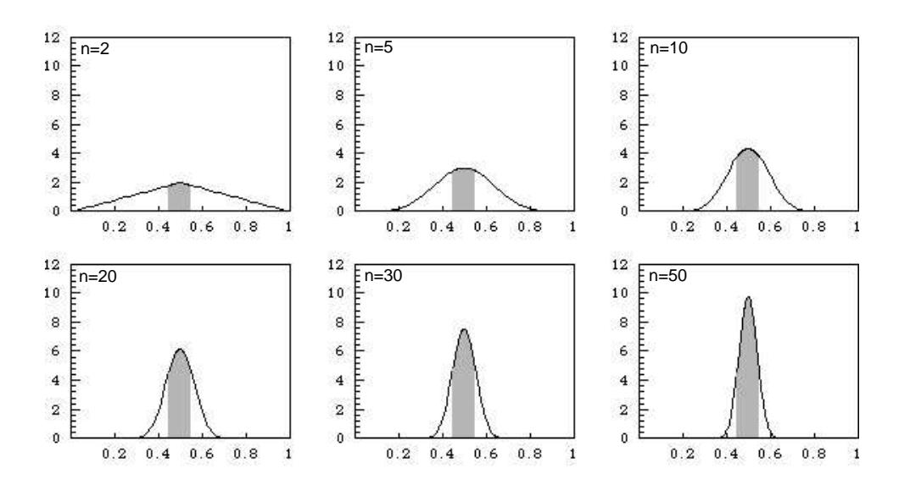
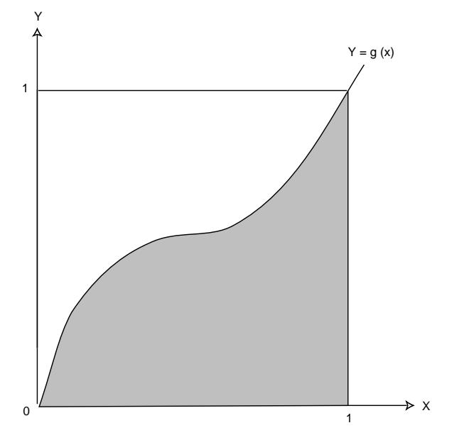

#### 8.2. CONTINUOUS RANDOM VARIABLES

Note that this theorem is not necessarily true if  $\sigma^2$  is infinite (see Example 8.8).

As in the discrete case, the Law of Large Numbers says that the average value of *n* independent trials tends to the expected value as  $n \to \infty$ , in the precise sense that, given  $\epsilon > 0$ , the probability that the average value and the expected value differ by more than  $\epsilon$  tends to 0 as  $n \to \infty$ .

Once again, we suppress the proof, as it is identical to the proof in the discrete case.

### **Uniform Case**

**Example 8.5** Suppose we choose at random n numbers from the interval [0, 1] with uniform distribution. Then if  $X_i$  describes the *i*th choice, we have

$$
\mu = E(X_i) = \int_0^1 x \, dx = \frac{1}{2},
$$
  
$$
\sigma^2 = V(X_i) = \int_0^1 x^2 \, dx - \mu^2
$$
  
$$
= \frac{1}{3} - \frac{1}{4} = \frac{1}{12}.
$$

Hence,

$$
E\left(\frac{S_n}{n}\right) = \frac{1}{2},
$$
  
$$
V\left(\frac{S_n}{n}\right) = \frac{1}{12n}
$$

and for any  $\epsilon > 0$ ,

$$
P\left(\left|\frac{S_n}{n} - \frac{1}{2}\right| \ge \epsilon\right) \le \frac{1}{12n\epsilon^2}
$$

This says that if we choose *n* numbers at random from  $[0, 1]$ , then the chances are better than  $1 - 1/(12n\epsilon^2)$  that the difference  $|S_n/n - 1/2|$  is less than  $\epsilon$ . Note that  $\epsilon$  plays the role of the amount of error we are willing to tolerate: If we choose  $\epsilon = 0.1$ , say, then the chances that  $|S_n/n - 1/2|$  is less than 0.1 are better than  $1-100/(12n)$ . For  $n=100$ , this is about 0.92, but if  $n=1000$ , this is better than .99 and if  $n = 10,000$ , this is better than .999.

We can illustrate what the Law of Large Numbers says for this example graphically. The density for  $A_n = S_n/n$  is determined by

$$
f_{A_n}(x) = n f_{S_n}(nx) .
$$

We have seen in Section 7.2, that we can compute the density  $f_{S_n}(x)$  for the sum of  $n$  uniform random variables. In Figure 8.2 we have used this to plot the density for  $A_n$  for various values of n. We have shaded in the area for which  $A_n$ would lie between  $.45$  and  $.55$ . We see that as we increase  $n$ , we obtain more and more of the total area inside the shaded region. The Law of Large Numbers tells us that we can obtain as much of the total area as we please inside the shaded region by choosing  $n$  large enough (see also Figure 8.1).  $\Box$ 

Figure 8.2: Illustration of Law of Large Numbers — uniform case.

# Normal Case

**Example 8.6** Suppose we choose  $n$  real numbers at random, using a normal distribution with mean 0 and variance 1. Then

$$
\mu = E(X_i) = 0 ,
$$
  
$$
\sigma^2 = V(X_i) = 1 .
$$

Hence,

$$
E\left(\frac{S_n}{n}\right) = 0,
$$
  
$$
V\left(\frac{S_n}{n}\right) = \frac{1}{n},
$$

and, for any  $\epsilon > 0$ ,

$$
P\left(\left|\frac{S_n}{n} - 0\right| \ge \epsilon\right) \le \frac{1}{n\epsilon^2}.
$$

In this case it is possible to compare the Chebyshev estimate for  $P(|S_n/n - \mu| \ge \epsilon)$ in the Law of Large Numbers with exact values, since we know the density function for  $S_n/n$  exactly (see Example 7.9). The comparison is shown in Table 8.1, for  $\epsilon = 0.1$ . The data in this table was produced by the program LawContinuous. We see here that the Chebyshev estimates are in general  $not$  very accurate.  $\Box$ 

| $\boldsymbol{n}$ | $P( S_n/n  \geq .1)$ | Chebyshev |
|------------------|----------------------|-----------|
| 100              | .31731               | 1.00000   |
| 200              | .15730               | .50000    |
| 300              | .08326               | .33333    |
| 400              | .04550               | .25000    |
| 500              | .02535               | .20000    |
| 600              | .01431               | .16667    |
| 700              | .00815               | .14286    |
| 800              | .00468               | .12500    |
| 900              | .00270               | .11111    |
| 1000             | .00157               | .10000    |

Table 8.1: Chebyshev estimates.

### Monte Carlo Method

Here is a somewhat more interesting example.

**Example 8.7** Let  $g(x)$  be a continuous function defined for  $x \in [0,1]$  with values in  $[0,1]$ . In Section 2.1, we showed how to estimate the area of the region under the graph of  $g(x)$  by the Monte Carlo method, that is, by choosing a large number of random values for  $x$  and  $y$  with uniform distribution and seeing what fraction of the points  $P(x, y)$  fell inside the region under the graph (see Example 2.2).

Here is a better way to estimate the same area (see Figure 8.3). Let us choose a large number of independent values  $X_n$  at random from [0, 1] with uniform density, set  $Y_n = g(X_n)$ , and find the average value of the  $Y_n$ . Then this average is our estimate for the area. To see this, note that if the density function for  $X_n$  is uniform,

$$
\mu = E(Y_n) = \int_0^1 g(x) f(x) dx
$$
  
= 
$$
\int_0^1 g(x) dx
$$
  
= average value of  $g(x)$ ,

while the variance is

$$
\sigma^2 = E((Y_n - \mu)^2) = \int_0^1 (g(x) - \mu)^2 dx < 1,
$$

since for all x in [0,1],  $g(x)$  is in [0,1], hence  $\mu$  is in [0,1], and so  $|g(x) - \mu| \leq 1$ . Now let  $A_n = (1/n)(Y_1 + Y_2 + \cdots + Y_n)$ . Then by Chebyshev's Inequality, we have

$$
P(|A_n - \mu| \ge \epsilon) \le \frac{\sigma^2}{n\epsilon^2} < \frac{1}{n\epsilon^2}
$$

This says that to get within  $\epsilon$  of the true value for  $\mu = \int_0^1 g(x) dx$  with probability at least p, we should choose n so that  $1/n\epsilon^2 \leq 1-p$  (i.e., so that  $n \geq 1/\epsilon^2(1-p)$ ). Note that this method tells us how large to take  $n$  to get a desired accuracy.  $\Box$ 

Figure 8.3: Area problem.

The Law of Large Numbers requires that the variance  $\sigma^2$  of the original underlying density be finite:  $\sigma^2 < \infty$ . In cases where this fails to hold, the Law of Large Numbers may fail, too. An example follows.

# Cauchy Case

**Example 8.8** Suppose we choose *n* numbers from  $(-\infty, +\infty)$  with a Cauchy density with parameter  $a = 1$ . We know that for the Cauchy density the expected value and variance are undefined (see Example 6.28). In this case, the density function for

$$
A_n = \frac{S_n}{n}
$$

is given by (see Example  $7.6$ )

$$
f_{A_n}(x) = \frac{1}{\pi(1+x^2)},
$$

that is, the density function for  $A_n$  is the same for all n. In this case, as n increases, the density function does not change at all, and the Law of Large Numbers does  $\operatorname*{not}% \mathcal{M}(n)$  hold.  $\Box$ 

# Exercises

1 Let X be a continuous random variable with mean  $\mu = 10$  and variance  $\sigma^2 = 100/3$ . Using Chebyshev's Inequality, find an upper bound for the following probabilities.