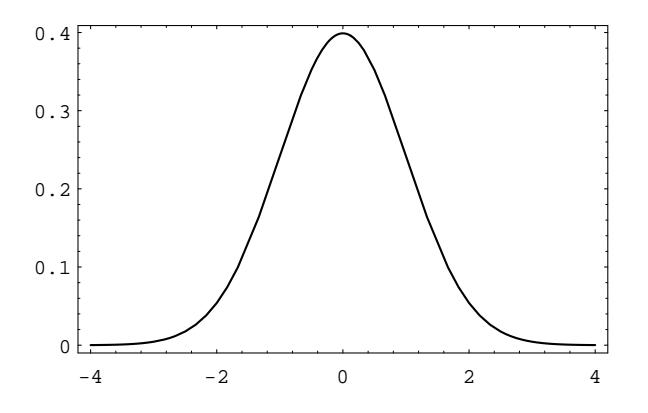
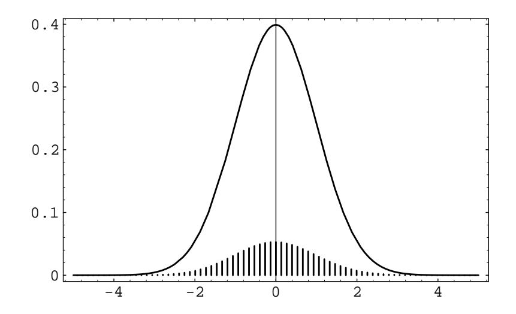
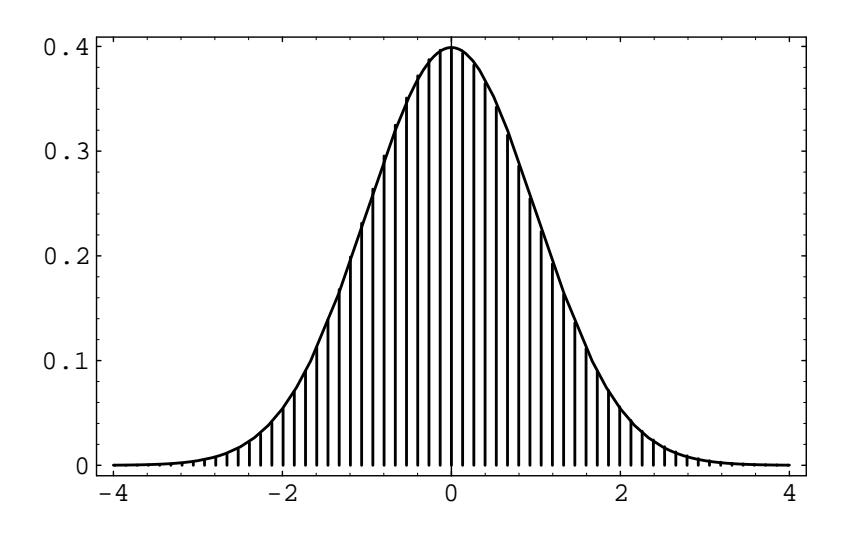

## Chapter 9

# **Central Limit Theorem**

#### 9.1 Central Limit Theorem for Bernoulli Trials

The second fundamental theorem of probability is the Central Limit Theorem. This theorem says that if  $S_n$  is the sum of n mutually independent random variables, then the distribution function of  $S_n$  is well-approximated by a certain type of continuous function known as a normal density function, which is given by the formula

$$
f_{\mu,\sigma}(x) = \frac{1}{\sqrt{2\pi}\sigma}e^{-(x-\mu)^2/(2\sigma^2)}
$$

as we have seen in Chapter 4.3. In this section, we will deal only with the case that  $\mu = 0$  and  $\sigma = 1$ . We will call this particular normal density function the standard normal density, and we will denote it by  $\phi(x)$ :

$$
\phi(x) = \frac{1}{\sqrt{2\pi}} e^{-x^2/2}.
$$

A graph of this function is given in Figure 9.1. It can be shown that the area under any normal density equals 1.

The Central Limit Theorem tells us, quite generally, what happens when we have the sum of a large number of independent random variables each of which contributes a small amount to the total. In this section we shall discuss this theorem as it applies to the Bernoulli trials and in Section 9.2 we shall consider more general processes. We will discuss the theorem in the case that the individual random variables are identically distributed, but the theorem is true, under certain conditions, even if the individual random variables have different distributions.

## **Bernoulli Trials**

Consider a Bernoulli trials process with probability  $p$  for success on each trial. Let  $X_i = 1$  or 0 according as the *i*th outcome is a success or failure, and let  $S_n = X_1 + X_2 + \cdots + X_n$ . Then  $S_n$  is the number of successes in *n* trials. We know that  $S_n$  has as its distribution the binomial probabilities  $b(n, p, j)$ . In Section 3.2,

Figure 9.1: Standard normal density.

we plotted these distributions for  $p = .3$  and  $p = .5$  for various values of n (see Figure  $3.5$ ).

We note that the maximum values of the distributions appeared near the expected value  $np$ , which causes their spike graphs to drift off to the right as n increased. Moreover, these maximum values approach  $0$  as n increased, which causes the spike graphs to flatten out.

### **Standardized Sums**

We can prevent the drifting of these spike graphs by subtracting the expected number of successes *np* from  $S_n$ , obtaining the new random variable  $S_n - np$ . Now the maximum values of the distributions will always be near 0.

To prevent the spreading of these spike graphs, we can normalize  $S_n - np$  to have variance 1 by dividing by its standard deviation  $\sqrt{npq}$  (see Exercise 6.2.12 and Exercise  $6.2.16$ ).

**Definition 9.1** The *standardized sum* of  $S_n$  is given by

$$
S_n^* = \frac{S_n - np}{\sqrt{npq}}.
$$

 $S_n^*$  always has expected value 0 and variance 1.

Suppose we plot a spike graph with the spikes placed at the possible values of  $S_n^*$ :  $x_0, x_1, \ldots, x_n$ , where

$$
x_j = \frac{j - np}{\sqrt{npq}} \tag{9.1}
$$

We make the height of the spike at  $x_i$  equal to the distribution value  $b(n, p, j)$ . An example of this standardized spike graph, with  $n = 270$  and  $p = .3$ , is shown in Figure 9.2. This graph is beautifully bell-shaped. We would like to fit a normal density to this spike graph. The obvious choice to try is the standard normal density, since it is centered at 0, just as the standardized spike graph is. In this figure, we

 $\Box$ 

Figure 9.2: Normalized binomial distribution and standard normal density.

have drawn this standard normal density. The reader will note that a horrible thing has occurred: Even though the shapes of the two graphs are the same, the heights are quite different.

If we want the two graphs to fit each other, we must modify one of them; we choose to modify the spike graph. Since the shapes of the two graphs look fairly close, we will attempt to modify the spike graph without changing its shape. The reason for the differing heights is that the sum of the heights of the spikes equals 1, while the area under the standard normal density equals 1. If we were to draw a continuous curve through the top of the spikes, and find the area under this curve, we see that we would obtain, approximately, the sum of the heights of the spikes multiplied by the distance between consecutive spikes, which we will call  $\epsilon$ . Since the sum of the heights of the spikes equals one, the area under this curve would be approximately  $\epsilon$ . Thus, to change the spike graph so that the area under this curve has value 1, we need only multiply the heights of the spikes by  $1/\epsilon$ . It is easy to see from Equation 9.1 that

$$
\epsilon = \frac{1}{\sqrt{npq}} \; .
$$

In Figure 9.3 we show the standardized sum  $S_n^*$  for  $n = 270$  and  $p = .3$ , after correcting the heights, together with the standard normal density. (This figure was produced with the program **CLTBernoulliPlot**.) The reader will note that the standard normal fits the height-corrected spike graph extremely well. In fact, one version of the Central Limit Theorem (see Theorem 9.1) says that as  $n$  increases, the standard normal density will do an increasingly better job of approximating the height-corrected spike graphs corresponding to a Bernoulli trials process with  $n$  summands.

Let us fix a value  $x$  on the  $x$ -axis and let  $n$  be a fixed positive integer. Then, using Equation 9.1, the point  $x_j$  that is closest to x has a subscript j given by the

Figure 9.3: Corrected spike graph with standard normal density.

formula

$$
j = \langle np + x\sqrt{npq} \rangle
$$

where  $\langle a \rangle$  means the integer nearest to a. Thus the height of the spike above  $x_i$ will be

$$
\sqrt{npq} b(n, p, j) = \sqrt{npq} b(n, p, \langle np + x_j \sqrt{npq} \rangle) .
$$

For large  $n$ , we have seen that the height of the spike is very close to the height of the normal density at  $x$ . This suggests the following theorem.

Theorem 9.1 (Central Limit Theorem for Binomial Distributions) For the binomial distribution  $b(n, p, j)$  we have

$$
\lim_{n \to \infty} \sqrt{npq} \, b(n, p, \langle np + x \sqrt{npq} \rangle) = \phi(x) ,
$$

where  $\phi(x)$  is the standard normal density.

The proof of this theorem can be carried out using Stirling's approximation from Section 3.1. We indicate this method of proof by considering the case  $x = 0$ . In this case, the theorem states that

$$
\lim_{n \to \infty} \sqrt{npq} \, b(n, p, \langle np \rangle) = \frac{1}{\sqrt{2\pi}} = .3989 \dots \, .
$$

In order to simplify the calculation, we assume that  $np$  is an integer, so that  $\langle np \rangle =$  $np.$  Then

$$
\sqrt{npq} b(n, p, np) = \sqrt{npq} p^{np} q^{nq} \frac{n!}{(np)! (nq)!}
$$

Recall that Stirling's formula (see Theorem 3.3) states that

$$
n! \sim \sqrt{2\pi n} \, n^n e^{-n} \qquad \text{as} \quad n \to \infty \; .
$$