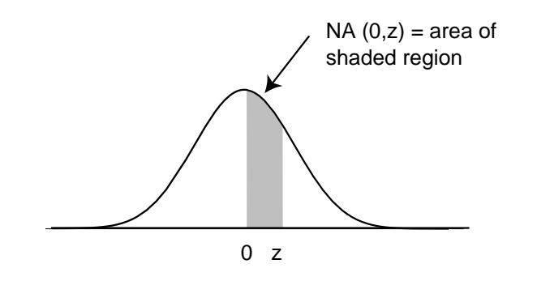

Using this, we have

$$
\sqrt{npq} b(n, p, np) \sim \frac{\sqrt{npq} p^{np} q^{nq} \sqrt{2\pi n} n^n e^{-n}}{\sqrt{2\pi np} \sqrt{2\pi nq} (np)^{np} (nq)^{nq} e^{-np} e^{-nq}} ,
$$

which simplifies to  $1/\sqrt{2\pi}$ .

## **Approximating Binomial Distributions**

We can use Theorem 9.1 to find approximations for the values of binomial distribution functions. If we wish to find an approximation for  $b(n, p, j)$ , we set

$$
j = np + x\sqrt{npq}
$$

and solve for  $x$ , obtaining

$$
x = \frac{j - np}{\sqrt{npq}} \; .
$$

Theorem 9.1 then says that

$$
\sqrt{npq}\,b(n,p,j)
$$

is approximately equal to  $\phi(x)$ , so

$$
b(n, p, j) \approx \frac{\phi(x)}{\sqrt{npq}}
$$
  
= 
$$
\frac{1}{\sqrt{npq}} \phi\left(\frac{j - np}{\sqrt{npq}}\right).
$$

**Example 9.1** Let us estimate the probability of exactly 55 heads in 100 tosses of a coin. For this case  $np = 100 \cdot 1/2 = 50$  and  $\sqrt{npq} = \sqrt{100 \cdot 1/2 \cdot 1/2} = 5$ . Thus  $x_{55} = (55-50)/5 = 1$  and

$$
P(S_{100} = 55) \sim \frac{\phi(1)}{5} = \frac{1}{5} \left( \frac{1}{\sqrt{2\pi}} e^{-1/2} \right)
$$
  
= .0484.

To four decimal places, the actual value is 0.0485, and so the approximation is  $\Box$ very good.

The program **CLTBernoulliLocal** illustrates this approximation for any choice of  $n, p,$  and  $j$ . We have run this program for two examples. The first is the probability of exactly 50 heads in 100 tosses of a coin; the estimate is .0798, while the actual value, to four decimal places, is .0796. The second example is the probability of exactly eight sixes in 36 rolls of a die; here the estimate is .1093, while the actual value, to four decimal places, is .1196.

 $\Box$ 

The individual binomial probabilities tend to  $0$  as  $n$  tends to infinity. In most applications we are not interested in the probability that a specific outcome occurs, but rather in the probability that the outcome lies in a given interval, say the interval  $[a, b]$ . In order to find this probability, we add the heights of the spike graphs for values of j between a and b. This is the same as asking for the probability that the standardized sum  $S_n^*$  lies between  $a^*$  and  $b^*$ , where  $a^*$  and  $b^*$  are the standardized values of  $a$  and  $b$ . But as  $n$  tends to infinity the sum of these areas could be expected to approach the area under the standard normal density between  $a^*$  and  $b^*$ . The Central Limit Theorem states that this does indeed happen.

**Theorem 9.2 (Central Limit Theorem for Bernoulli Trials)** Let  $S_n$  be the number of successes in  $n$  Bernoulli trials with probability  $p$  for success, and let  $a$ and  $b$  be two fixed real numbers. Then

$$
\lim_{n \to \infty} P\left(a \le \frac{S_n - np}{\sqrt{npq}} \le b\right) = \int_a^b \phi(x) dx.
$$

This theorem can be proved by adding together the approximations to  $b(n, p, k)$ given in Theorem 9.1.It is also a special case of the more general Central Limit Theorem (see Section 10.3).

We know from calculus that the integral on the right side of this equation is equal to the area under the graph of the standard normal density  $\phi(x)$  between a and b. We denote this area by  $NA(a^*, b^*)$ . Unfortunately, there is no simple way to integrate the function  $e^{-x^2/2}$ , and so we must either use a table of values or else a numerical integration program. (See Figure 9.4 for values of  $NA(0, z)$ . A more extensive table is given in Appendix A.)

It is clear from the symmetry of the standard normal density that areas such as that between  $-2$  and 3 can be found from this table by adding the area from 0 to 2 (same as that from  $-2$  to 0) to the area from 0 to 3.

## **Approximation of Binomial Probabilities**

Suppose that  $S_n$  is binomially distributed with parameters n and p. We have seen that the above theorem shows how to estimate a probability of the form

$$
P(i \le S_n \le j) \t{,} \t(9.2)
$$

where i and j are integers between 0 and n. As we have seen, the binomial distribution can be represented as a spike graph, with spikes at the integers between 0 and n, and with the height of the kth spike given by  $b(n, p, k)$ . For moderate-sized values of  $n$ , if we standardize this spike graph, and change the heights of its spikes, in the manner described above, the sum of the heights of the spikes is approximated by the area under the standard normal density between  $i^*$  and  $j^*$ . It turns out that a slightly more accurate approximation is afforded by the area under the standard

| z         | NA(z) | z   | NA(z) | z   | NA(z) | z   | NA(z) |
|-----------|-------|-----|-------|-----|-------|-----|-------|
| .0        | .0000 | 1.0 | .3413 | 2.0 | .4772 | 3.0 | .4987 |
| $\cdot$ 1 | .0398 | 1.1 | .3643 | 2.1 | .4821 | 3.1 | .4990 |
| .2        | .0793 | 1.2 | .3849 | 2.2 | .4861 | 3.2 | .4993 |
| .3        | .1179 | 1.3 | .4032 | 2.3 | .4893 | 3.3 | .4995 |
| $\cdot$   | .1554 | 1.4 | .4192 | 2.4 | .4918 | 3.4 | .4997 |
| .5        | .1915 | 1.5 | .4332 | 2.5 | .4938 | 3.5 | .4998 |
| .6        | .2257 | 1.6 | .4452 | 2.6 | .4953 | 3.6 | .4998 |
| .7        | .2580 | 1.7 | .4554 | 2.7 | .4965 | 3.7 | .4999 |
| .8        | .2881 | 1.8 | .4641 | 2.8 | .4974 | 3.8 | .4999 |
| .9        | .3159 | 1.9 | .4713 | 2.9 | .4981 | 3.9 | .5000 |

Figure 9.4: Table of values of  $NA(0, z)$ , the normal area from 0 to z.

normal density between the standardized values corresponding to  $(i - 1/2)$  and  $(j+1/2)$ ; these values are

$$
i^* = \frac{i - 1/2 - np}{\sqrt{npq}}
$$

and

$$
j^* = \frac{j + 1/2 - np}{\sqrt{npq}}
$$

Thus.

$$
P(i \le S_n \le j) \approx \text{NA}\left(\frac{i - \frac{1}{2} - np}{\sqrt{npq}}, \frac{j + \frac{1}{2} - np}{\sqrt{npq}}\right).
$$

It should be stressed that the approximations obtained by using the Central Limit Theorem are only approximations, and sometimes they are not very close to the actual values (see Exercise 12).

We now illustrate this idea with some examples.

**Example 9.2** A coin is tossed 100 times. Estimate the probability that the number of heads lies between 40 and 60 (the word "between" in mathematics means inclusive of the endpoints). The expected number of heads is  $100 \cdot 1/2 = 50$ , and the standard deviation for the number of heads is  $\sqrt{100 \cdot 1/2 \cdot 1/2} = 5$ . Thus, since  $n = 100$  is reasonably large, we have

$$
P(40 \le S_n \le 60) \approx P\left(\frac{39.5 - 50}{5} \le S_n^* \le \frac{60.5 - 50}{5}\right)
$$
  
=  $P(-2.1 \le S_n^* \le 2.1)$   
 $\approx$  NA(-2.1, 2.1)  
=  $2NA(0, 2.1)$   
 $\approx .9642$ .

The actual value is .96480, to five decimal places.

Note that in this case we are asking for the probability that the outcome will not deviate by more than two standard deviations from the expected value. Had we asked for the probability that the number of successes is between 35 and 65, this would have represented three standard deviations from the mean, and, using our  $1/2$  correction, our estimate would be the area under the standard normal curve between  $-3.1$  and 3.1, or  $2NA(0,3.1) = .9980$ . The actual answer in this case, to five places, is .99821.  $\Box$ 

It is important to work a few problems by hand to understand the conversion from a given inequality to an inequality relating to the standardized variable. After this, one can then use a computer program that carries out this conversion, including the  $1/2$  correction. The program **CLTBernoulliGlobal** is such a program for estimating probabilities of the form  $P(a \leq S_n \leq b)$ .

**Example 9.3** Dartmouth College would like to have 1050 freshmen. This college cannot accommodate more than 1060. Assume that each applicant accepts with