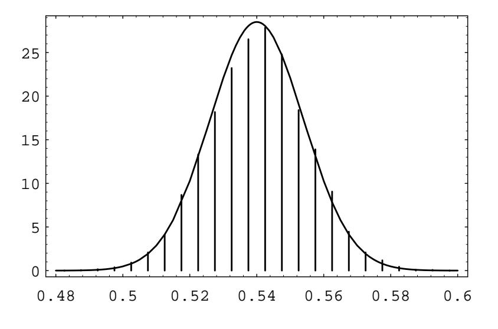
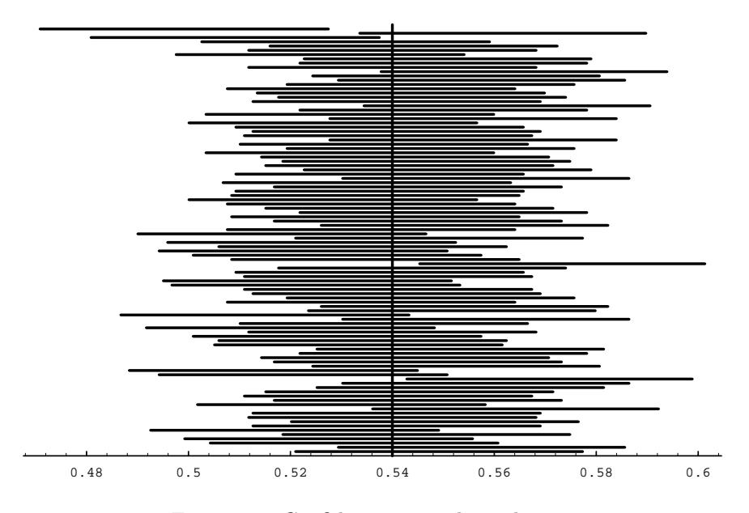

probability .6 and that the acceptances can be modeled by Bernoulli trials. If the college accepts 1700, what is the probability that it will have too many acceptances?

If it accepts 1700 students, the expected number of students who matriculate is  $.6 \cdot 1700 = 1020$ . The standard deviation for the number that accept is  $\sqrt{1700 \cdot .6 \cdot .4} \approx 20$ . Thus we want to estimate the probability

$$
P(S_{1700} > 1060) = P(S_{1700} \ge 1061)
$$
  
= 
$$
P(S_{1700} \ge \frac{1060.5 - 1020}{20})
$$
  
= 
$$
P(S_{1700}^* \ge 2.025).
$$

From Table 9.4, if we interpolate, we would estimate this probability to be  $.5 - .4784 = .0216$ . Thus, the college is fairly safe using this admission policy.  $\Box$ 

## Applications to Statistics

There are many important questions in the field of statistics that can be answered using the Central Limit Theorem for independent trials processes. The following example is one that is encountered quite frequently in the news. Another example of an application of the Central Limit Theorem to statistics is given in Section 9.2.

**Example 9.4** One frequently reads that a poll has been taken to estimate the proportion of people in a certain population who favor one candidate over another in a race with two candidates. (This model also applies to races with more than two candidates  $A$  and  $B$ , and two ballot propositions.) Clearly, it is not possible for pollsters to ask everyone for their preference. What is done instead is to pick a subset of the population, called a sample, and ask everyone in the sample for their preference. Let  $p$  be the actual proportion of people in the population who are in favor of candidate A and let  $q = 1 - p$ . If we choose a sample of size n from the population, the preferences of the people in the sample can be represented by random variables  $X_1, X_2, \ldots, X_n$ , where  $X_i = 1$  if person i is in favor of candidate A, and  $X_i = 0$  if person i is in favor of candidate B. Let  $S_n = X_1 + X_2 + \cdots + X_n$ . If each subset of size *n* is chosen with the same probability, then  $S_n$  is hypergeometrically distributed. If  $n$  is small relative to the size of the population (which is typically true in practice), then  $S_n$  is approximately binomially distributed, with parameters  $n$  and  $p$ .

The pollster wants to estimate the value  $p$ . An estimate for  $p$  is provided by the value  $\bar{p} = S_n/n$ , which is the proportion of people in the sample who favor candidate B. The Central Limit Theorem says that the random variable  $\bar{p}$  is approximately normally distributed. (In fact, our version of the Central Limit Theorem says that the distribution function of the random variable

$$
S_n^* = \frac{S_n - np}{\sqrt{npq}}
$$

is approximated by the standard normal density.) But we have

$$
\bar{p} = \frac{S_n - np}{\sqrt{npq}} \sqrt{\frac{pq}{n}} + p ,
$$

i.e.,  $\bar{p}$  is just a linear function of  $S_n^*$ . Since the distribution of  $S_n^*$  is approximated by the standard normal density, the distribution of the random variable  $\bar{p}$  must also be bell-shaped. We also know how to write the mean and standard deviation of  $\bar{p}$ in terms of p and n. The mean of  $\bar{p}$  is just p, and the standard deviation is

$$
\sqrt{\frac{pq}{n}}
$$

Thus, it is easy to write down the standardized version of  $\bar{p}$ ; it is

$$
\bar{p}^* = \frac{\bar{p} - p}{\sqrt{pq/n}} \ .
$$

Since the distribution of the standardized version of  $\bar{p}$  is approximated by the standard normal density, we know, for example, that 95% of its values will lie within two standard deviations of its mean, and the same is true of  $\bar{p}$ . So we have

$$
P\left(p-2\sqrt{\frac{pq}{n}} < \bar{p} < p+2\sqrt{\frac{pq}{n}}\right) \approx .954.
$$

Now the pollster does not know p or q, but he can use  $\bar{p}$  and  $\bar{q} = 1 - \bar{p}$  in their place without too much danger. With this idea in mind, the above statement is equivalent to the statement

$$
P\left(\bar{p} - 2\sqrt{\frac{\bar{p}\bar{q}}{n}} < p < \bar{p} + 2\sqrt{\frac{\bar{p}\bar{q}}{n}}\right) \approx .954.
$$

The resulting interval

$$
\left(\bar{p}-\frac{2\sqrt{\bar{p}\bar{q}}}{\sqrt{n}},\ \bar{p}+\frac{2\sqrt{\bar{p}\bar{q}}}{\sqrt{n}}\right)
$$

is called the 95 percent confidence interval for the unknown value of  $p$ . The name is suggested by the fact that if we use this method to estimate  $p$  in a large number of samples we should expect that in about 95 percent of the samples the true value of  $p$  is contained in the confidence interval obtained from the sample. In Exercise 11 you are asked to write a program to illustrate that this does indeed happen.

The pollster has control over the value of n. Thus, if he wants to create a  $95\%$ confidence interval with length  $6\%$ , then he should choose a value of n so that

$$
\frac{2\sqrt{\bar{p}\bar{q}}}{\sqrt{n}} \leq .03
$$

Using the fact that  $\bar{p}\bar{q} \leq 1/4$ , no matter what the value of  $\bar{p}$  is, it is easy to show that if he chooses a value of  $n$  so that

$$
\frac{1}{\sqrt{n}} \leq .03
$$

he will be safe. This is equivalent to choosing

$$
n\geq 1111.
$$

Figure 9.5: Polling simulation.

So if the pollster chooses n to be 1200, say, and calculates  $\bar{p}$  using his sample of size 1200, then 19 times out of 20 (i.e., 95% of the time), his confidence interval, which is of length  $6\%$ , will contain the true value of p. This type of confidence interval is typically reported in the news as follows: this survey has a 3% margin of error. In fact, most of the surveys that one sees reported in the paper will have sample sizes around 1000. A somewhat surprising fact is that the size of the population has apparently no effect on the sample size needed to obtain a 95% confidence interval for p with a given margin of error. To see this, note that the value of n that was needed depended only on the number 0.03, which is the margin of error. In other words, whether the population is of size  $100,000$  or  $100,000,000$ , the pollster needs only to choose a sample of size 1200 or so to get the same accuracy of estimate of p. (We did use the fact that the sample size was small relative to the population size in the statement that  $S_n$  is approximately binomially distributed.)

In Figure 9.5, we show the results of simulating the polling process. The population is of size 100,000, and for the population,  $p = .54$ . The sample size was chosen to be 1200. The spike graph shows the distribution of  $\bar{p}$  for 10,000 randomly chosen samples. For this simulation, the program kept track of the number of samples for which  $\bar{p}$  was within 3% of .54. This number was 9648, which is close to 95% of the number of samples used.

Another way to see what the idea of confidence intervals means is shown in Figure 9.6. In this figure, we show 100 confidence intervals, obtained by computing  $\bar{p}$  for 100 different samples of size 1200 from the same population as before. The reader can see that most of these confidence intervals (96, to be exact) contain the true value of  $p$ .

The Gallup Poll has used these polling techniques in every Presidential election since 1936 (and in innumerable other elections as well). Table  $9.11$  shows the results

&lt;sup>1The Gallup Poll Monthly, November 1992, No. 326, p. 33. Supplemented with the help of

Figure 9.6: Confidence interval simulation.

of their efforts. The reader will note that most of the approximations to  $p$  are within  $3\%$  of the actual value of p. The sample sizes for these polls were typically around 1500. (In the table, both the predicted and actual percentages for the winning candidate refer to the percentage of the vote among the "major" political parties. In most elections, there were two major parties, but in several elections, there were three.)

This technique also plays an important role in the evaluation of the effectiveness of drugs in the medical profession. For example, it is sometimes desired to know what proportion of patients will be helped by a new drug. This proportion can be estimated by giving the drug to a subset of the patients, and determining the proportion of this sample who are helped by the drug. П

## **Historical Remarks**

The Central Limit Theorem for Bernoulli trials was first proved by Abraham de Moivre and appeared in his book, *The Doctrine of Chances*, first published in  $1718.2$ 

De Moivre spent his years from age 18 to 21 in prison in France because of his Protestant background. When he was released he left France for England, where he worked as a tutor to the sons of noblemen. Newton had presented a copy of his *Principia Mathematica* to the Earl of Devonshire. The story goes that, while de Moivre was tutoring at the Earl's house, he came upon Newton's work and found that it was beyond him. It is said that he then bought a copy of his own and tore

Lydia K. Saab, The Gallup Organization.

&lt;sup>2A. de Moivre, *The Doctrine of Chances*, 3d ed. (London: Millar, 1756).