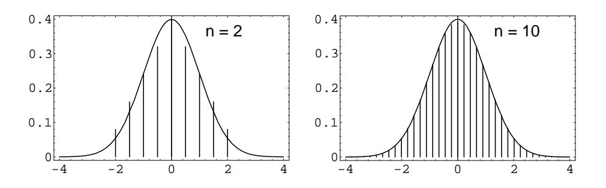
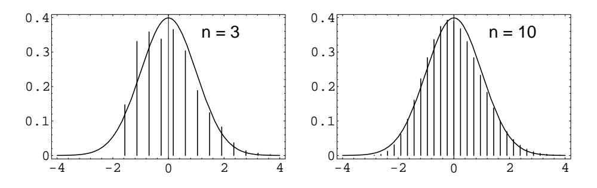

Let  $S_n = X_1 + X_2 + \cdots + X_n$  be the sum of *n* independent discrete random variables of an independent trials process with common distribution function  $m(x)$ defined on the integers, with mean  $\mu$  and variance  $\sigma^2$ . We have seen in Section 7.2 that the distributions for such independent sums have shapes resembling the normal curve, but the largest values drift to the right and the curves flatten out (see Figure 7.6). We can prevent this just as we did for Bernoulli trials.

# **Standardized Sums**

Consider the standardized random variable

$$
S_n^* = \frac{S_n - n\mu}{\sqrt{n\sigma^2}}.
$$

This standardizes  $S_n$  to have expected value 0 and variance 1. If  $S_n = j$ , then  $S_n^*$  has the value  $x_j$  with

$$
x_j = \frac{j - n\mu}{\sqrt{n\sigma^2}} \; .
$$

We can construct a spike graph just as we did for Bernoulli trials. Each spike is centered at some  $x_j$ . The distance between successive spikes is

$$
b=\frac{1}{\sqrt{n\sigma^2}}\ ,
$$

and the height of the spike is

$$
h = \sqrt{n\sigma^2} P(S_n = j)
$$

The case of Bernoulli trials is the special case for which  $X_j = 1$  if the jth outcome is a success and 0 otherwise; then  $\mu = p$  and  $\sigma^2 = \sqrt{pq}$ .

We now illustrate this process for two different discrete distributions. The first is the distribution  $m$ , given by

$$
m = \begin{pmatrix} 1 & 2 & 3 & 4 & 5 \\ .2 & .2 & .2 & .2 & .2 \end{pmatrix}
$$

In Figure 9.7 we show the standardized sums for this distribution for the cases  $n = 2$  and  $n = 10$ . Even for  $n = 2$  the approximation is surprisingly good.

For our second discrete distribution, we choose

$$
m = \begin{pmatrix} 1 & 2 & 3 & 4 & 5 \\ .4 & .3 & .1 & .1 & .1 \end{pmatrix}.
$$

This distribution is quite asymmetric and the approximation is not very good for  $n = 3$ , but by  $n = 10$  we again have an excellent approximation (see Figure 9.8). Figures 9.7 and 9.8 were produced by the program CLTIndTrialsPlot.

Figure 9.7: Distribution of standardized sums.

Figure 9.8: Distribution of standardized sums.

## **Approximation Theorem**

As in the case of Bernoulli trials, these graphs suggest the following approximation theorem for the individual probabilities.

**Theorem 9.3** Let  $X_1, X_2, ..., X_n$  be an independent trials process and let  $S_n =$  $X_1 + X_2 + \cdots + X_n$ . Assume that the greatest common divisor of the differences of all the values that the  $X_j$  can take on is 1. Let  $E(X_j) = \mu$  and  $V(X_j) = \sigma^2$ . Then for  $n$  large,

$$
P(S_n = j) \sim \frac{\phi(x_j)}{\sqrt{n\sigma^2}} ,
$$

 $\Box$ 

where  $x_j = (j - n\mu)/\sqrt{n\sigma^2}$ , and  $\phi(x)$  is the standard normal density.

The program CLTIndTrialsLocal implements this approximation. When we run this program for 6 rolls of a die, and ask for the probability that the sum of the rolls equals 21, we obtain an actual value of 0.09285, and a normal approximation value of .09537. If we run this program for 24 rolls of a die, and ask for the probability that the sum of the rolls is 72, we obtain an actual value of 0.01724 and a normal approximation value of .01705. These results show that the normal approximations are quite good.

# Central Limit Theorem for a Discrete Independent Trials Process

The Central Limit Theorem for a discrete independent trials process is as follows.

**Theorem 9.4 (Central Limit Theorem)** Let  $S_n = X_1 + X_2 + \cdots + X_n$  be the sum of  $n$  discrete independent random variables with common distribution having expected value  $\mu$  and variance  $\sigma^2$ . Then, for  $a < b$ ,

$$
\lim_{n \to \infty} P\left(a < \frac{S_n - n\mu}{\sqrt{n\sigma^2}} < b\right) = \frac{1}{\sqrt{2\pi}} \int_a^b e^{-x^2/2} \, dx \, .
$$

We will give the proofs of Theorems 9.3 and Theorem 9.4 in Section 10.3. Here we consider several examples.

#### Examples

**Example 9.5** A die is rolled 420 times. What is the probability that the sum of the rolls lies between 1400 and 1550?

The sum is a random variable

$$
S_{420}=X_1+X_2+\cdots+X_{420},
$$

where each  $X_j$  has distribution

$$
m_X = \begin{pmatrix} 1 & 2 & 3 & 4 & 5 & 6 \\ 1/6 & 1/6 & 1/6 & 1/6 & 1/6 & 1/6 \end{pmatrix}
$$

We have seen that  $\mu = E(X) = 7/2$  and  $\sigma^2 = V(X) = 35/12$ . Thus,  $E(S_{420}) =$  $420 \cdot 7/2 = 1470$ ,  $\sigma^2(S_{420}) = 420 \cdot 35/12 = 1225$ , and  $\sigma(S_{420}) = 35$ . Therefore,

$$
P(1400 \le S_{420} \le 1550) \approx P\left(\frac{1399.5 - 1470}{35} \le S_{420}^* \le \frac{1550.5 - 1470}{35}\right)
$$
  
=  $P(-2.01 \le S_{420}^* \le 2.30)$   
 $\approx$  NA(-2.01, 2.30) = .9670.

We note that the program **CLTIndTrialsGlobal** could be used to calculate these probabilities.  $\Box$ 

**Example 9.6** A student's grade point average is the average of his grades in 30 courses. The grades are based on 100 possible points and are recorded as integers. Assume that, in each course, the instructor makes an error in grading of  $k$  with probability  $|p/k|$ , where  $k = \pm 1, \pm 2, \pm 3, \pm 4, \pm 5$ . The probability of no error is then  $1 - (137/30)p$ . (The parameter p represents the inaccuracy of the instructor's grading.) Thus, in each course, there are two grades for the student, namely the

"correct" grade and the recorded grade. So there are two average grades for the student, namely the average of the correct grades and the average of the recorded grades.

We wish to estimate the probability that these two average grades differ by less than .05 for a given student. We now assume that  $p = 1/20$ . We also assume that the total error is the sum  $S_{30}$  of 30 independent random variables each with distribution

 $m_X : \left\{ \begin{array}{rrrrr} -5 & -4 & -3 & -2 & -1 & 0 & 1 & 2 & 3 & 4 & 5 \\ \frac{1}{100} & \frac{1}{80} & \frac{1}{60} & \frac{1}{40} & \frac{1}{20} & \frac{463}{600} & \frac{1}{20} & \frac{1}{40} & \frac{1}{60} & \frac{1}{80} & \frac{1}{100} \end{array} \right\} \ .$ 

One can easily calculate that  $E(X) = 0$  and  $\sigma^2(X) = 1.5$ . Then we have

$$
P(-.05 \le \frac{S_{30}}{30} \le .05) = P(-1.5 \le S_{30} \le 1.5)
$$
  
= 
$$
P\left(\frac{-1.5}{\sqrt{30 \cdot 1.5}} \le S_{30}^* \le \frac{1.5}{\sqrt{30 \cdot 1.5}}\right)
$$
  
= 
$$
P(-.224 \le S_{30}^* \le .224)
$$
  
$$
\approx \text{NA}(-.224, .224) = .1772.
$$

This means that there is only a 17.7% chance that a given student's grade point average is accurate to within 0.05. (Thus, for example, if two candidates for valedictorian have recorded averages of 97.1 and 97.2, there is an appreciable probability that their correct averages are in the reverse order.) For a further discussion of this example, see the article by R. M. Kozelka.5  $\Box$ 

#### A More General Central Limit Theorem

In Theorem 9.4, the discrete random variables that were being summed were assumed to be independent and identically distributed. It turns out that the assumption of identical distributions can be substantially weakened. Much work has been done in this area, with an important contribution being made by J. W. Lindeberg. Lindeberg found a condition on the sequence  $\{X_n\}$  which guarantees that the distribution of the sum  $S_n$  is asymptotically normally distributed. Feller showed that Lindeberg's condition is necessary as well, in the sense that if the condition does not hold, then the sum  $S_n$  is not asymptotically normally distributed. For a precise statement of Lindeberg's Theorem, we refer the reader to Feller.6 A sufficient condition that is stronger (but easier to state) than Lindeberg's condition, and is weaker than the condition in Theorem 9.4, is given in the following theorem.

&lt;sup>5R. M. Kozelka, "Grade-Point Averages and the Central Limit Theorem," American Math. Monthly, vol. 86 (Nov 1979), pp. 773-777.

 ${}^6$ W. Feller, *Introduction to Probability Theory and its Applications*, vol. 1, 3rd ed. (New York: John Wiley & Sons, 1968), p. 254.