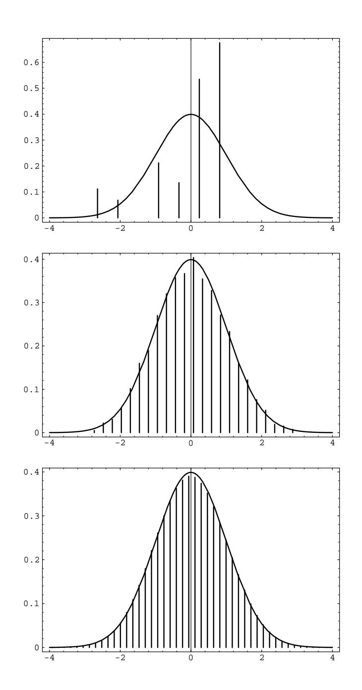
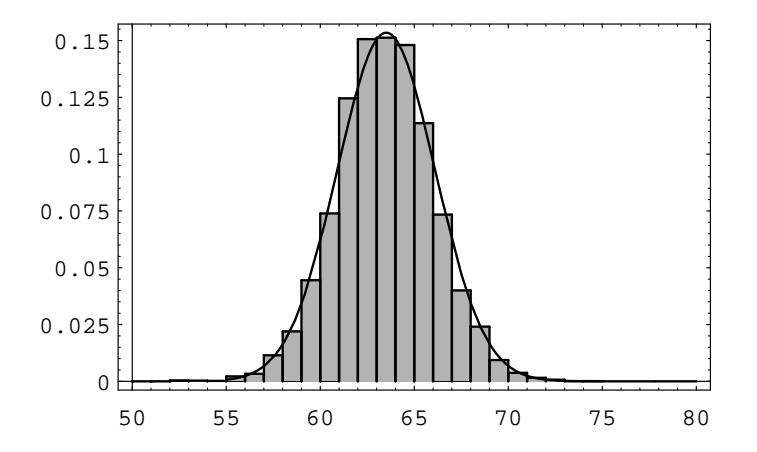

## 9.2. DISCRETE INDEPENDENT TRIALS

**Theorem 9.5 (Central Limit Theorem)** Let  $X_1, X_2, \ldots, X_n$ , ... be a sequence of independent discrete random variables, and let  $S_n = X_1 + X_2 + \cdots + X_n$ . For each *n*, denote the mean and variance of  $X_n$  by  $\mu_n$  and  $\sigma_n^2$ , respectively. Define the mean and variance of  $S_n$  to be  $m_n$  and  $s_n^2$ , respectively, and assume that  $s_n \to \infty$ . If there exists a constant A, such that  $|X_n| \leq A$  for all n, then for  $a < b$ ,

$$
\lim_{n \to \infty} P\left(a < \frac{S_n - m_n}{s_n} < b\right) = \frac{1}{\sqrt{2\pi}} \int_a^b e^{-x^2/2} \, dx \, .
$$

The condition that  $|X_n| \leq A$  for all n is sometimes described by saying that the sequence  $\{X_n\}$  is uniformly bounded. The condition that  $s_n \to \infty$  is necessary (see Exercise 15).

We illustrate this theorem by generating a sequence of  $n$  random distributions on the interval [a, b]. We then convolute these distributions to find the distribution of the sum of  $n$  independent experiments governed by these distributions. Finally, we standardize the distribution for the sum to have mean 0 and standard deviation 1 and compare it with the normal density. The program CLTGeneral carries out this procedure.

In Figure 9.9 we show the result of running this program for  $[a, b] = [-2, 4]$ , and  $n = 1$ , 4, and 10. We see that our first random distribution is quite asymmetric. By the time we choose the sum of ten such experiments we have a very good fit to the normal curve.

The above theorem essentially says that anything that can be thought of as being made up as the sum of many small independent pieces is approximately normally distributed. This brings us to one of the most important questions that was asked about genetics in the 1800's.

## The Normal Distribution and Genetics

When one looks at the distribution of heights of adults of one sex in a given population, one cannot help but notice that this distribution looks like the normal distribution. An example of this is shown in Figure 9.10. This figure shows the distribution of heights of 9593 women between the ages of 21 and 74. These data come from the Health and Nutrition Examination Survey I (HANES I). For this survey, a sample of the U.S. civilian population was chosen. The survey was carried out between 1971 and 1974.

A natural question to ask is "How does this come about?". Francis Galton, an English scientist in the 19th century, studied this question, and other related questions, and constructed probability models that were of great importance in explaining the genetic effects on such attributes as height. In fact, one of the most important ideas in statistics, the idea of regression to the mean, was invented by Galton in his attempts to understand these genetic effects.

Galton was faced with an apparent contradiction. On the one hand, he knew that the normal distribution arises in situations in which many small independent effects are being summed. On the other hand, he also knew that many quantitative

Figure 9.9: Sums of randomly chosen random variables.

Figure 9.10: Distribution of heights of adult women.

attributes, such as height, are strongly influenced by genetic factors: tall parents tend to have tall offspring. Thus in this case, there seem to be two large effects, namely the parents. Galton was certainly aware of the fact that non-genetic factors played a role in determining the height of an individual. Nevertheless, unless these non-genetic factors overwhelm the genetic ones, thereby refuting the hypothesis that heredity is important in determining height, it did not seem possible for sets of parents of given heights to have offspring whose heights were normally distributed.

One can express the above problem symbolically as follows. Suppose that we choose two specific positive real numbers  $x$  and  $y$ , and then find all pairs of parents one of whom is  $x$  units tall and the other of whom is  $y$  units tall. We then look at all of the offspring of these pairs of parents. One can postulate the existence of a function  $f(x, y)$  which denotes the genetic effect of the parents' heights on the heights of the offspring. One can then let  $W$  denote the effects of the non-genetic factors on the heights of the offspring. Then, for a given set of heights  $\{x, y\}$ , the random variable which represents the heights of the offspring is given by

$$
H = f(x, y) + W
$$

where  $f$  is a deterministic function, i.e., it gives one output for a pair of inputs  $\{x, y\}$ . If we assume that the effect of f is large in comparison with the effect of  $W$ , then the variance of  $W$  is small. But since f is deterministic, the variance of  $H$ equals the variance of  $W$ , so the variance of  $H$  is small. However, Galton observed from his data that the variance of the heights of the offspring of a given pair of parent heights is not small. This would seem to imply that inheritance plays a small role in the determination of the height of an individual. Later in this section, we will describe the way in which Galton got around this problem.

We will now consider the modern explanation of why certain traits, such as heights, are approximately normally distributed. In order to do so, we need to introduce some terminology from the field of genetics. The cells in a living organism that are not directly involved in the transmission of genetic material to offspring are called somatic cells, and the remaining cells are called germ cells. Organisms of a given species have their genetic information encoded in sets of physical entities, called chromosomes. The chromosomes are paired in each somatic cell. For example, human beings have 23 pairs of chromosomes in each somatic cell. The sex cells contain one chromosome from each pair. In sexual reproduction, two sex cells, one from each parent, contribute their chromosomes to create the set of chromosomes for the offspring.

Chromosomes contain many subunits, called genes. Genes consist of molecules of DNA, and one gene has, encoded in its DNA, information that leads to the regulation of proteins. In the present context, we will consider those genes containing information that has an effect on some physical trait, such as height, of the organism. The pairing of the chromosomes gives rise to a pairing of the genes on the chromosomes.

In a given species, each gene can be any one of several forms. These various forms are called alleles. One should think of the different alleles as potentially producing different effects on the physical trait in question. Of the two alleles that are found in a given gene pair in an organism, one of the alleles came from one parent and the other allele came from the other parent. The possible types of pairs of alleles (without regard to order) are called genotypes.

If we assume that the height of a human being is largely controlled by a specific gene, then we are faced with the same difficulty that Galton was. We are assuming that each parent has a pair of alleles which largely controls their heights. Since each parent contributes one allele of this gene pair to each of its offspring, there are four possible allele pairs for the offspring at this gene location. The assumption is that these pairs of alleles largely control the height of the offspring, and we are also assuming that genetic factors outweight non-genetic factors. It follows that among the offspring we should see several modes in the height distribution of the offspring, one mode corresponding to each possible pair of alleles. This distribution does not correspond to the observed distribution of heights.

An alternative hypothesis, which does explain the observation of normally distributed heights in offspring of a given sex, is the multiple-gene hypothesis. Under this hypothesis, we assume that there are many genes that affect the height of an individual. These genes may differ in the amount of their effects. Thus, we can represent each gene pair by a random variable  $X_i$ , where the value of the random variable is the allele pair's effect on the height of the individual. Thus, for example, if each parent has two different alleles in the gene pair under consideration, then the offspring has one of four possible pairs of alleles at this gene location. Now the height of the offspring is a random variable, which can be expressed as

$$
H=X_1+X_2+\cdots+X_n+W,
$$

if there are n genes that affect height. (Here, as before, the random variable  $W$  denotes non-genetic effects.) Although  $n$  is fixed, if it is fairly large, then Theorem 9.5 implies that the sum  $X_1 + X_2 + \cdots + X_n$  is approximately normally distributed. Now, if we assume that the  $X_i$ 's have a significantly larger cumulative effect than  $W$  does, then  $H$  is approximately normally distributed.

Another observed feature of the distribution of heights of adults of one sex in