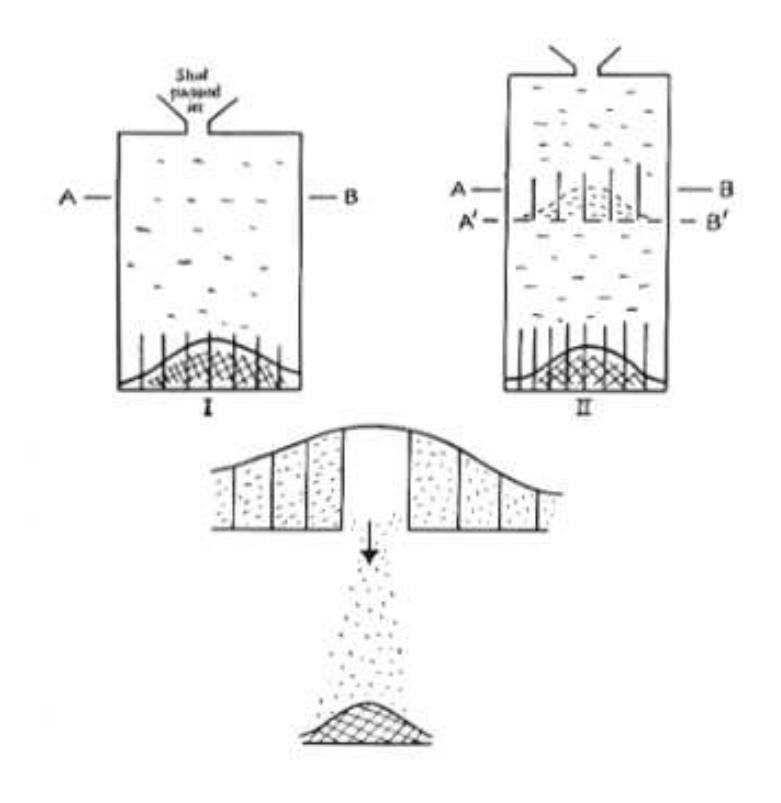

a population is that the variance does not seem to increase or decrease from one generation to the next. This was known at the time of Galton, and his attempts to explain this led him to the idea of regression to the mean. This idea will be discussed further in the historical remarks at the end of the section. (The reason that we only consider one sex is that human heights are clearly sex-linked, and in general, if we have two populations that are each normally distributed, then their union need not be normally distributed.)

Using the multiple-gene hypothesis, it is easy to explain why the variance should be constant from generation to generation. We begin by assuming that for a specific gene location, there are k alleles, which we will denote by  $A_1, A_2, \ldots, A_k$ . We assume that the offspring are produced by random mating. By this we mean that given any offspring, it is equally likely that it came from any pair of parents in the preceding generation. There is another way to look at random mating that makes the calculations easier. We consider the set  $S$  of all of the alleles (at the given gene location) in all of the germ cells of all of the individuals in the parent generation. In terms of the set  $S$ , by random mating we mean that each pair of alleles in  $S$  is equally likely to reside in any particular offspring. (The reader might object to this way of thinking about random mating, as it allows two alleles from the same parent to end up in an offspring; but if the number of individuals in the parent population is large, then whether or not we allow this event does not affect the probabilities very much.)

For  $1 \leq i \leq k$ , we let  $p_i$  denote the proportion of alleles in the parent population that are of type  $A_i$ . It is clear that this is the same as the proportion of alleles in the germ cells of the parent population, assuming that each parent produces roughly the same number of germs cells. Consider the distribution of alleles in the offspring. Since each germ cell is equally likely to be chosen for any particular offspring, the distribution of alleles in the offspring is the same as in the parents.

We next consider the distribution of genotypes in the two generations. We will prove the following fact: the distribution of genotypes in the offspring generation depends only upon the distribution of alleles in the parent generation (in particular, it does not depend upon the distribution of genotypes in the parent generation). Consider the possible genotypes; there are  $k(k+1)/2$  of them. Under our assumptions, the genotype  $A_i A_i$  will occur with frequency  $p_i^2$ , and the genotype  $A_i A_j$ , with  $i \neq j$ , will occur with frequency  $2p_i p_j$ . Thus, the frequencies of the genotypes depend only upon the allele frequencies in the parent generation, as claimed.

This means that if we start with a certain generation, and a certain distribution of alleles, then in all generations after the one we started with, both the allele distribution and the genotype distribution will be fixed. This last statement is known as the Hardy-Weinberg Law.

We can describe the consequences of this law for the distribution of heights among adults of one sex in a population. We recall that the height of an offspring was given by a random variable  $H$ , where

$$
H = X_1 + X_2 + \cdots + X_n + W
$$

with the  $X_i$ 's corresponding to the genes that affect height, and the random variable

W denoting non-genetic effects. The Hardy-Weinberg Law states that for each  $X_i$ , the distribution in the offspring generation is the same as the distribution in the parent generation. Thus, if we assume that the distribution of  $W$  is roughly the same from generation to generation (or if we assume that its effects are small), then the distribution of  $H$  is the same from generation to generation. (In fact, dietary effects are part of  $W$ , and it is clear that in many human populations, diets have changed quite a bit from one generation to the next in recent times. This change is thought to be one of the reasons that humans, on the average, are getting taller. It is also the case that the effects of  $W$  are thought to be small relative to the genetic effects of the parents.)

## **Discussion**

Generally speaking, the Central Limit Theorem contains more information than the Law of Large Numbers, because it gives us detailed information about the shape of the distribution of  $S_n^*$ ; for large *n* the shape is approximately the same as the shape of the standard normal density. More specifically, the Central Limit Theorem says that if we standardize and height-correct the distribution of  $S_n$ , then the normal density function is a very good approximation to this distribution when *n* is large. Thus, we have a computable approximation for the distribution for  $S_n$ , which provides us with a powerful technique for generating answers for all sorts of questions about sums of independent random variables, even if the individual random variables have different distributions.

## **Historical Remarks**

In the mid-1800's, the Belgian mathematician Quetelet7 had shown empirically that the normal distribution occurred in real data, and had also given a method for fitting the normal curve to a given data set. Laplace8 had shown much earlier that the sum of many independent identically distributed random variables is approximately normal. Galton knew that certain physical traits in a population appeared to be approximately normally distributed, but he did not consider Laplace's result to be a good explanation of how this distribution comes about. We give a quote from Galton that appears in the fascinating book by S. Stigler9 on the history of statistics:

First, let me point out a fact which Quetelet and all writers who have followed in his paths have unaccountably overlooked, and which has an intimate bearing on our work to-night. It is that, although characteristics of plants and animals conform to the law, the reason of their doing so is as yet totally unexplained. The essence of the law is that differences should be wholly due to the collective actions of a host of independent *petty* influences in various combinations...Now the processes of heredity...are not petty influences, but very important ones...The conclusion

&lt;sup>7S. Stigler, *The History of Statistics*, (Cambridge: Harvard University Press, 1986), p. 203.  $8$ ibid., p. 136

9ibid., p. 281.

Figure 9.11: Two-stage version of the quincunx.

is...that the processes of heredity must work harmoniously with the law of deviation, and be themselves in some sense conformable to it.

Galton invented a device known as a quincum (now commonly called a Galton board), which we used in Example 3.10 to show how to physically obtain a binomial distribution. Of course, the Central Limit Theorem says that for large values of the parameter  $n$ , the binomial distribution is approximately normal. Galton used the quincum to explain how inheritance affects the distribution of a trait among offspring.

We consider, as Galton did, what happens if we interrupt, at some intermediate height, the progress of the shot that is falling in the quincunx. The reader is referred to Figure 9.11. This figure is a drawing of Karl Pearson,10 based upon Galton's notes. In this figure, the shot is being temporarily segregated into compartments at the line AB. (The line  $A'B'$  forms a platform on which the shot can rest.) If the line AB is not too close to the top of the quincunx, then the shot will be approximately normally distributed at this line. Now suppose that one compartment is opened, as shown in the figure. The shot from that compartment will fall, forming a normal distribution at the bottom of the quincunx. If now all of the compartments are

 $10$ Karl Pearson, The Life, Letters and Labours of Francis Galton, vol. IIIB, (Cambridge at the University Press 1930.) p. 466. Reprinted with permission.

opened, all of the shot will fall, producing the same distribution as would occur if the shot were not temporarily stopped at the line AB. But the action of stopping the shot at the line AB, and then releasing the compartments one at a time, is just the same as convoluting two normal distributions. The normal distributions at the bottom, corresponding to each compartment at the line AB, are being mixed, with their weights being the number of shot in each compartment. On the other hand, it is already known that if the shot are unimpeded, the final distribution is approximately normal. Thus, this device shows that the convolution of two normal distributions is again normal.

Galton also considered the quincunx from another perspective. He segregated into seven groups, by weight, a set of 490 sweet pea seeds. He gave 10 seeds from each of the seven group to each of seven friends, who grew the plants from the seeds. Galton found that each group produced seeds whose weights were normally distributed. (The sweet pea reproduces by self-pollination, so he did not need to consider the possibility of interaction between different groups.) In addition, he found that the variances of the weights of the offspring were the same for each group. This segregation into groups corresponds to the compartments at the line AB in the quincunx. Thus, the sweet peas were acting as though they were being governed by a convolution of normal distributions.

He now was faced with a problem. We have shown in Chapter 7, and Galton knew, that the convolution of two normal distributions produces a normal distribution with a larger variance than either of the original distributions. But his data on the sweet pea seeds showed that the variance of the offspring population was the same as the variance of the parent population. His answer to this problem was to postulate a mechanism that he called *reversion*, and is now called *regression to the mean*. As Stigler puts it: $^{11}$ 

The seven groups of progeny were normally distributed, but not about their parents' weight. Rather they were in every case distributed about a value that was closer to the average population weight than was that of the parent. Furthermore, this reversion followed "the simplest possible law," that is, it was linear. The average deviation of the progeny from the population average was in the same direction as that of the parent, but only a third as great. The mean progeny reverted to type, and the increased variation was just sufficient to maintain the population variability.

Galton illustrated reversion with the illustration shown in Figure  $9.12^{12}$  The parent population is shown at the top of the figure, and the slanted lines are meant to correspond to the reversion effect. The offspring population is shown at the bottom of the figure.

 $11$ ibid., p. 282.

&lt;sup>12Karl Pearson, *The Life, Letters and Labours of Francis Galton*, vol. IIIA, (Cambridge at the University Press 1930.) p. 9. Reprinted with permission.