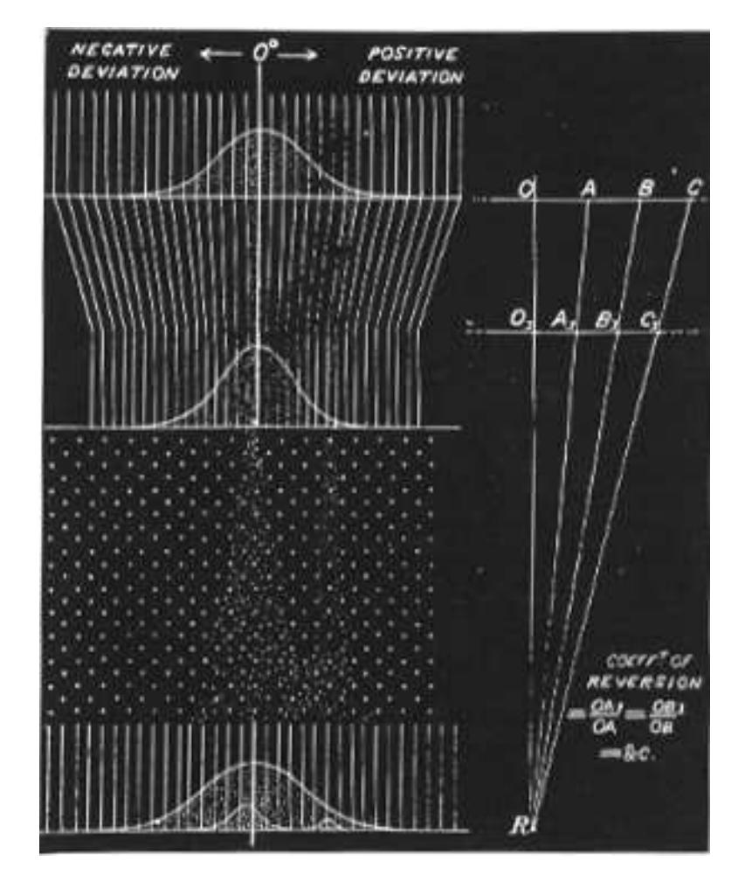

Figure 9.12: Galton's explanation of reversion.

## Exercises

- 1 A die is rolled 24 times. Use the Central Limit Theorem to estimate the probability that
  - $(a)$  the sum is greater than 84.
  - (b) the sum is equal to  $84$ .
- 2 A random walker starts at 0 on the x-axis and at each time unit moves 1 step to the right or 1 step to the left with probability  $1/2$ . Estimate the probability that, after 100 steps, the walker is more than 10 steps from the starting position.
- 3 A piece of rope is made up of 100 strands. Assume that the breaking strength of the rope is the sum of the breaking strengths of the individual strands. Assume further that this sum may be considered to be the sum of an independent trials process with 100 experiments each having expected value of 10 pounds and standard deviation 1. Find the approximate probability that the rope will support a weight
  - $(a)$  of 1000 pounds.
  - $(b)$  of 970 pounds.
- 4 Write a program to find the average of 1000 random digits  $0, 1, 2, 3, 4, 5, 6, 7$ , 8, or 9. Have the program test to see if the average lies within three standard deviations of the expected value of 4.5. Modify the program so that it repeats this simulation 1000 times and keeps track of the number of times the test is passed. Does your outcome agree with the Central Limit Theorem?
- 5 A die is thrown until the first time the total sum of the face values of the die is 700 or greater. Estimate the probability that, for this to happen,
  - (a) more than 210 tosses are required.
  - (b) less than 190 tosses are required.
  - (c) between 180 and 210 tosses, inclusive, are required.
- 6 A bank accepts rolls of pennies and gives 50 cents credit to a customer without counting the contents. Assume that a roll contains 49 pennies 30 percent of the time, 50 pennies 60 percent of the time, and 51 pennies 10 percent of the time.
  - (a) Find the expected value and the variance for the amount that the bank loses on a typical roll.
  - (b) Estimate the probability that the bank will lose more than 25 cents in  $100$  rolls.
  - (c) Estimate the probability that the bank will lose exactly 25 cents in 100 rolls.

354

## 9.2. DISCRETE INDEPENDENT TRIALS

- (d) Estimate the probability that the bank will lose any money in 100 rolls.
- (e) How many rolls does the bank need to collect to have a 99 percent chance of a net loss?
- 7 A surveying instrument makes an error of  $-2$ ,  $-1$ , 0, 1, or 2 feet with equal probabilities when measuring the height of a 200-foot tower.
  - (a) Find the expected value and the variance for the height obtained using this instrument once.
  - (b) Estimate the probability that in 18 independent measurements of this tower, the average of the measurements is between 199 and 201, inclusive.
- 8 For Example 9.6 estimate  $P(S_{30} = 0)$ . That is, estimate the probability that the errors cancel out and the student's grade point average is correct.
- 9 Prove the Law of Large Numbers using the Central Limit Theorem.
- 10 Peter and Paul match pennies 10,000 times. Describe briefly what each of the following theorems tells you about Peter's fortune.
  - (a) The Law of Large Numbers.
  - (b) The Central Limit Theorem.
- 11 A tourist in Las Vegas was attracted by a certain gambling game in which the customer stakes 1 dollar on each play; a win then pays the customer 2 dollars plus the return of her stake, although a loss costs her only her stake. Las Vegas insiders, and alert students of probability theory, know that the probability of winning at this game is  $1/4$ . When driven from the tables by hunger, the tourist had played this game 240 times. Assuming that no near miracles happened, about how much poorer was the tourist upon leaving the casino? What is the probability that she lost no money?
- 12 We have seen that, in playing roulette at Monte Carlo (Example 6.13), betting 1 dollar on red or 1 dollar on 17 amounts to choosing between the distributions

$$
m_X = \begin{pmatrix} -1 & -1/2 & 1 \\ 18/37 & 1/37 & 18/37 \end{pmatrix}
$$

**or** 

 $m_X = \begin{pmatrix} -1 & 35 \\ 36/37 & 1/37 \end{pmatrix}$ 

You plan to choose one of these methods and use it to make 100 1-dollar bets using the method chosen. Using the Central Limit Theorem, estimate the probability of winning any money for each of the two games. Compare your estimates with the actual probabilities, which can be shown, from exact calculations, to equal .437 and .509 to three decimal places.

13 In Example 9.6 find the largest value of  $p$  that gives probability 0.954 that the first decimal place is correct.

- 14 It has been suggested that Example 9.6 is unrealistic, in the sense that the probabilities of errors are too low. Make up your own (reasonable) estimate for the distribution  $m(x)$ , and determine the probability that a student's grade point average is accurate to within 0.05. Also determine the probability that it is accurate to within  $.5$ .
- 15 Find a sequence of uniformly bounded discrete independent random variables  $\{X_n\}$  such that the variance of their sum does not tend to  $\infty$  as  $n \to \infty$ , and such that their sum is not asymptotically normally distributed.

## Central Limit Theorem for Continuous Inde-9.3 pendent Trials

We have seen in Section 9.2 that the distribution function for the sum of a large number *n* of independent discrete random variables with mean  $\mu$  and variance  $\sigma^2$ tends to look like a normal density with mean  $n\mu$  and variance  $n\sigma^2$ . What is remarkable about this result is that it holds for *any* distribution with finite mean and variance. We shall see in this section that the same result also holds true for continuous random variables having a common density function.

Let us begin by looking at some examples to see whether such a result is even plausible.

## **Standardized Sums**

**Example 9.7** Suppose we choose *n* random numbers from the interval  $[0,1]$  with uniform density. Let  $X_1, X_2, ..., X_n$  denote these choices, and  $S_n = X_1 + X_2 +$  $\cdots + X_n$  their sum.

We saw in Example 7.9 that the density function for  $S_n$  tends to have a normal shape, but is centered at  $n/2$  and is flattened out. In order to compare the shapes of these density functions for different values of  $n$ , we proceed as in the previous section: we *standardize*  $S_n$  by defining

$$
S_n^* = \frac{S_n - n\mu}{\sqrt{n}\sigma} \ .
$$

Then we see that for all  $n$  we have

$$
E(S_n^*) = 0 ,\nV(S_n^*) = 1 .
$$

The density function for  $S_n^*$  is just a standardized version of the density function for  $S_n$  (see Figure 9.13).  $\Box$ 

**Example 9.8** Let us do the same thing, but now choose numbers from the interval  $[0, +\infty)$  with an exponential density with parameter  $\lambda$ . Then (see Example 6.26)