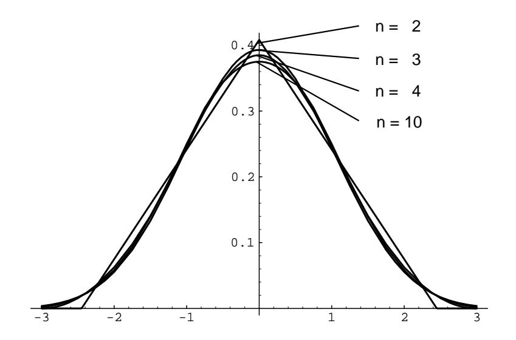
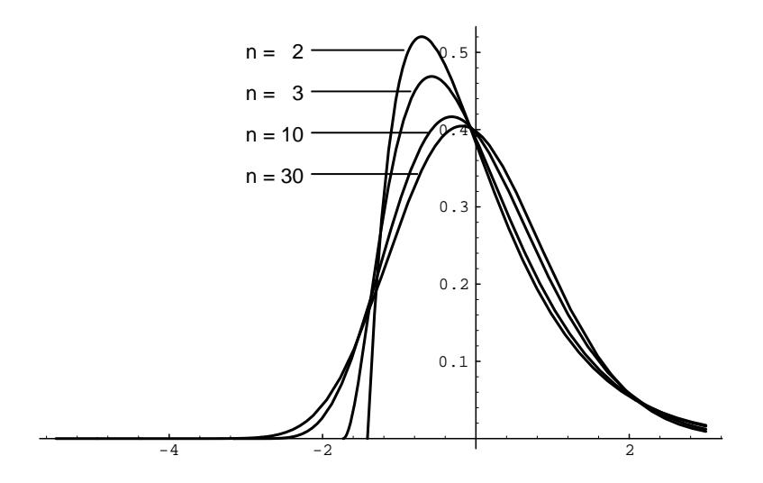

Figure 9.13: Density function for  $S_n^*$  (uniform case,  $n = 2, 3, 4, 10$ ).

$$
\mu = E(X_i) = \frac{1}{\lambda},
$$
  
$$
\sigma^2 = V(X_j) = \frac{1}{\lambda^2}.
$$

Here we know the density function for  $S_n$  explicitly (see Section 7.2). We can use Corollary 5.1 to calculate the density function for  $S_n^*$ . We obtain

$$
f_{S_n}(x) = \frac{\lambda e^{-\lambda x} (\lambda x)^{n-1}}{(n-1)!},
$$
  
$$
f_{S_n^*}(x) = \frac{\sqrt{n}}{\lambda} f_{S_n} \left( \frac{\sqrt{n} x + n}{\lambda} \right)
$$

The graph of the density function for  $S_n^*$  is shown in Figure 9.14.

 $\Box$ 

These examples make it seem plausible that the density function for the normalized random variable  $S_n^*$  for large *n* will look very much like the normal density with mean  $0$  and variance  $1$  in the continuous case as well as in the discrete case. The Central Limit Theorem makes this statement precise.

# **Central Limit Theorem**

**Theorem 9.6 (Central Limit Theorem)** Let  $S_n = X_1 + X_2 + \cdots + X_n$  be the sum of  $n$  independent continuous random variables with common density function  $p$ having expected value  $\mu$  and variance  $\sigma^2$ . Let  $S_n^* = (S_n - n\mu)/\sqrt{n}\sigma$ . Then we have,

Figure 9.14: Density function for  $S_n^*$  (exponential case,  $n = 2, 3, 10, 30, \lambda = 1$ ).

for all  $a < b$ ,

$$
\lim_{n \to \infty} P(a < S_n^* < b) = \frac{1}{\sqrt{2\pi}} \int_a^b e^{-x^2/2} \, dx \, .
$$

We shall give a proof of this theorem in Section 10.3. We will now look at some examples.

**Example 9.9** Suppose a surveyor wants to measure a known distance, say of 1 mile, using a transit and some method of triangulation. He knows that because of possible motion of the transit, atmospheric distortions, and human error, any one measurement is apt to be slightly in error. He plans to make several measurements and take an average. He assumes that his measurements are independent random variables with a common distribution of mean  $\mu = 1$  and standard deviation  $\sigma = .0002$  (so, if the errors are approximately normally distributed, then his measurements are within 1 foot of the correct distance about  $65\%$  of the time). What can be say about the average?

He can say that if n is large, the average  $S_n/n$  has a density function that is approximately normal, with mean  $\mu = 1$  mile, and standard deviation  $\sigma = .0002/\sqrt{n}$ miles.

How many measurements should he make to be reasonably sure that his average lies within .0001 of the true value? The Chebyshev inequality says

$$
P\left(\left|\frac{S_n}{n} - \mu\right| \ge 0.001\right) \le \frac{(0.002)^2}{n(10^{-8})} = \frac{4}{n},
$$

so that we must have  $n \geq 80$  before the probability that his error is less than .0001 exceeds .95.

### 9.3. CONTINUOUS INDEPENDENT TRIALS

We have already noticed that the estimate in the Chebyshev inequality is not always a good one, and here is a case in point. If we assume that  $n$  is large enough so that the density for  $S_n$  is approximately normal, then we have

$$
P\left(\left|\frac{S_n}{n} - \mu\right| < .0001\right) = P\left(-.5\sqrt{n} < S_n^* < +.5\sqrt{n}\right)
$$
\n
$$
\approx \frac{1}{\sqrt{2\pi}} \int_{-.5\sqrt{n}}^{+.5\sqrt{n}} e^{-x^2/2} \, dx \,,
$$

and this last expression is greater than .95 if  $.5\sqrt{n} \geq 2$ . This says that it suffices to take  $n = 16$  measurements for the same results. This second calculation is stronger, but depends on the assumption that  $n = 16$  is large enough to establish the normal density as a good approximation to  $S_n^*$ , and hence to  $S_n$ . The Central Limit Theorem here says nothing about how large  $n$  has to be. In most cases involving sums of independent random variables, a good rule of thumb is that for  $n \geq 30$ , the approximation is a good one. In the present case, if we assume that the errors are approximately normally distributed, then the approximation is probably fairly good even for  $n = 16$ .  $\Box$ 

## **Estimating the Mean**

**Example 9.10** (Continuation of Example 9.9) Now suppose our surveyor is measuring an unknown distance with the same instruments under the same conditions. He takes 36 measurements and averages them. How sure can be be that his measurement lies within .0002 of the true value?

Again using the normal approximation, we get

$$
P\left(\left|\frac{S_n}{n} - \mu\right| < .0002\right) = P(|S_n^*| < .5\sqrt{n})
$$
\n
$$
\approx \frac{2}{\sqrt{2\pi}} \int_{-3}^{3} e^{-x^2/2} dx
$$
\n
$$
\approx .997.
$$

This means that the surveyor can be 99.7 percent sure that his average is within .0002 of the true value. To improve his confidence, he can take more measurements, or require less accuracy, or improve the quality of his measurements (i.e., reduce the variance  $\sigma^2$ ). In each case, the Central Limit Theorem gives quantitative information about the confidence of a measurement process, assuming always that the normal approximation is valid.

Now suppose the surveyor does not know the mean or standard deviation of his measurements, but assumes that they are independent. How should he proceed?

Again, he makes several measurements of a known distance and averages them. As before, the average error is approximately normally distributed, but now with unknown mean and variance.  $\Box$ 

### Sample Mean

If he knows the variance  $\sigma^2$  of the error distribution is .0002, then he can estimate the mean  $\mu$  by taking the *average*, or *sample mean* of, say, 36 measurements:

$$
\bar{\mu} = \frac{x_1 + x_2 + \dots + x_n}{n}
$$

where  $n = 36$ . Then, as before,  $E(\bar{\mu}) = \mu$ . Moreover, the preceding argument shows that

$$
P(|\bar{\mu} - \mu| < .0002) \approx .997
$$

The interval  $(\bar{\mu} - .0002, \bar{\mu} + .0002)$  is called the 99.7% confidence interval for  $\mu$  (see Example 9.4).

### **Sample Variance**

If he does not know the variance  $\sigma^2$  of the error distribution, then he can estimate  $\sigma^2$  by the *sample variance*:

$$
\bar{\sigma}^2 = \frac{(x_1 - \bar{\mu})^2 + (x_2 - \bar{\mu})^2 + \dots + (x_n - \bar{\mu})^2}{n}
$$

where  $n = 36$ . The Law of Large Numbers, applied to the random variables  $(X_i \bar{\mu}$ 2, says that for large *n*, the sample variance  $\bar{\sigma}^2$  lies close to the variance  $\sigma^2$ , so that the surveyor can use  $\bar{\sigma}^2$  in place of  $\sigma^2$  in the argument above.

Experience has shown that, in most practical problems of this type, the sample variance is a good estimate for the variance, and can be used in place of the variance to determine confidence levels for the sample mean. This means that we can rely on the Law of Large Numbers for estimating the variance, and the Central Limit Theorem for estimating the mean.

We can check this in some special cases. Suppose we know that the error distribution is *normal*, with unknown mean and variance. Then we can take a sample of *n* measurements, find the sample mean  $\bar{\mu}$  and sample variance  $\bar{\sigma}^2$ , and form

$$
T_n^* = \frac{S_n - n\bar{\mu}}{\sqrt{n}\bar{\sigma}} ,
$$

where  $n = 36$ . We expect  $T_n^*$  to be a good approximation for  $S_n^*$  for large n.

#### $t$ -Density

The statistician W. S. Gosset13 has shown that in this case  $T_n^*$  has a density function that is not normal but rather a  $t$ -density with  $n$  degrees of freedom. (The number  $n$  of degrees of freedom is simply a parameter which tells us which t-density to use.) In this case we can use the *t*-density in place of the normal density to determine confidence levels for  $\mu$ . As *n* increases, the *t*-density approaches the normal density. Indeed, even for  $n = 8$  the *t*-density and normal density are practically the same (see Figure  $9.15$ ).

360

 $13$ W. S. Gosset discovered the distribution we now call the *t*-distribution while working for the Guinness Brewery in Dublin. He wrote under the pseudonym "Student." The results discussed here first appeared in Student, "The Probable Error of a Mean," Biometrika, vol. 6 (1908), pp. 1-24.