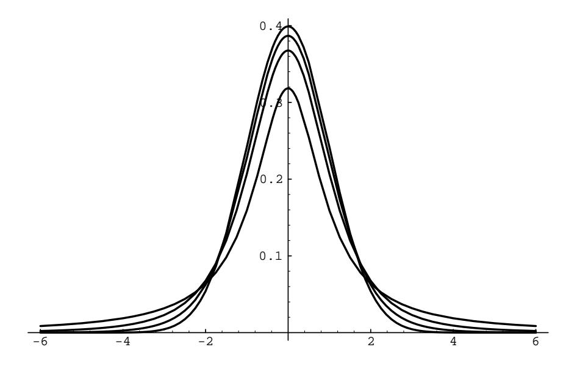

Figure 9.15: Graph of t-density for  $n = 1,3,8$  and the normal density with  $\mu =$  $0, \sigma = 1.$ 

## **Exercises**

Notes on computer problems:

(a) Simulation: Recall (see Corollary 5.2) that

$$
X = F^{-1}(rnd)
$$

will simulate a random variable with density  $f(x)$  and distribution

$$
F(X) = \int_{-\infty}^{x} f(t) dt .
$$

In the case that  $f(x)$  is a normal density function with mean  $\mu$  and standard deviation  $\sigma$ , where neither F nor  $F^{-1}$  can be expressed in closed form, use  $instead$ 

$$
X=\sigma\sqrt{-2\log(rnd)\cos2\pi(rnd)+\mu}
$$

- (b) Bar graphs: you should aim for about 20 to 30 bars (of equal width) in your graph. You can achieve this by a good choice of the range  $[xmin, xmin]$  and the number of bars (for instance,  $[\mu - 3\sigma, \mu + 3\sigma]$  with 30 bars will work in many cases). Experiment!
  - 1 Let X be a continuous random variable with mean  $\mu(X)$  and variance  $\sigma^2(X)$ , and let  $X^* = (X - \mu)/\sigma$  be its standardized version. Verify directly that  $\mu(X^*) = 0$  and  $\sigma^2(X^*) = 1$ .

- 2 Let  $\{X_k\}, 1 \leq k \leq n$ , be a sequence of independent random variables, all with mean 0 and variance 1, and let  $S_n$ ,  $S_n^*$ , and  $A_n$  be their sum, standardized sum, and average, respectively. Verify directly that  $S_n^* = S_n / \sqrt{n} = \sqrt{n} A_n$ .
- **3** Let  $\{X_k\}, 1 \leq k \leq n$ , be a sequence of random variables, all with mean  $\mu$  and variance  $\sigma^2$ , and  $Y_k = X_k^*$  be their standardized versions. Let  $S_n$  and  $T_n$  be the sum of the  $X_k$  and  $Y_k$ , and  $S_n^*$  and  $T_n^*$  their standardized version. Show that  $S_n^* = T_n^* = T_n / \sqrt{n}$ .
- 4 Suppose we choose independently 25 numbers at random (uniform density) from the interval  $[0, 20]$ . Write the normal densities that approximate the densities of their sum  $S_{25}$ , their standardized sum  $S_{25}^*$ , and their average  $A_{25}$ .
- 5 Write a program to choose independently 25 numbers at random from  $[0, 20]$ , compute their sum  $S_{25}$ , and repeat this experiment 1000 times. Make a bar graph for the density of  $S_{25}$  and compare it with the normal approximation of Exercise 4. How good is the fit? Now do the same for the standardized sum  $S_{25}^*$  and the average  $A_{25}$ .
- 6 In general, the Central Limit Theorem gives a better estimate than Chebyshev's inequality for the average of a sum. To see this, let  $A_{25}$  be the average calculated in Exercise 5, and let  $N$  be the normal approximation for  $A_{25}$ . Modify your program in Exercise 5 to provide a table of the function  $F(x) = P(|A_{25} - 10| \ge x) =$  fraction of the total of 1000 trials for which  $|A_{25}-10| \geq x$ . Do the same for the function  $f(x) = P(|N-10| \geq x)$ . (You can use the normal table, Table 9.4, or the procedure **NormalArea** for this.) Now plot on the same axes the graphs of  $F(x)$ ,  $f(x)$ , and the Chebyshev function  $g(x) = 4/(3x^2)$ . How do  $f(x)$  and  $g(x)$  compare as estimates for  $F(x)$ ?
- 7 The Central Limit Theorem says the sums of independent random variables tend to look normal, no matter what crazy distribution the individual variables have. Let us test this by a computer simulation. Choose independently 25 numbers from the interval [0, 1] with the probability density  $f(x)$  given below, and compute their sum  $S_{25}$ . Repeat this experiment 1000 times, and make up a bar graph of the results. Now plot on the same graph the density  $\phi(x)$  = normal  $(x, \mu(S_{25}), \sigma(S_{25}))$ . How well does the normal density fit your bar graph in each case?
  - (a)  $f(x) = 1$ .
  - (b)  $f(x) = 2x$ .
  - (c)  $f(x) = 3x^2$ .
  - (d)  $f(x) = 4|x-1/2|$ .
  - (e)  $f(x) = 2 4|x 1/2|$ .
- 8 Repeat the experiment described in Exercise 7 but now choose the 25 numbers from  $[0,\infty)$ , using  $f(x) = e^{-x}$ .

## 9.3. CONTINUOUS INDEPENDENT TRIALS

- 9 How large must n be before  $S_n = X_1 + X_2 + \cdots + X_n$  is approximately normal? This number is often surprisingly small. Let us explore this question with a computer simulation. Choose n numbers from  $[0,1]$  with probability density  $f(x)$ , where  $n = 3, 6, 12, 20$ , and  $f(x)$  is each of the densities in Exercise 7. Compute their sum  $S_n$ , repeat this experiment 1000 times, and make up a bar graph of 20 bars of the results. How large must  $n$  be before you get a good fit?
- 10 A surveyor is measuring the height of a cliff known to be about 1000 feet. He assumes his instrument is properly calibrated and that his measurement errors are independent, with mean  $\mu = 0$  and variance  $\sigma^2 = 10$ . He plans to take  $n$  measurements and form the average. Estimate, using (a) Chebyshev's inequality and (b) the normal approximation, how large  $n$  should be if he wants to be 95 percent sure that his average falls within 1 foot of the true value. Now estimate, using (a) and (b), what value should  $\sigma^2$  have if he wants to make only 10 measurements with the same confidence?
- 11 The price of one share of stock in the Pilsdorff Beer Company (see Exercise 8.2.12) is given by  $Y_n$  on the nth day of the year. Finn observes that the differences  $X_n = Y_{n+1} - Y_n$  appear to be independent random variables with a common distribution having mean  $\mu = 0$  and variance  $\sigma^2 = 1/4$ . If  $Y_1 = 100$ , estimate the probability that  $Y_{365}$  is
  - (a)  $> 100$ .
  - (b)  $\geq$  110.
  - (c)  $\geq$  120.
- 12 Test your conclusions in Exercise 11 by computer simulation. First choose 364 numbers  $X_i$  with density  $f(x) = \text{normal}(x, 0, 1/4)$ . Now form the sum  $Y_{365} = 100 + X_1 + X_2 + \cdots + X_{364}$ , and repeat this experiment 200 times. Make up a bar graph on  $[50, 150]$  of the results, superimposing the graph of the approximating normal density. What does this graph say about your answers in Exercise 11?
- 13 Physicists say that particles in a long tube are constantly moving back and forth along the tube, each with a velocity  $V_k$  (in cm/sec) at any given moment that is normally distributed, with mean  $\mu = 0$  and variance  $\sigma^2 = 1$ . Suppose there are  $10^{20}$  particles in the tube.
  - (a) Find the mean and variance of the average velocity of the particles.
  - (b) What is the probability that the average velocity is  $\geq 10^{-9}$  cm/sec?
- 14 An astronomer makes n measurements of the distance between Jupiter and a particular one of its moons. Experience with the instruments used leads her to believe that for the proper units the measurements will be normally

distributed with mean  $d$ , the true distance, and variance 16. She performs a series of  $n$  measurements. Let

$$
A_n = \frac{X_1 + X_2 + \dots + X_n}{n}
$$

be the average of these measurements.

(a) Show that

$$
P\left(A_n - \frac{8}{\sqrt{n}} \le d \le A_n + \frac{8}{\sqrt{n}}\right) \approx .95.
$$

- (b) When nine measurements were taken, the average of the distances turned out to be 23.2 units. Putting the observed values in (a) gives the  $95$  percent confidence interval for the unknown distance d. Compute this interval.
- (c) Why not say in (b) more simply that the probability is .95 that the value of  $d$  lies in the computed confidence interval?
- (d) What changes would you make in the above procedure if you wanted to compute a 99 percent confidence interval?
- 15 Plot a bar graph similar to that in Figure 9.10 for the heights of the midparents in Galton's data as given in Appendix B and compare this bar graph to the appropriate normal curve.