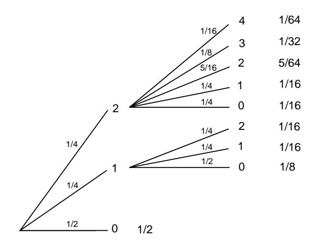
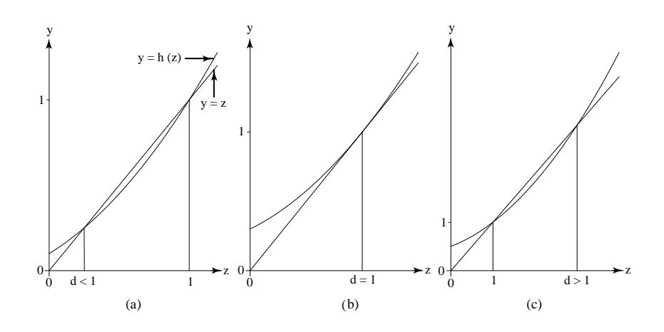

## 10.2. BRANCHING PROCESSES

The first attempt at a solution was given by Reverend H. W. Watson. Because of a mistake in algebra, he incorrectly concluded that a family name would always die out with probability 1. However, the methods that he employed to solve the problems were, and still are, the basis for obtaining the correct solution.

Heyde and Seneta discovered an earlier communication by Bienaymé (1845) that anticipated Galton and Watson by 28 years. Bienaymé showed, in fact, that he was aware of the correct solution to Galton's problem. Heyde and Seneta in their book I. J. Bienaymé: Statistical Theory Anticipated,2 give the following translation from Bienaymé's paper:

If ... the mean of the number of male children who replace the number of males of the preceding generation were less than unity, it would be easily realized that families are dying out due to the disappearance of the members of which they are composed. However, the analysis shows further that when this mean is equal to unity families tend to disappear, although less rapidly  $\dots$ 

The analysis also shows clearly that if the mean ratio is greater than unity, the probability of the extinction of families with the passing of time no longer reduces to certainty. It only approaches a finite limit, which is fairly simple to calculate and which has the singular characteristic of being given by one of the roots of the equation (in which the number of generations is made infinite) which is not relevant to the question when the mean ratio is less than unity.3

Although Bienaymé does not give his reasoning for these results, he did indicate that he intended to publish a special paper on the problem. The paper was never written, or at least has never been found. In his communication Bienaymé indicated that he was motivated by the same problem that occurred to Galton. The opening paragraph of his paper as translated by Heyde and Seneta says,

A great deal of consideration has been given to the possible multiplication of the numbers of mankind; and recently various very curious observations have been published on the fate which allegedly hangs over the aristocrary and middle classes; the families of famous men, etc. This fate, it is alleged, will inevitably bring about the disappearance of the so-called *families fermées.*4

A much more extensive discussion of the history of branching processes may be found in two papers by David G. Kendall.5

&lt;sup>2C. C. Heyde and E. Seneta, I. J. Bienaymé: Statistical Theory Anticipated (New York: Springer Verlag, 1977).

 $3$ ibid., pp. 117–118.

 $4$ ibid., p. 118.

 ${}^{5}D.$  G. Kendall, "Branching Processes Since 1873," pp. 385-406; and "The Genealogy of Genealogy: Branching Processes Before (and After) 1873," Bulletin London Mathematics Society, vol. 7 (1975), pp. 225-253.

Figure 10.1: Tree diagram for Example 10.8.

Branching processes have served not only as crude models for population growth but also as models for certain physical processes such as chemical and nuclear chain reactions.

## Problem of Extinction

We turn now to the first problem posed by Galton (i.e., the problem of finding the probability of extinction for a branching process). We start in the 0th generation with 1 male parent. In the first generation we shall have  $0, 1, 2, 3, \ldots$  male offspring with probabilities  $p_0, p_1, p_2, p_3, \ldots$  If in the first generation there are k offspring, then in the second generation there will be  $X_1 + X_2 + \cdots + X_k$  offspring, where  $X_1, X_2, \ldots, X_k$  are independent random variables, each with the common distribution  $p_0, p_1, p_2, \ldots$  This description enables us to construct a tree, and a tree measure, for any number of generations.

## **Examples**

**Example 10.8** Assume that  $p_0 = 1/2$ ,  $p_1 = 1/4$ , and  $p_2 = 1/4$ . Then the tree measure for the first two generations is shown in Figure 10.1.

Note that we use the theory of sums of independent random variables to assign branch probabilities. For example, if there are two offspring in the first generation, the probability that there will be two in the second generation is

$$
P(X_1 + X_2 = 2) = p_0 p_2 + p_1 p_1 + p_2 p_0
$$
  
=  $\frac{1}{2} \cdot \frac{1}{4} + \frac{1}{4} \cdot \frac{1}{4} + \frac{1}{4} \cdot \frac{1}{2} = \frac{5}{16}$ 

We now study the probability that our process dies out (i.e., that at some generation there are no offspring).

## 10.2. BRANCHING PROCESSES

Let  $d_m$  be the probability that the process dies out by the mth generation. Of course,  $d_0 = 0$ . In our example,  $d_1 = 1/2$  and  $d_2 = 1/2 + 1/8 + 1/16 = 11/16$  (see Figure 10.1). Note that we must add the probabilities for all paths that lead to  $0$ by the  $m$ th generation. It is clear from the definition that

$$
0=d_0\leq d_1\leq d_2\leq\cdots\leq 1
$$

Hence,  $d_m$  converges to a limit d,  $0 \leq d \leq 1$ , and d is the probability that the process will ultimately die out. It is this value that we wish to determine. We begin by expressing the value  $d_m$  in terms of all possible outcomes on the first generation. If there are  $j$  offspring in the first generation, then to die out by the mth generation, each of these lines must die out in  $m-1$  generations. Since they proceed independently, this probability is  $(d_{m-1})^j$ . Therefore

$$
d_m = p_0 + p_1 d_{m-1} + p_2 (d_{m-1})^2 + p_3 (d_{m-1})^3 + \cdots \tag{10.1}
$$

Let  $h(z)$  be the ordinary generating function for the  $pi$ :

$$
h(z) = p_0 + p_1 z + p_2 z^2 + \cdots
$$

Using this generating function, we can rewrite Equation 10.1 in the form

$$
d_m = h(d_{m-1}) \tag{10.2}
$$

Since  $d_m \to d$ , by Equation 10.2 we see that the value d that we are looking for satisfies the equation

$$
d = h(d) \tag{10.3}
$$

One solution of this equation is always  $d = 1$ , since

$$
1=p_0+p_1+p_2+\cdots
$$

This is where Watson made his mistake. He assumed that 1 was the only solution to Equation 10.3. To examine this question more carefully, we first note that solutions to Equation 10.3 represent intersections of the graphs of

 $y = z$ 

and

$$
y = h(z) = p_0 + p_1 z + p_2 z^2 + \cdots
$$

Thus we need to study the graph of  $y = h(z)$ . We note that  $h(0) = p_0$ . Also,

$$
h'(z) = p_1 + 2p_2z + 3p_3z^2 + \cdots,
$$
\n(10.4)

and

$$
h''(z) = 2p_2 + 3 \cdot 2p_3 z + 4 \cdot 3p_4 z^2 + \cdots
$$

From this we see that for  $z \geq 0$ ,  $h'(z) \geq 0$  and  $h''(z) \geq 0$ . Thus for nonnegative z,  $h(z)$  is an increasing function and is concave upward. Therefore the graph of

Figure 10.2: Graphs of  $y = z$  and  $y = h(z)$ .

 $y = h(z)$  can intersect the line  $y = z$  in at most two points. Since we know it must intersect the line  $y = z$  at (1,1), we know that there are just three possibilities, as shown in Figure 10.2.

In case (a) the equation  $d = h(d)$  has roots  $\{d, 1\}$  with  $0 \leq d < 1$ . In the second case (b) it has only the one root  $d = 1$ . In case (c) it has two roots  $\{1, d\}$  where  $1 < d$ . Since we are looking for a solution  $0 \leq d \leq 1$ , we see in cases (b) and (c) that our only solution is 1. In these cases we can conclude that the process will die out with probability 1. However in case (a) we are in doubt. We must study this case more carefully.

From Equation 10.4 we see that

$$
h'(1) = p_1 + 2p_2 + 3p_3 + \cdots = m,
$$

where m is the expected number of offspring produced by a single parent. In case (a) we have  $h'(1) > 1$ , in (b)  $h'(1) = 1$ , and in (c)  $h'(1) < 1$ . Thus our three cases correspond to  $m > 1$ ,  $m = 1$ , and  $m < 1$ . We assume now that  $m > 1$ . Recall that  $d_0 = 0, d_1 = h(d_0) = p_0, d_2 = h(d_1), \ldots$ , and  $d_n = h(d_{n-1})$ . We can construct these values geometrically, as shown in Figure 10.3.

We can see geometrically, as indicated for  $d_0$ ,  $d_1$ ,  $d_2$ , and  $d_3$  in Figure 10.3, that the points  $(d_i, h(d_i))$  will always lie above the line  $y = z$ . Hence, they must converge to the first intersection of the curves  $y = z$  and  $y = h(z)$  (i.e., to the root  $d < 1$ ). This leads us to the following theorem.  $\Box$ 

**Theorem 10.2** Consider a branching process with generating function  $h(z)$  for the number of offspring of a given parent. Let d be the smallest root of the equation  $z = h(z)$ . If the mean number m of offspring produced by a single parent is  $\leq 1$ , then  $d = 1$  and the process dies out with probability 1. If  $m > 1$  then  $d < 1$  and the process dies out with probability  $d$ . П

We shall often want to know the probability that a branching process dies out by a particular generation, as well as the limit of these probabilities. Let  $d_n$  be