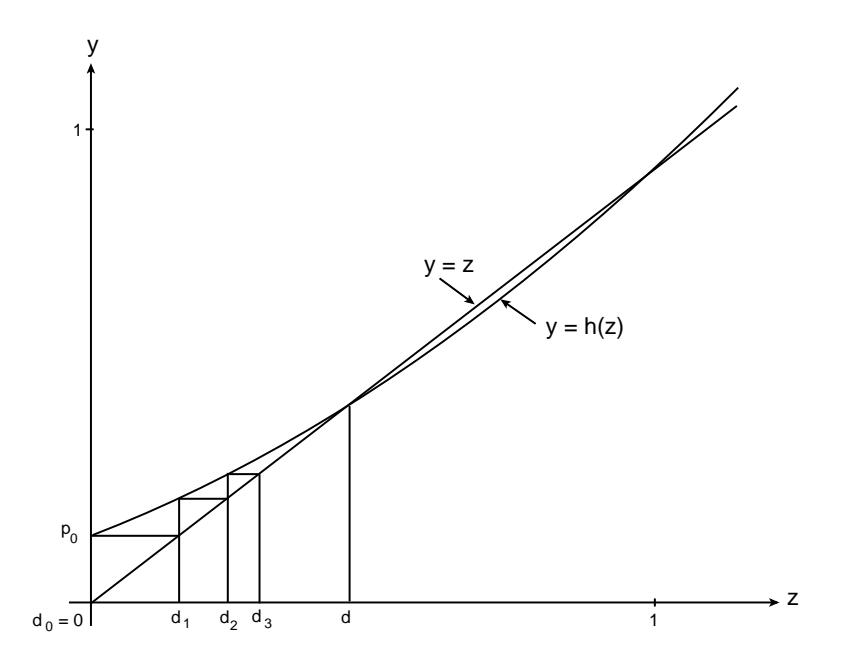

Figure 10.3: Geometric determination of  $d$ .

the probability of dying out by the *n*th generation. Then we know that  $d_1 = p_0$ . We know further that  $d_n = h(d_{n-1})$  where  $h(z)$  is the generating function for the number of offspring produced by a single parent. This makes it easy to compute these probabilities.

The program **Branch** calculates the values of  $d_n$ . We have run this program for 12 generations for the case that a parent can produce at most two offspring and the probabilities for the number produced are  $p_0 = .2$ ,  $p_1 = .5$ , and  $p_2 = .3$ . The results are given in Table 10.1.

We see that the probability of dying out by 12 generations is about .6. We shall see in the next example that the probability of eventually dying out is  $2/3$ , so that even 12 generations is not enough to give an accurate estimate for this probability.

We now assume that at most two offspring can be produced. Then

$$
h(z) = p_0 + p_1 z + p_2 z^2
$$

In this simple case the condition  $z = h(z)$  yields the equation

$$
d = p_0 + p_1 d + p_2 d^2,
$$

which is satisfied by  $d = 1$  and  $d = p_0/p_2$ . Thus, in addition to the root  $d = 1$  we have the second root  $d = p_0/p_2$ . The mean number m of offspring produced by a single parent is

$$
m = p_1 + 2p_2 = 1 - p_0 - p_2 + 2p_2 = 1 - p_0 + p_2.
$$

Thus, if  $p_0 > p_2$ ,  $m < 1$  and the second root is  $> 1$ . If  $p_0 = p_2$ , we have a double root  $d = 1$ . If  $p_0 < p_2$ ,  $m > 1$  and the second root d is less than 1 and represents the probability that the process will die out.

| Generation     | Probability of dying out |
|----------------|--------------------------|
| 1              | $\cdot^2$                |
| $\overline{2}$ | .312                     |
| 3              | .385203                  |
| 4              | .437116                  |
| 5              | .475879                  |
| 6              | .505878                  |
| 7              | .529713                  |
| 8              | .549035                  |
| 9              | .564949                  |
| 10             | .578225                  |
| 11             | .589416                  |
| 12             | .598931                  |

Table 10.1: Probability of dying out.

 $=.2092$  $p_0$  $p_1 = .2584$  $p_2 = .2360$  $=.1593$  $p_3$  $\overline{p_4}$  $=.0828$  $=.0357$  $p_5$  $=.0133$  $p_6$  $=.0042$  $p7$  $= .0011$  $p_8$  $= .0002$  $p_9$  $= .0000$  $p_{10}$ 

Table 10.2: Distribution of number of female children.

**Example 10.9** Keyfitz6 compiled and analyzed data on the continuation of the female family line among Japanese women. His estimates at the basic probability distribution for the number of female children born to Japanese women of ages  $45-49$  in 1960 are given in Table 10.2.

The expected number of girls in a family is then  $1.837$  so the probability d of extinction is less than 1. If we run the program **Branch**, we can estimate that  $d$  is in fact only about .324.  $\Box$ 

## Distribution of Offspring

So far we have considered only the first of the two problems raised by Galton, namely the probability of extinction. We now consider the second problem, that is, the distribution of the number  $Z_n$  of offspring in the nth generation. The exact form of the distribution is not known except in very special cases. We shall see,

 ${}^{6}$ N. Keyfitz, *Introduction to the Mathematics of Population*, rev. ed. (Reading, PA: Addison Wesley, 1977).

however, that we can describe the limiting behavior of  $Z_n$  as  $n \to \infty$ .

We first show that the generating function  $h_n(z)$  of the distribution of  $Z_n$  can be obtained from  $h(z)$  for any branching process.

We recall that the value of the generating function at the value  $z$  for any random variable  $X$  can be written as

$$
h(z) = E(z^X) = p_0 + p_1 z + p_2 z^2 + \cdots
$$

That is,  $h(z)$  is the expected value of an experiment which has outcome  $z^{j}$  with probability  $p_i$ .

Let  $S_n = X_1 + X_2 + \cdots + X_n$  where each  $X_j$  has the same integer-valued distribution  $(p_j)$  with generating function  $k(z) = p_0 + p_1 z + p_2 z^2 + \cdots$ . Let  $k_n(z)$ be the generating function of  $S_n$ . Then using one of the properties of ordinary generating functions discussed in Section 10.1, we have

$$
k_n(z) = (k(z))^n
$$

since the  $X_j$ 's are independent and all have the same distribution.

Consider now the branching process  $Z_n$ . Let  $h_n(z)$  be the generating function of  $Z_n$ . Then

$$
h_{n+1}(z) = E(z^{Z_{n+1}})
$$
  
= 
$$
\sum_{k} E(z^{Z_{n+1}} | Z_n = k) P(Z_n = k) .
$$

If  $Z_n = k$ , then  $Z_{n+1} = X_1 + X_2 + \cdots + X_k$  where  $X_1, X_2, \ldots, X_k$  are independent random variables with common generating function  $h(z)$ . Thus

$$
E(z^{Z_{n+1}}|Z_n = k) = E(z^{X_1 + X_2 + \dots + X_k}) = (h(z))^k
$$

and

$$
h_{n+1}(z) = \sum_{k} (h(z))^{k} P(Z_n = k) .
$$

But

$$
h_n(z) = \sum_k P(Z_n = k) z^k
$$

Thus.

$$
h_{n+1}(z) = h_n(h(z)) . \t\t(10.5)
$$

If we differentiate Equation 10.5 and use the chain rule we have

$$
h'_{n+1}(z) = h'_n(h(z))h'(z).
$$

Putting  $z = 1$  and using the fact that  $h(1) = 1$ ,  $h'(1) = m$ , and  $h'_n(1) = m_n$  = the mean number of offspring in the  $nth$  generation, we have

$$
m_{n+1}=m_n\cdot m.
$$

Thus,  $m_2 = m \cdot m = m^2$ ,  $m_3 = m^2 \cdot m = m^3$ , and in general

$$
m_n = m^n
$$

Thus, for a branching process with  $m > 1$ , the mean number of offspring grows exponentially at a rate  $m$ .

## **Examples**

**Example 10.10** For the branching process of Example 10.8 we have

$$
h(z) = 1/2 + (1/4)z + (1/4)z2,
$$
  
\n
$$
h_2(z) = h(h(z)) = 1/2 + (1/4)[1/2 + (1/4)z + (1/4)z2]
$$
  
\n
$$
= + (1/4)[1/2 + (1/4)z + (1/4)z2]2
$$
  
\n
$$
= 11/16 + (1/8)z + (9/64)z2 + (1/32)z3 + (1/64)z4.
$$

The probabilities for the number of offspring in the second generation agree with those obtained directly from the tree measure (see Figure 1).  $\Box$ 

It is clear that even in the simple case of at most two offspring, we cannot easily carry out the calculation of  $h_n(z)$  by this method. However, there is one special case in which this can be done.

**Example 10.11** Assume that the probabilities  $p_1, p_2, \ldots$  form a geometric series:  $p_k = bc^{k-1}, k = 1, 2, ...,$  with  $0 < b \le 1 - c$  and  $0 < c < 1$ . Then we have

$$
p_0 = 1 - p_1 - p_2 - \cdots
$$
  
= 1 - b - bc - bc2 - \cdots  
= 1 - \frac{b}{1 - c}

The generating function  $h(z)$  for this distribution is

$$
h(z) = p_0 + p_1 z + p_2 z^2 + \cdots
$$
  
=  $1 - \frac{b}{1 - c} + bz + bcz^2 + bc^2 z^3 + \cdots$   
=  $1 - \frac{b}{1 - c} + \frac{bz}{1 - cz}$ .

From this we find

$$
h'(z) = \frac{bcz}{(1 - cz)^2} + \frac{b}{1 - cz} = \frac{b}{(1 - cz)^2}
$$

and

$$
m = h'(1) = \frac{b}{(1-c)^2} .
$$

We know that if  $m \leq 1$  the process will surely die out and  $d = 1$ . To find the probability d when  $m > 1$  we must find a root  $d < 1$  of the equation

$$
z=h(z)\ ,
$$

**or** 

$$
z = 1 - \frac{b}{1 - c} + \frac{bz}{1 - cz}.
$$