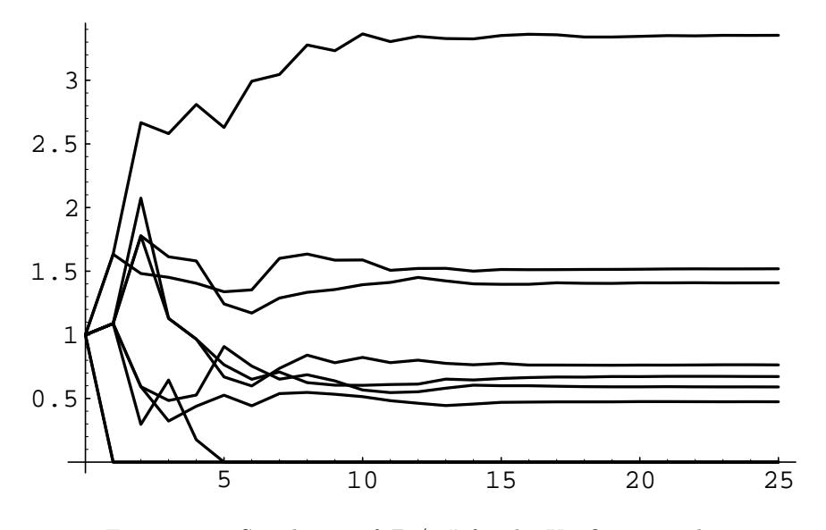

## 10.2. BRANCHING PROCESSES

This leads us to a quadratic equation. We know that  $z = 1$  is one solution. The other is found to be

$$
d = \frac{1 - b - c}{c(1 - c)}.
$$

It is easy to verify that  $d < 1$  just when  $m > 1$ .

It is possible in this case to find the distribution of  $Z_n$ . This is done by first finding the generating function  $h_n(z)$ .7 The result for  $m \neq 1$  is:

$$
h_n(z) = 1 - m^n \left[ \frac{1-d}{m^n - d} \right] + \frac{m^n \left[ \frac{1-d}{m^n - d} \right]^2 z}{1 - \left[ \frac{m^n - 1}{m^n - d} \right] z}.
$$

The coefficients of the powers of z give the distribution for  $Z_n$ .

$$
P(Z_n = 0) = 1 - m^n \frac{1 - d}{m^n - d} = \frac{d(m^n - 1)}{m^n - d}
$$

and

$$
P(Z_n = j) = m^n \left(\frac{1-d}{m^n - d}\right)^2 \cdot \left(\frac{m^n - 1}{m^n - d}\right)^{j-1},
$$

for  $j \geq 1$ .

**Example 10.12** Let us re-examine the Keyfitz data to see if a distribution of the type considered in Example 10.11 could reasonably be used as a model for this population. We would have to estimate from the data the parameters  $b$  and  $c$  for the formula  $p_k = bc^{k-1}$ . Recall that

$$
m = \frac{b}{(1 - c)^2} \tag{10.6}
$$

and the probability  $d$  that the process dies out is

$$
d = \frac{1 - b - c}{c(1 - c)} \tag{10.7}
$$

Solving Equation 10.6 and 10.7 for  $b$  and  $c$  gives

$$
c=\frac{m-1}{m-d}
$$

and

$$
b=m\Big(\frac{1-d}{m-d}\Big)^2
$$

We shall use the value 1.837 for m and .324 for d that we found in the Keyfitz example. Using these values, we obtain  $b = .3666$  and  $c = .5533$ . Note that  $(1-c)^2 < b < 1-c$ , as required. In Table 10.3 we give for comparison the probabilities  $p_0$  through  $p_8$  as calculated by the geometric distribution versus the empirical values.

 $\Box$ 

&lt;sup>7T. E. Harris, *The Theory of Branching Processes* (Berlin: Springer, 1963), p. 9.

|                |       | Geometric |
|----------------|-------|-----------|
| $p_j$          | Data. | Model     |
| 0              | .2092 | .1816     |
| 1              | .2584 | .3666     |
| $\overline{2}$ | .2360 | .2028     |
| 3              | .1593 | .1122     |
| 4              | .0828 | .0621     |
| 5              | .0357 | .0344     |
| 6              | .0133 | .0190     |
| 7              | .0042 | .0105     |
| 8              | .0011 | .0058     |
| 9              | .0002 | .0032     |
| 10             | .0000 | .0018     |

Table 10.3: Comparison of observed and expected frequencies.

The geometric model tends to favor the larger numbers of offspring but is similar enough to show that this modified geometric distribution might be appropriate to use for studies of this kind.

Recall that if  $S_n = X_1 + X_2 + \cdots + X_n$  is the sum of independent random variables with the same distribution then the Law of Large Numbers states that  $S_n/n$  converges to a constant, namely  $E(X_1)$ . It is natural to ask if there is a similar limiting theorem for branching processes.

Consider a branching process with  $Z_n$  representing the number of offspring after *n* generations. Then we have seen that the expected value of  $Z_n$  is  $m^n$ . Thus we can scale the random variable  $Z_n$  to have expected value 1 by considering the random variable

$$
W_n = \frac{Z_n}{m^n}
$$

In the theory of branching processes it is proved that this random variable  $W_n$ will tend to a limit as  $n$  tends to infinity. However, unlike the case of the Law of Large Numbers where this limit is a constant, for a branching process the limiting value of the random variables  $W_n$  is itself a random variable.

Although we cannot prove this theorem here we can illustrate it by simulation. This requires a little care. When a branching process survives, the number of offspring is apt to get very large. If in a given generation there are 1000 offspring, the offspring of the next generation are the result of 1000 chance events, and it will take a while to simulate these 1000 experiments. However, since the final result is the sum of 1000 independent experiments we can use the Central Limit Theorem to replace these 1000 experiments by a single experiment with normal density having the appropriate mean and variance. The program **BranchingSimulation** carries out this process.

We have run this program for the Keyfitz example, carrying out 10 simulations and graphing the results in Figure 10.4.

The expected number of female offspring per female is 1.837, so that we are graphing the outcome for the random variables  $W_n = Z_n/(1.837)^n$ . For three of

Figure 10.4: Simulation of  $Z_n/m^n$  for the Keyfitz example.

the simulations the process died out, which is consistent with the value  $d = .3$  that we found for this example. For the other seven simulations the value of  $W_n$  tends to a limiting value which is different for each simulation.  $\Box$ 

**Example 10.13** We now examine the random variable  $Z_n$  more closely for the case  $m < 1$  (see Example 10.11). Fix a value  $t > 0$ ; let  $\lceil t m^n \rceil$  be the integer part of  $tm^n$ . Then

$$
P(Z_n = [tm^n]) = m^n \left(\frac{1-d}{m^n - d}\right)^2 \left(\frac{m^n - 1}{m^n - d}\right)^{[tm^n]-1}
$$
  
= 
$$
\frac{1}{m^n} \left(\frac{1-d}{1-d/m^n}\right)^2 \left(\frac{1-1/m^n}{1-d/m^n}\right)^{tm^n+a},
$$

where  $|a| \leq 2$ . Thus, as  $n \to \infty$ ,

$$
m^{n} P(Z_{n} = [tm^{n}]) \rightarrow (1-d)^{2} \frac{e^{-t}}{e^{-td}} = (1-d)^{2} e^{-t(1-d)}.
$$

For  $t=0$ ,

$$
P(Z_n=0)\to d.
$$

We can compare this result with the Central Limit Theorem for sums  $S_n$  of integervalued independent random variables (see Theorem 9.3), which states that if  $t$  is an integer and  $u = (t - n\mu)/\sqrt{\sigma^2 n}$ , then as  $n \to \infty$ ,

$$
\sqrt{\sigma^2 n} P(S_n = u\sqrt{\sigma^2 n} + \mu n) \rightarrow \frac{1}{\sqrt{2\pi}} e^{-u^2/2} .
$$

We see that the form of these statements are quite similar. It is possible to prove a limit theorem for a general class of branching processes that states that under suitable hypotheses, as  $n \to \infty$ ,

$$
m^{n}P(Z_{n}=[tm^{n}])\rightarrow k(t) ,
$$

for  $t > 0$ , and

$$
P(Z_n=0)\to d.
$$

However, unlike the Central Limit Theorem for sums of independent random variables, the function  $k(t)$  will depend upon the basic distribution that determines the process. Its form is known for only a very few examples similar to the one we have considered here.  $\Box$ 

## **Chain Letter Problem**

**Example 10.14** An interesting example of a branching process was suggested by Free Huizinga.8 In 1978, a chain letter called the "Circle of Gold," believed to have started in California, found its way across the country to the theater district of New York. The chain required a participant to buy a letter containing a list of 12 names for 100 dollars. The buyer gives 50 dollars to the person from whom the letter was purchased and then sends 50 dollars to the person whose name is at the top of the list. The buyer then crosses off the name at the top of the list and adds her own name at the bottom in each letter before it is sold again.

Let us first assume that the buyer may sell the letter only to a single person. If you buy the letter you will want to compute your expected winnings. (We are ignoring here the fact that the passing on of chain letters through the mail is a federal offense with certain obvious resulting penalties.) Assume that each person involved has a probability  $p$  of selling the letter. Then you will receive 50 dollars with probability  $p$  and another 50 dollars if the letter is sold to 12 people, since then your name would have risen to the top of the list. This occurs with probability  $p^{12}$ , and so your expected winnings are  $-100 + 50p + 50p^{12}$ . Thus the chain in this situation is a highly unfavorable game.

It would be more reasonable to allow each person involved to make a copy of the list and try to sell the letter to at least 2 other people. Then you would have a chance of recovering your 100 dollars on these sales, and if any of the letters is sold 12 times you will receive a bonus of 50 dollars for each of these cases. We can consider this as a branching process with 12 generations. The members of the first generation are the letters you sell. The second generation consists of the letters sold by members of the first generation, and so forth.

Let us assume that the probabilities that each individual sells letters to  $0, 1$ , or 2 others are  $p_0$ ,  $p_1$ , and  $p_2$ , respectively. Let  $Z_1, Z_2, \ldots, Z_{12}$  be the number of letters in the first 12 generations of this branching process. Then your expected winnings are

$$
50(E(Z_1) + E(Z_{12})) = 50m + 50m^{12} ,
$$

388

&lt;sup>8Private communication.