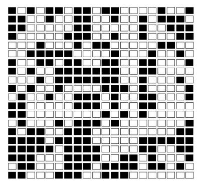
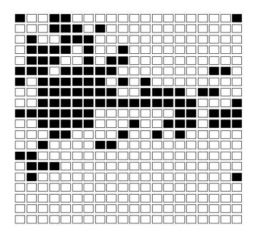

Figure 11.1: Initial state of the stepping stone model.

Figure 11.2: State of the stepping stone model after 10,000 steps.

is enormous. This is an example of a Markov chain that is easy to simulate but difficult to analyze in terms of its transition matrix. The program SteppingStone simulates this chain. We have started with a random initial configuration of two colors with  $n = 20$  and show the result after the process has run for some time in Figure 11.2.

This is an example of an *absorbing* Markov chain. This type of chain will be studied in Section 11.2. One of the theorems proved in that section, applied to the present example, implies that with probability 1, the stones will eventually all be the same color. By watching the program run, you can see that territories are established and a battle develops to see which color survives. At any time the probability that a particular color will win out is equal to the proportion of the array of this color. You are asked to prove this in Exercise 11.2.32.  $\Box$ 

## **Exercises**

1 It is raining in the Land of Oz. Determine a tree and a tree measure for the next three days' weather. Find  $\mathbf{w}^{(1)}, \mathbf{w}^{(2)}$ , and  $\mathbf{w}^{(3)}$  and compare with the results obtained from **P**,  $\mathbf{P}^2$ , and  $\mathbf{P}^3$ .

- **2** In Example 11.4, let  $a = 0$  and  $b = 1/2$ . Find **P**,  $\mathbf{P}^2$ , and  $\mathbf{P}^3$ . What would  $\mathbf{P}^n$  be? What happens to  $\mathbf{P}^n$  as n tends to infinity? Interpret this result.
- 3 In Example 11.5, find  $P$ ,  $P^2$ , and  $P^3$ . What is  $P^n$ ?
- 4 For Example 11.6, find the probability that the grandson of a man from Harvard went to Harvard.
- 5 In Example 11.7, find the probability that the grandson of a man from Harvard went to Harvard.
- 6 In Example 11.9, assume that we start with a hybrid bred to a hybrid. Find  $\mathbf{u}^{(1)}$ ,  $\mathbf{u}^{(2)}$ , and  $\mathbf{u}^{(3)}$ . What would  $\mathbf{u}^{(n)}$  be?
- 7 Find the matrices  $\mathbf{P}^2$ ,  $\mathbf{P}^3$ ,  $\mathbf{P}^4$ , and  $\mathbf{P}^n$  for the Markov chain determined by the transition matrix  $\mathbf{P} = \begin{pmatrix} 1 & 0 \\ 0 & 1 \end{pmatrix}$ . Do the same for the transition matrix  $\mathbf{P} = \begin{pmatrix} 0 & 1 \\ 1 & 0 \end{pmatrix}$ . Interpret what happens in each of these processes.
- 8 A certain calculating machine uses only the digits 0 and 1. It is supposed to transmit one of these digits through several stages. However, at every stage, there is a probability  $p$  that the digit that enters this stage will be changed when it leaves and a probability  $q = 1 - p$  that it won't. Form a Markov chain to represent the process of transmission by taking as states the digits  $0$  and  $1$ . What is the matrix of transition probabilities?
- **9** For the Markov chain in Exercise 8, draw a tree and assign a tree measure assuming that the process begins in state 0 and moves through two stages of transmission. What is the probability that the machine, after two stages, produces the digit  $0$  (i.e., the correct digit)? What is the probability that the machine never changed the digit from 0? Now let  $p = .1$ . Using the program **MatrixPowers**, compute the 100th power of the transition matrix. Interpret the entries of this matrix. Repeat this with  $p = .2$ . Why do the 100th powers appear to be the same?
- 10 Modify the program MatrixPowers so that it prints out the average  $A_n$  of the powers  $\mathbf{P}^n$ , for  $n = 1$  to N. Try your program on the Land of Oz example and compare  $\mathbf{A}_n$  and  $\mathbf{P}^n$ .
- 11 Assume that a man's profession can be classified as professional, skilled laborer, or unskilled laborer. Assume that, of the sons of professional men, 80 percent are professional, 10 percent are skilled laborers, and 10 percent are unskilled laborers. In the case of sons of skilled laborers, 60 percent are skilled laborers, 20 percent are professional, and 20 percent are unskilled. Finally, in the case of unskilled laborers, 50 percent of the sons are unskilled laborers, and 25 percent each are in the other two categories. Assume that every man has at least one son, and form a Markov chain by following the profession of a randomly chosen son of a given family through several generations. Set up

the matrix of transition probabilities. Find the probability that a randomly chosen grandson of an unskilled laborer is a professional man.

- 12 In Exercise 11, we assumed that every man has a son. Assume instead that the probability that a man has at least one son is .8. Form a Markov chain with four states. If a man has a son, the probability that this son is in a particular profession is the same as in Exercise 11. If there is no son, the process moves to state four which represents families whose male line has died out. Find the matrix of transition probabilities and find the probability that a randomly chosen grandson of an unskilled laborer is a professional man.
- **13** Write a program to compute  $\mathbf{u}^{(n)}$  given **u** and **P**. Use this program to compute  $\mathbf{u}^{(10)}$  for the Land of Oz example, with  $\mathbf{u} = (0,1,0)$ , and with  $\mathbf{u} = (1/3, 1/3, 1/3).$
- 14 Using the program MatrixPowers, find  $P^1$  through  $P^6$  for Examples 11.9 and 11.10. See if you can predict the long-range probability of finding the process in each of the states for these examples.
- 15 Write a program to simulate the outcomes of a Markov chain after  $n$  steps. given the initial starting state and the transition matrix  $\bf{P}$  as data (see Example  $11.12$ ). Keep this program for use in later problems.
- 16 Modify the program of Exercise 15 so that it keeps track of the proportion of times in each state in  $n$  steps. Run the modified program for different starting states for Example 11.1 and Example 11.8. Does the initial state affect the proportion of time spent in each of the states if  $n$  is large?
- 17 Prove Theorem 11.1.
- 18 Prove Theorem 11.2.
- 19 Consider the following process. We have two coins, one of which is fair, and the other of which has heads on both sides. We give these two coins to our friend, who chooses one of them at random (each with probability  $1/2$ ). During the rest of the process, she uses only the coin that she chose. She now proceeds to toss the coin many times, reporting the results. We consider this process to consist solely of what she reports to us.
  - (a) Given that she reports a head on the nth toss, what is the probability that a head is thrown on the  $(n + 1)$ st toss?
  - (b) Consider this process as having two states, heads and tails. By computing the other three transition probabilities analogous to the one in part (a). write down a "transition matrix" for this process.
  - (c) Now assume that the process is in state "heads" on both the  $(n-1)$ st and the *n*th toss. Find the probability that a head comes up on the  $(n+1)$ st toss.
  - (d) Is this process a Markov chain?

## 11.2 Absorbing Markov Chains

The subject of Markov chains is best studied by considering special types of Markov chains. The first type that we shall study is called an *absorbing Markov chain*.

**Definition 11.1** A state  $s_i$  of a Markov chain is called *absorbing* if it is impossible to leave it (i.e.,  $p_{ii} = 1$ ). A Markov chain is *absorbing* if it has at least one absorbing state, and if from every state it is possible to go to an absorbing state (not necessarily  $\Box$ in one step).

**Definition 11.2** In an absorbing Markov chain, a state which is not absorbing is called *transient*.  $\Box$ 

## Drunkard's Walk

**Example 11.13** A man walks along a four-block stretch of Park Avenue (see Figure 11.3). If he is at corner 1, 2, or 3, then he walks to the left or right with equal probability. He continues until he reaches corner 4, which is a bar, or corner  $0$ , which is his home. If he reaches either home or the bar, he stays there.

We form a Markov chain with states  $0, 1, 2, 3$ , and 4. States  $0$  and 4 are absorbing states. The transition matrix is then

$$
\mathbf{P} = \begin{bmatrix}\n0 & 1 & 2 & 3 & 4 \\
0 & 1 & 0 & 0 & 0 & 0 \\
1 & 1/2 & 0 & 1/2 & 0 & 0 \\
0 & 1/2 & 0 & 1/2 & 0 & 0 \\
3 & 0 & 0 & 1/2 & 0 & 1/2 \\
4 & 0 & 0 & 0 & 0 & 1\n\end{bmatrix}
$$

The states 1, 2, and 3 are transient states, and from any of these it is possible to reach the absorbing states 0 and 4. Hence the chain is an absorbing chain. When a process reaches an absorbing state, we shall say that it is *absorbed*.  $\Box$ 

The most obvious question that can be asked about such a chain is: What is the probability that the process will eventually reach an absorbing state? Other interesting questions include: (a) What is the probability that the process will end up in a given absorbing state? (b) On the average, how long will it take for the process to be absorbed? (c) On the average, how many times will the process be in each transient state? The answers to all these questions depend, in general, on the state from which the process starts as well as the transition probabilities.

## **Canonical Form**

Consider an arbitrary absorbing Markov chain. Renumber the states so that the transient states come first. If there are  $r$  absorbing states and  $t$  transient states, the transition matrix will have the following *canonical form*