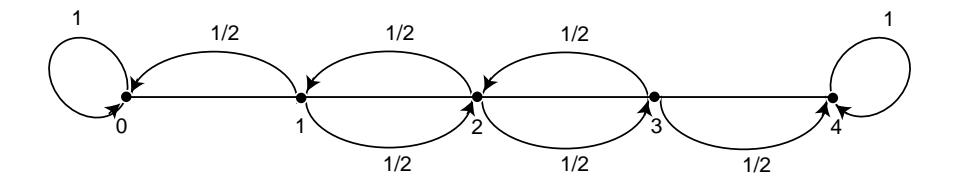

Figure 11.3: Drunkard's walk.

$$
\mathbf{P} = \frac{\text{TR.}}{\text{ABS.}} \left( \begin{array}{c|c} \mathbf{Q} & \mathbf{R} \\ \hline \mathbf{Q} & \mathbf{R} \\ \hline \mathbf{0} & \mathbf{I} \end{array} \right)
$$

Here I is an r-by-r indentity matrix, 0 is an r-by-t zero matrix, R is a nonzero t-by-r matrix, and  $Q$  is an t-by-t matrix. The first t states are transient and the last  $r$  states are absorbing.

In Section 11.1, we saw that the entry  $p_{ij}^{(n)}$  of the matrix  $\mathbf{P}^n$  is the probability of being in the state  $s_j$  after *n* steps, when the chain is started in state  $s_i$ . A standard matrix algebra argument shows that  $\mathbf{P}^n$  is of the form

$$
\mathbf{P}^{n} = \frac{\text{TR.}}{\text{ABS.}} \begin{pmatrix} \mathbf{Q}^{n} & * \\ \hline \mathbf{0} & \mathbf{I} \end{pmatrix}
$$

where the asterisk  $*$  stands for the t-by-r matrix in the upper right-hand corner of  $\mathbf{P}^n$ . (This submatrix can be written in terms of **Q** and **R**, but the expression is complicated and is not needed at this time.) The form of  $\mathbf{P}^n$  shows that the entries of  $\mathbf{Q}^n$  give the probabilities for being in each of the transient states after n steps for each possible transient starting state. For our first theorem we prove that the probability of being in the transient states after  $n$  steps approaches zero. Thus every entry of  $\mathbf{Q}^n$  must approach zero as *n* approaches infinity (i.e,  $\mathbf{Q}^n \to \mathbf{0}$ ).

## **Probability of Absorption**

Theorem 11.3 In an absorbing Markov chain, the probability that the process will be absorbed is 1 (i.e.,  $\mathbf{Q}^n \to \mathbf{0}$  as  $n \to \infty$ ).

**Proof.** From each nonabsorbing state  $s_i$  it is possible to reach an absorbing state. Let  $m_j$  be the minimum number of steps required to reach an absorbing state, starting from  $s_j$ . Let  $p_j$  be the probability that, starting from  $s_j$ , the process will not reach an absorbing state in  $m_j$  steps. Then  $p_j < 1$ . Let m be the largest of the

 $m_j$  and let p be the largest of  $p_j$ . The probability of not being absorbed in m steps is less than or equal to p, in 2m steps less than or equal to  $p^2$ , etc. Since  $p < 1$ these probabilities tend to 0. Since the probability of not being absorbed in  $n$  steps is monotone decreasing, these probabilities also tend to 0, hence  $\lim_{n\to\infty} \mathbf{Q}^n = 0$ .  $\Box$ 

## The Fundamental Matrix

**Theorem 11.4** For an absorbing Markov chain the matrix  $I - Q$  has an inverse **N** and  $N = I + Q + Q^2 + \cdots$ . The *ij*-entry  $n_{ij}$  of the matrix **N** is the expected number of times the chain is in state  $s_j$ , given that it starts in state  $s_i$ . The initial state is counted if  $i = j$ .

**Proof.** Let  $(I - Q)x = 0$ ; that is  $x = Qx$ . Then, iterating this we see that  $\mathbf{x} = \mathbf{Q}^n \mathbf{x}$ . Since  $\mathbf{Q}^n \to \mathbf{0}$ , we have  $\mathbf{Q}^n \mathbf{x} \to \mathbf{0}$ , so  $\mathbf{x} = \mathbf{0}$ . Thus  $(\mathbf{I} - \mathbf{Q})^{-1} = \mathbf{N}$ exists. Note next that

$$
(I - Q)(I + Q + Q2 + \cdots + Qn) = I - Qn+1
$$
.

Thus multiplying both sides by  $N$  gives

$$
\mathbf{I} + \mathbf{Q} + \mathbf{Q}^2 + \cdots + \mathbf{Q}^n = \mathbf{N}(\mathbf{I} - \mathbf{Q}^{n+1})
$$

Letting  $n$  tend to infinity we have

$$
\mathbf{N} = \mathbf{I} + \mathbf{Q} + \mathbf{Q}^2 + \cdots.
$$

Let  $s_i$  and  $s_j$  be two transient states, and assume throughout the remainder of the proof that i and j are fixed. Let  $X^{(k)}$  be a random variable which equals 1 if the chain is in state  $s_i$  after k steps, and equals 0 otherwise. For each k, this random variable depends upon both  $i$  and  $j$ ; we choose not to explicitly show this dependence in the interest of clarity. We have

$$
P(X^{(k)} = 1) = q_{ij}^{(k)},
$$

and

$$
P(X^{(k)} = 0) = 1 - q_{ij}^{(k)},
$$

where  $q_{ij}^{(k)}$  is the *ij*th entry of  $\mathbf{Q}^k$ . These equations hold for  $k = 0$  since  $\mathbf{Q}^0 = \mathbf{I}$ . Therefore, since  $X^{(k)}$  is a 0-1 random variable,  $E(X^{(k)}) = q_{ii}^{(k)}$ .

The expected number of times the chain is in state  $s_j$  in the first *n* steps, given that it starts in state  $s_i$ , is clearly

$$
E(X^{(0)} + X^{(1)} + \dots + X^{(n)}) = q_{ij}^{(0)} + q_{ij}^{(1)} + \dots + q_{ij}^{(n)}
$$

Letting  $n$  tend to infinity we have

$$
E(X^{(0)} + X^{(1)} + \cdots) = q_{ij}^{(0)} + q_{ij}^{(1)} + \cdots = n_{ij}.
$$

**Definition 11.3** For an absorbing Markov chain **P**, the matrix  $N = (I - Q)^{-1}$  is called the fundamental matrix for **P**. The entry  $n_{ij}$  of **N** gives the expected number of times that the process is in the transient state  $s_j$  if it is started in the transient  $\Box$ state  $s_i$ .

**Example 11.14** (Example 11.13 continued) In the Drunkard's Walk example, the transition matrix in canonical form is

$$
\mathbf{P} = \begin{bmatrix} 1 & 2 & 3 & 0 & 4 \\ 1 & 0 & 1/2 & 0 & 1/2 & 0 \\ 2 & 1/2 & 0 & 1/2 & 0 & 0 \\ 0 & 0 & 1/2 & 0 & 0 & 1/2 \\ 0 & 0 & 0 & 0 & 1 & 0 \\ 4 & 0 & 0 & 0 & 0 & 1 \end{bmatrix}
$$

From this we see that the matrix  $Q$  is

$$
\mathbf{Q} = \begin{pmatrix} 0 & 1/2 & 0 \\ 1/2 & 0 & 1/2 \\ 0 & 1/2 & 0 \end{pmatrix} ,
$$

and

$$
\mathbf{I} - \mathbf{Q} = \begin{pmatrix} 1 & -1/2 & 0 \\ -1/2 & 1 & -1/2 \\ 0 & -1/2 & 1 \end{pmatrix} .
$$

Computing  $(I - Q)^{-1}$ , we find

$$
\mathbf{N} = (\mathbf{I} - \mathbf{Q})^{-1} = \begin{array}{cc} & 1 & 2 & 3 \\ 1 & 3/2 & 1 & 1/2 \\ 1 & 2 & 1 & 2 \\ 3 & 1/2 & 1 & 3/2 \end{array}.
$$

From the middle row of  $N$ , we see that if we start in state 2, then the expected number of times in states 1, 2, and 3 before being absorbed are 1, 2, and 1.  $\Box$ 

## Time to Absorption

We now consider the question: Given that the chain starts in state  $s_i$ , what is the expected number of steps before the chain is absorbed? The answer is given in the next theorem.

**Theorem 11.5** Let  $t_i$  be the expected number of steps before the chain is absorbed, given that the chain starts in state  $s_i$ , and let **t** be the column vector whose *i*th entry is  $t_i$ . Then

$$
\mathbf{t} = \mathbf{N}\mathbf{c} \ ,
$$

where  $c$  is a column vector all of whose entries are 1.

**Proof.** If we add all the entries in the *i*th row of N, we will have the expected number of times in any of the transient states for a given starting state  $s_i$ , that is, the expected time required before being absorbed. Thus,  $t_i$  is the sum of the entries in the  $i$ th row of  $N$ . If we write this statement in matrix form, we obtain the theorem.  $\Box$ 

## **Absorption Probabilities**

**Theorem 11.6** Let  $b_{ij}$  be the probability that an absorbing chain will be absorbed in the absorbing state  $s_j$  if it starts in the transient state  $s_i$ . Let **B** be the matrix with entries  $b_{ij}$ . Then **B** is an *t*-by-*r* matrix, and

$$
\mathbf{B}=\mathbf{NR}.
$$

where  $N$  is the fundamental matrix and  $R$  is as in the canonical form.

Proof. We have

$$
\mathbf{B}_{ij} = \sum_{n} \sum_{k} q_{ik}^{(n)} r_{kj}
$$
$$
= \sum_{k} \sum_{n} q_{ik}^{(n)} r_{kj}
$$
$$
= \sum_{k} n_{ik} r_{kj}
$$
$$
= (\mathbf{NR})_{ij} .
$$

This completes the proof.

 $\Box$ 

Another proof of this is given in Exercise 34.

**Example 11.15** (Example 11.14 continued) In the Drunkard's Walk example, we found that  $\overline{1}$  $\Omega$  $\overline{Q}$ 

$$
\mathbf{N} = \begin{array}{ccc} & 1 & 2 & 3 \\ 1 & 3/2 & 1 & 1/2 \\ 2 & 1 & 2 & 1 \\ 3 & 1/2 & 1 & 3/2 \end{array}.
$$

Hence,

$$
\mathbf{t} = \mathbf{N}\mathbf{c} = \begin{pmatrix} 3/2 & 1 & 1/2 \\ 1 & 2 & 1 \\ 1/2 & 1 & 3/2 \end{pmatrix} \begin{pmatrix} 1 \\ 1 \\ 1 \end{pmatrix}
$$
$$
= \begin{pmatrix} 3 \\ 4 \\ 3 \end{pmatrix} .
$$