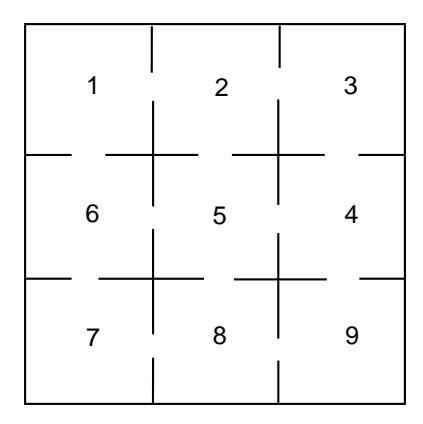

Figure 11.4: The maze problem.

To find the fixed probability vector for this matrix, we would have to solve ten equations in nine unknowns. However, it would seem reasonable that the times spent in each compartment should, in the long run, be proportional to the number of entries to each compartment. Thus, we try the vector whose  $j$ th component is the number of entries to the jth compartment:

$$
\mathbf{x} = \begin{pmatrix} 2 & 3 & 2 & 3 & 4 & 3 & 2 & 3 & 2 \end{pmatrix}.
$$

It is easy to check that this vector is indeed a fixed vector so that the unique probability vector is this vector normalized to have sum 1:

$$
\mathbf{w} = \begin{pmatrix} \frac{1}{12} & \frac{1}{8} & \frac{1}{12} & \frac{1}{8} & \frac{1}{6} & \frac{1}{8} & \frac{1}{12} & \frac{1}{8} & \frac{1}{12} \end{pmatrix} .
$$

Example 11.23 (Example 11.8 continued) We recall the Ehrenfest urn model of Example 11.8. The transition matrix for this chain is as follows:

$$
\mathbf{P} = \begin{bmatrix} 0 & 1 & 2 & 3 & 4 \\ 0 & .000 & 1.000 & .000 & .000 & .000 \\ 1 & .250 & .000 & .750 & .000 & .000 \\ .000 & .500 & .000 & .500 & .000 \\ 3 & .000 & .000 & .750 & .000 & .250 \\ 4 & .000 & .000 & .000 & 1.000 & .000 \end{bmatrix}.
$$

If we run the program Fixed Vector for this chain, we obtain the vector

$$
\mathbf{w} = \begin{pmatrix} 0 & 1 & 2 & 3 & 4 \\ .0625 & .2500 & .3750 & .2500 & .0625 \end{pmatrix}.
$$

By Theorem 11.12, we can interpret these values for  $w_i$  as the proportion of times the process is in each of the states in the long run. For example, the proportion of times in state 0 is .0625 and the proportion of times in state 1 is .375. The asture reader will note that these numbers are the binomial distribution  $1/16$ ,  $4/16$ ,  $6/16$ ,  $4/16$ ,  $1/16$ . We could have guessed this answer as follows: If we consider a particular ball, it simply moves randomly back and forth between the two urns. This suggests that the equilibrium state should be just as if we randomly distributed the four balls in the two urns. If we did this, the probability that there would be exactly j balls in one urn would be given by the binomial distribution  $b(n, p, j)$  with  $n = 4$ and  $p = 1/2$ .  $\Box$ 

## **Exercises**

1 Which of the following matrices are transition matrices for regular Markov chains?

(a) 
$$
\mathbf{P} = \begin{pmatrix} .5 & .5 \\ .5 & .5 \end{pmatrix}
$$
.  
\n(b)  $\mathbf{P} = \begin{pmatrix} .5 & .5 \\ 1 & 0 \end{pmatrix}$ .  
\n(c)  $\mathbf{P} = \begin{pmatrix} 1/3 & 0 & 2/3 \\ 0 & 1 & 0 \\ 0 & 1/5 & 4/5 \end{pmatrix}$   
\n(d)  $\mathbf{P} = \begin{pmatrix} 0 & 1 \\ 1 & 0 \end{pmatrix}$ .  
\n(e)  $\mathbf{P} = \begin{pmatrix} 1/2 & 1/2 & 0 \\ 0 & 1/2 & 1/2 \\ 1/3 & 1/3 & 1/3 \end{pmatrix}$ 

2 Consider the Markov chain with transition matrix

$$
\mathbf{P} = \begin{pmatrix} 1/2 & 1/3 & 1/6 \\ 3/4 & 0 & 1/4 \\ 0 & 1 & 0 \end{pmatrix}
$$

- (a) Show that this is a regular Markov chain.
- (b) The process is started in state 1; find the probability that it is in state 3 after two steps.
- (c) Find the limiting probability vector  $\mathbf{w}$ .
- $\bf 3\,$  Consider the Markov chain with general  $2\times 2$  transition matrix

$$
\mathbf{P} = \begin{pmatrix} 1-a & a \\ b & 1-b \end{pmatrix}
$$

- (a) Under what conditions is  $P$  absorbing?
- (b) Under what conditions is  $P$  ergodic but not regular?
- (c) Under what conditions is  $P$  regular?

## 11.3. ERGODIC MARKOV CHAINS

- 4 Find the fixed probability vector w for the matrices in Exercise 3 that are ergodic.
- 5 Find the fixed probability vector **w** for each of the following regular matrices.

(a) 
$$
\mathbf{P} = \begin{pmatrix} .75 & .25 \\ .5 & .5 \end{pmatrix}
$$
.  
\n(b)  $\mathbf{P} = \begin{pmatrix} .9 & .1 \\ .1 & .9 \end{pmatrix}$ .  
\n(c)  $\mathbf{P} = \begin{pmatrix} 3/4 & 1/4 & 0 \\ 0 & 2/3 & 1/3 \\ 1/4 & 1/4 & 1/2 \end{pmatrix}$ 

**6** Consider the Markov chain with transition matrix in Exercise 3, with  $a = b =$ 1. Show that this chain is ergodic but not regular. Find the fixed probability vector and interpret it. Show that  $\mathbf{P}^n$  does not tend to a limit, but that

$$
\mathbf{A}_n = \frac{\mathbf{I} + \mathbf{P} + \mathbf{P}^2 + \dots + \mathbf{P}^n}{n+1}
$$

does.

- 7 Consider the Markov chain with transition matrix of Exercise 3, with  $a = 0$ and  $b = 1/2$ . Compute directly the unique fixed probability vector, and use your result to prove that the chain is not ergodic.
- 8 Show that the matrix

$$
\mathbf{P} = \begin{pmatrix} 1 & 0 & 0 \\ 1/4 & 1/2 & 1/4 \\ 0 & 0 & 1 \end{pmatrix}
$$

has more than one fixed probability vector. Find the matrix that  $\mathbf{P}^n$  approaches as  $n \to \infty$ , and verify that it is not a matrix all of whose rows are the same.

- 9 Prove that, if a 3-by-3 transition matrix has the property that its *column* sums are 1, then  $(1/3, 1/3, 1/3)$  is a fixed probability vector. State a similar result for  $n$ -by- $n$  transition matrices. Interpret these results for ergodic chains.
- 10 Is the Markov chain in Example 11.10 ergodic?
- 11 Is the Markov chain in Example 11.11 ergodic?
- 12 Consider Example 11.13 (Drunkard's Walk). Assume that if the walker reaches state 0, he turns around and returns to state 1 on the next step and, similarly, if he reaches 4 he returns on the next step to state 3. Is this new chain ergodic? Is it regular?
- 13 For Example 11.4 when **P** is ergodic, what is the proportion of people who are told that the President will run? Interpret the fact that this proportion is independent of the starting state.

- 14 Consider an independent trials process to be a Markov chain whose states are the possible outcomes of the individual trials. What is its fixed probability vector? Is the chain always regular? Illustrate this for Example 11.5.
- 15 Show that Example 11.8 is an ergodic chain, but not a regular chain. Show that its fixed probability vector **w** is a binomial distribution.
- 16 Show that Example 11.9 is regular and find the limiting vector.
- 17 Toss a fair die repeatedly. Let  $S_n$  denote the total of the outcomes through the nth toss. Show that there is a limiting value for the proportion of the first *n* values of  $S_n$  that are divisible by 7, and compute the value for this limit. *Hint*: The desired limit is an equilibrium probability vector for an appropriate seven state Markov chain.
- 18 Let P be the transition matrix of a regular Markov chain. Assume that there are r states and let  $N(r)$  be the smallest integer n such that **P** is regular if and only if  $\mathbf{P}^{N(r)}$  has no zero entries. Find a finite upper bound for  $N(r)$ . See if you can determine  $N(3)$  exactly.
- \*19 Define  $f(r)$  to be the smallest integer n such that for all regular Markov chains with  $r$  states, the *n*th power of the transition matrix has all entries positive. It has been shown,14 that  $f(r) = r^2 - 2r + 2$ .
  - (a) Define the transition matrix of an  $r$ -state Markov chain as follows: For states  $s_i$ , with  $i = 1, 2, ..., r-2$ ,  $P(i, i+1) = 1$ ,  $P(r-1,r) = P(r-1, 1) =$  $1/2$ , and  $P(r, 1) = 1$ . Show that this is a regular Markov chain.
  - (b) For  $r = 3$ , verify that the fifth power is the first power that has no zeros.
  - (c) Show that, for general r, the smallest n such that  $\mathbf{P}^n$  has all entries positive is  $n = f(r)$ .
- **20** A discrete time queueing system of capacity n consists of the person being served and those waiting to be served. The queue length  $x$  is observed each second. If  $0 < x < n$ , then with probability p, the queue size is increased by one by an arrival and, inependently, with probability  $r$ , it is decreased by one because the person being served finishes service. If  $x = 0$ , only an arrival (with probability p) is possible. If  $x = n$ , an arrival will depart without waiting for service, and so only the departure (with probability  $r$ ) of the person being served is possible. Form a Markov chain with states given by the number of customers in the queue. Modify the program Fixed Vector so that you can input  $n$ ,  $p$ , and  $r$ , and the program will construct the transition matrix and compute the fixed vector. The quantity  $s = p/r$  is called the *traffic intensity*. Describe the differences in the fixed vectors according as  $s < 1$ ,  $s = 1$ , or  $s>1$ .

 $14E$ . Seneta, Non-Negative Matrices: An Introduction to Theory and Applications, Wiley, New York, 1973, pp. 52-54.