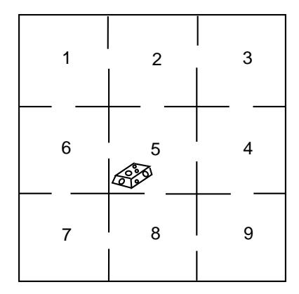

Figure 11.5: The maze problem.

chain, these quantities give the expected number of times in each of the states before reaching state  $s_j$  for the first time. The *i*th component of the vector **Nc** gives the expected number of steps before absorption in the new chain, starting in state  $s_i$ . In terms of the old chain, this is the expected number of steps required to reach state  $s_j$  for the first time starting at state  $s_i$ .

## Mean First Passage Time

**Definition 11.7** If an ergodic Markov chain is started in state  $s_i$ , the expected number of steps to reach state  $s_j$  for the first time is called the *mean first passage time* from  $s_i$  to  $s_j$ . It is denoted by  $m_{ij}$ . By convention  $m_{ii} = 0$ .  $\Box$ 

**Example 11.24** Let us return to the maze example (Example 11.22). We shall make this ergodic chain into an absorbing chain by making state 5 an absorbing state. For example, we might assume that food is placed in the center of the maze and once the rat finds the food, he stays to enjoy it (see Figure 11.5).

The new transition matrix in canonical form is

|                |                  | $\mathfrak{D}$   | 3                | 4                | 6                |                  | 8                | 9              | 5              |  |
|----------------|------------------|------------------|------------------|------------------|------------------|------------------|------------------|----------------|----------------|--|
|                | $\Omega$         | 1/2              | $\boldsymbol{0}$ | $\overline{0}$   | 1/2              | $\boldsymbol{0}$ | $\overline{0}$   | 0              |                |  |
| $\overline{2}$ | 1/3              | $\boldsymbol{0}$ | 1/3              | $\boldsymbol{0}$ | $\boldsymbol{0}$ | $\boldsymbol{0}$ | $\theta$         | 0              | 1/3            |  |
| 3              | $\theta$         | 1/2              | $\boldsymbol{0}$ | 1/2              | $\boldsymbol{0}$ | $\boldsymbol{0}$ | $\overline{0}$   | 0              | $\overline{0}$ |  |
| $\overline{4}$ | $\theta$         | $\boldsymbol{0}$ | 1/3              | $\boldsymbol{0}$ | $\boldsymbol{0}$ | 1/3              | $\boldsymbol{0}$ | 1/3            | 1/3            |  |
| 6              | 1/3              | $\overline{0}$   | $\boldsymbol{0}$ | 0                | $\boldsymbol{0}$ | $\boldsymbol{0}$ | $\overline{0}$   | 0              | 1/3            |  |
|                | $\boldsymbol{0}$ | $\overline{0}$   | $\boldsymbol{0}$ | $\boldsymbol{0}$ | 1/2              | $\boldsymbol{0}$ | 1/2              | $\overline{0}$ | $\overline{0}$ |  |
| 8              | $\theta$         | 0                | 0                | $\theta$         | $\boldsymbol{0}$ | 1/3              | 0                | 1/3            | 1/3            |  |
| 9              | 0                | 0                | $\theta$         | 1/2              | $\overline{0}$   | $\boldsymbol{0}$ | 1/2              | 0              | 0              |  |
| 5              | 0                |                  |                  | $\theta$         |                  |                  | 0                |                |                |  |

If we compute the fundamental matrix  $N$ , we obtain

$$
\mathbf{N} = \frac{1}{8} \begin{pmatrix} 14 & 9 & 4 & 3 & 9 & 4 & 3 & 2 \\ 6 & 14 & 6 & 4 & 4 & 2 & 2 & 2 \\ 4 & 9 & 14 & 9 & 3 & 2 & 3 & 4 \\ 2 & 4 & 6 & 14 & 2 & 2 & 4 & 6 \\ 6 & 4 & 2 & 2 & 14 & 6 & 4 & 2 \\ 4 & 3 & 2 & 3 & 9 & 14 & 9 & 4 \\ 2 & 2 & 2 & 4 & 4 & 6 & 14 & 6 \\ 2 & 3 & 4 & 9 & 3 & 4 & 9 & 14 \end{pmatrix}
$$

The expected time to absorption for different starting states is given by the vector  $Nc$ , where

$$
\mathbf{N}\mathbf{c} = \begin{pmatrix} 6 \\ 5 \\ 6 \\ 5 \\ 5 \\ 6 \\ 6 \end{pmatrix}
$$

We see that, starting from compartment 1, it will take on the average six steps to reach food. It is clear from symmetry that we should get the same answer for starting at state  $3, 7,$  or  $9$ . It is also clear that it should take one more step, starting at one of these states, than it would starting at  $2, 4, 6$ , or 8. Some of the results obtained from N are not so obvious. For instance, we note that the expected number of times in the starting state is  $14/8$  regardless of the state in which we start.  $\Box$ 

## **Mean Recurrence Time**

A quantity that is closely related to the mean first passage time is the mean recurrence time, defined as follows. Assume that we start in state  $s_i$ ; consider the length of time before we return to  $s_i$  for the first time. It is clear that we must return, since we either stay at  $s_i$  the first step or go to some other state  $s_j$ , and from any other state  $s_j$ , we will eventually reach  $s_i$  because the chain is ergodic.

**Definition 11.8** If an ergodic Markov chain is started in state  $s_i$ , the expected number of steps to return to  $s_i$  for the first time is the *mean recurrence time* for  $s_i$ . It is denoted by  $r_i$ .  $\Box$ 

We need to develop some basic properties of the mean first passage time. Consider the mean first passage time from  $s_i$  to  $s_j$ ; assume that  $i \neq j$ . This may be computed as follows: take the expected number of steps required given the outcome of the first step, multiply by the probability that this outcome occurs, and add. If the first step is to  $s_j$ , the expected number of steps required is 1; if it is to some

#### 11.5. MEAN FIRST PASSAGE TIME

or, since  $\sum_k p_{ik} = 1$ ,

other state  $s_k$ , the expected number of steps required is  $m_{kj}$  plus 1 for the step already taken. Thus,

$$
m_{ij} = p_{ij} + \sum_{k \neq j} p_{ik}(m_{kj} + 1) ,
$$
  
$$
m_{ij} = 1 + \sum_{k \neq i} p_{ik} m_{kj} .
$$
 (11.2)

Similarly, starting in  $s_i$ , it must take at least one step to return. Considering all possible first steps gives us

$$
r_i = \sum_{k} p_{ik}(m_{ki} + 1) \tag{11.3}
$$

$$
= 1 + \sum_{k} p_{ik} m_{ki} . \tag{11.4}
$$

### Mean First Passage Matrix and Mean Recurrence Matrix

Let us now define two matrices **M** and **D**. The *ij*th entry  $m_{ij}$  of **M** is the mean first passage time to go from  $s_i$  to  $s_j$  if  $i \neq j$ ; the diagonal entries are 0. The matrix M is called the *mean first passage matrix*. The matrix  $\mathbf{D}$  is the matrix with all entries 0 except the diagonal entries  $d_{ii} = r_i$ . The matrix **D** is called the *mean recurrence matrix.* Let C be an  $r \times r$  matrix with all entries 1. Using Equation 11.2 for the case  $i \neq j$  and Equation 11.4 for the case  $i = j$ , we obtain the matrix equation

$$
\mathbf{M} = \mathbf{P}\mathbf{M} + \mathbf{C} - \mathbf{D} \tag{11.5}
$$

**or** 

$$
(\mathbf{I} - \mathbf{P})\mathbf{M} = \mathbf{C} - \mathbf{D} \tag{11.6}
$$

Equation 11.6 with  $m_{ii} = 0$  implies Equations 11.2 and 11.4. We are now in a position to prove our first basic theorem.

Theorem 11.15 For an ergodic Markov chain, the mean recurrence time for state  $s_i$  is  $r_i = 1/w_i$ , where  $w_i$  is the *i*th component of the fixed probability vector for the transition matrix.

**Proof.** Multiplying both sides of Equation 11.6 by w and using the fact that

$$
\mathbf{w}(\mathbf{I} - \mathbf{P}) = \mathbf{0}
$$

gives

$$
\mathbf{w}\mathbf{C}-\mathbf{w}\mathbf{D}=\mathbf{0}
$$

Here  $wC$  is a row vector with all entries 1 and  $wD$  is a row vector with *i*th entry  $w_i r_i$ . Thus

$$
(1, 1, \ldots, 1) = (w_1 r_1, w_2 r_2, \ldots, w_n r_n)
$$

and

$$
r_i=1/w_i
$$

as was to be proved.

 $\Box$ 

 $\Box$ 

Corollary 11.1 For an ergodic Markov chain, the components of the fixed probability vector **w** are strictly positive.

**Proof.** We know that the values of  $r_i$  are finite and so  $w_i = 1/r_i$  cannot be 0.  $\Box$ 

**Example 11.25** In Example 11.22 we found the fixed probability vector for the maze example to be

$$
\mathbf{w} = \begin{pmatrix} \frac{1}{12} & \frac{1}{8} & \frac{1}{12} & \frac{1}{8} & \frac{1}{6} & \frac{1}{8} & \frac{1}{12} & \frac{1}{8} & \frac{1}{12} \end{pmatrix}.
$$

Hence, the mean recurrence times are given by the reciprocals of these probabilities. That is.

$$
\mathbf{r} = (12 \quad 8 \quad 12 \quad 8 \quad 6 \quad 8 \quad 12 \quad 8 \quad 12).
$$

Returning to the Land of Oz, we found that the weather in the Land of Oz could be represented by a Markov chain with states rain, nice, and snow. In Section 11.3 we found that the limiting vector was  $\mathbf{w} = (2/5, 1/5, 2/5)$ . From this we see that the mean number of days between rainy days is  $5/2$ , between nice days is 5, and between snowy days is  $5/2$ .

# **Fundamental Matrix**

We shall now develop a fundamental matrix for ergodic chains that will play a role similar to that of the fundamental matrix  $N = (I - Q)^{-1}$  for absorbing chains. As was the case with absorbing chains, the fundamental matrix can be used to find a number of interesting quantities involving ergodic chains. Using this matrix, we will give a method for calculating the mean first passage times for ergodic chains that is easier to use than the method given above. In addition, we will state (but not prove) the Central Limit Theorem for Markov Chains, the statement of which uses the fundamental matrix.

We begin by considering the case that  $P$  is the transition matrix of a regular Markov chain. Since there are no absorbing states, we might be tempted to try  $\mathbf{Z} = (\mathbf{I} - \mathbf{P})^{-1}$  for a fundamental matrix. But  $\mathbf{I} - \mathbf{P}$  does not have an inverse. To see this, recall that a matrix **R** has an inverse if and only if  $Rx = 0$  implies  $x = 0$ . But since  $Pc = c$  we have  $(I - P)c = 0$ , and so  $I - P$  does not have an inverse.

We recall that if we have an absorbing Markov chain, and  $Q$  is the restriction of the transition matrix to the set of transient states, then the fundamental matrix N could be written as

$$
\mathbf{N} = \mathbf{I} + \mathbf{Q} + \mathbf{Q}^2 + \cdots.
$$

The reason that this power series converges is that  $\mathbf{Q}^n \to 0$ , so this series acts like a convergent geometric series.

This idea might prompt one to try to find a similar series for regular chains. Since we know that  $\mathbf{P}^n \to \mathbf{W}$ , we might consider the series

$$
\mathbf{I} + (\mathbf{P} - \mathbf{W}) + (\mathbf{P}^2 - \mathbf{W}) + \cdots
$$
 (11.7)