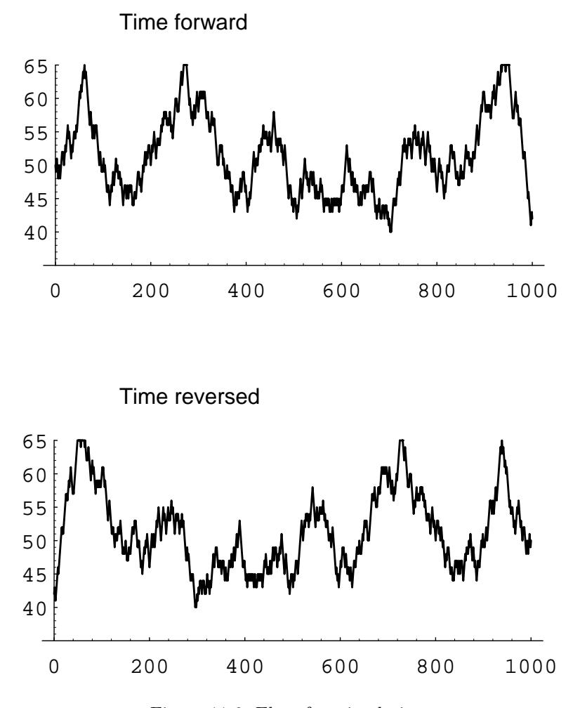

| 0                                                                               | 1       | 2       | 3      | 4      |         |         |
|---------------------------------------------------------------------------------|---------|---------|--------|--------|---------|---------|
| $\mathbf{r} = (16.0000 \quad 4.0000 \quad 2.6667 \quad 4.0000 \quad 16.0000)$ ; |         |         |        |        |         |         |
| 0                                                                               | 1       | 2       | 3      | 4      |         |         |
| 0                                                                               | 0.000   | 1.0000  | 2.6667 | 6.3333 | 21.3333 |         |
| 1                                                                               | 1       | 15.0000 | .0000  | 1.6667 | 5.3333  | 20.3333 |
| $\mathbf{M} = 2$                                                                | 18.6667 | 3.6667  | .0000  | 3.6667 | 18.6667 |         |
| 3                                                                               | 20.3333 | 5.3333  | 1.6667 | .0000  | 15.0000 |         |
| 4                                                                               | 21.3333 | 6.3333  | 2.6667 | 1.0000 | .0000   |         |

From the mean first passage matrix, we see that the mean time to go from 0 balls in urn 1 to 2 balls in urn 1 is 2.6667 steps while the mean time to go from 2 balls in urn 1 to 0 balls in urn 1 is 18.6667. This reflects the fact that the model exhibits a central tendency. Of course, the physicist is interested in the case of a large number of molecules, or balls, and so we should consider this example for  $n$  so large that we cannot compute it even with a computer.

# **Ehrenfest Model**

**Example 11.28** (Example 11.23 continued) Let us consider the Ehrenfest model (see Example 11.8) for gas diffusion for the general case of  $2n$  balls. Every second, one of the  $2n$  balls is chosen at random and moved from the urn it was in to the other urn. If there are i balls in the first urn, then with probability  $i/2n$  we take one of them out and put it in the second urn, and with probability  $(2n-i)/2n$  we take a ball from the second urn and put it in the first urn. At each second we let the number  $i$  of balls in the first urn be the state of the system. Then from state  $i$ we can pass only to state  $i-1$  and  $i+1$ , and the transition probabilities are given by

$$
p_{ij} = \begin{cases} \frac{i}{2n}, & \text{if } j = i - 1, \\ 1 - \frac{i}{2n}, & \text{if } j = i + 1, \\ 0, & \text{otherwise.} \end{cases}
$$

This defines the transition matrix of an ergodic, non-regular Markov chain (see Exercise 15). Here the physicist is interested in long-term predictions about the state occupied. In Example 11.23, we gave an intuitive reason for expecting that the fixed vector **w** is the binomial distribution with parameters 2n and 1/2. It is easy to check that this is correct. So,

$$
w_i = \frac{\binom{2n}{i}}{2^{2n}}.
$$

Thus the mean recurrence time for state  $i$  is

$$
r_i = \frac{2^{2n}}{\binom{2n}{i}}.
$$

Figure 11.6: Ehrenfest simulation.

Consider in particular the central term  $i = n$ . We have seen that this term is approximately  $1/\sqrt{\pi n}$ . Thus we may approximate  $r_n$  by  $\sqrt{\pi n}$ .

This model was used to explain the concept of reversibility in physical systems. Assume that we let our system run until it is in equilibrium. At this point, a movie is made, showing the system's progress. The movie is then shown to you, and you are asked to tell if the movie was shown in the forward or the reverse direction. It would seem that there should always be a tendency to move toward an equal proportion of balls so that the correct order of time should be the one with the most transitions from i to  $i-1$  if  $i > n$  and i to  $i+1$  if  $i < n$ .

In Figure 11.6 we show the results of simulating the Ehrenfest urn model for the case of  $n = 50$  and 1000 time units, using the program **EhrenfestUrn**. The top graph shows these results graphed in the order in which they occurred and the bottom graph shows the same results but with time reversed. There is no apparent difference.

#### 11.5. MEAN FIRST PASSAGE TIME

We note that if we had not started in equilibrium, the two graphs would typically look quite different.  $\Box$ 

## Reversibility

If the Ehrenfest model is started in equilibrium, then the process has no apparent time direction. The reason for this is that this process has a property called re*versibility.* Define  $X_n$  to be the number of balls in the left urn at step n. We can calculate, for a general ergodic chain, the reverse transition probability:

$$
P(X_{n-1} = j | X_n = i) = \frac{P(X_{n-1} = j, X_n = i)}{P(X_n = i)}
$$
  
= 
$$
\frac{P(X_{n-1} = j)P(X_n = i | X_{n-1} = j)}{P(X_n = i)}
$$
  
= 
$$
\frac{P(X_{n-1} = j)p_{ji}}{P(X_n = i)}
$$
.

In general, this will depend upon *n*, since  $P(X_n = j)$  and also  $P(X_{n-1} = j)$ change with  $n$ . However, if we start with the vector  $w$  or wait until equilibrium is reached, this will not be the case. Then we can define

$$
p_{ij}^* = \frac{w_j p_{ji}}{w_i}
$$

as a transition matrix for the process watched with time reversed.

Let us calculate a typical transition probability for the reverse chain  $\mathbf{P}^* = \{p_{ij}^*\}$ in the Ehrenfest model. For example,

$$
p_{i,i-1}^{*} = \frac{w_{i-1}p_{i-1,i}}{w_i} = \frac{\binom{2n}{i-1}}{2^{2n}} \times \frac{2n-i+1}{2n} \times \frac{2^{2n}}{\binom{2n}{i}}
$$
$$
= \frac{(2n)!}{(i-1)!(2n-i+1)!} \times \frac{(2n-i+1)i!(2n-i)!}{2n(2n)!}
$$
$$
= \frac{i}{2n} = p_{i,i-1} .
$$

Similar calculations for the other transition probabilities show that  $\mathbf{P}^* = \mathbf{P}$ . When this occurs the process is called *reversible*. Clearly, an ergodic chain is reversible if, and only if, for every pair of states  $s_i$  and  $s_j$ ,  $w_i p_{ij} = w_j p_{ji}$ . In particular, for the Ehrenfest model this means that  $w_i p_{i,i-1} = w_{i-1} p_{i-1,i}$ . Thus, in equilibrium, the pairs  $(i, i-1)$  and  $(i-1, i)$  should occur with the same frequency. While many of the Markov chains that occur in applications are reversible, this is a very strong condition. In Exercise 12 you are asked to find an example of a Markov chain which is not reversible.

## The Central Limit Theorem for Markov Chains

Suppose that we have an ergodic Markov chain with states  $s_1, s_2, \ldots, s_k$ . It is natural to consider the distribution of the random variables  $S_j^{(n)}$ , which denotes the number of times that the chain is in state  $s_i$  in the first *n* steps. The jth component  $w_j$  of the fixed probability row vector **w** is the proportion of times that the chain is in state  $s_j$  in the long run. Hence, it is reasonable to conjecture that the expected value of the random variable  $S_i^{(n)}$ , as  $n \to \infty$ , is asymptotic to  $nw_j$ , and it is easy to show that this is the case (see Exercise 23).

It is also natural to ask whether there is a limiting distribution of the random variables  $S_i^{(n)}$ . The answer is yes, and in fact, this limiting distribution is the normal distribution. As in the case of independent trials, one must normalize these random variables. Thus, we must subtract from  $S_j^{(n)}$  its expected value, and then divide by its standard deviation. In both cases, we will use the asymptotic values of these quantities, rather than the values themselves. Thus, in the first case, we will use the value  $nw_i$ . It is not so clear what we should use in the second case. It turns out that the quantity

$$
\sigma_j^2 = 2w_j z_{jj} - w_j - w_j^2 \tag{11.10}
$$

represents the asymptotic variance. Armed with these ideas, we can state the following theorem.

Theorem 11.17 (Central Limit Theorem for Markov Chains) For an ergodic chain, for any real numbers  $r < s$ , we have

$$
P\left(r < \frac{S_j^{(n)} - nw_j}{\sqrt{n\sigma_j^2}} < s\right) \to \frac{1}{\sqrt{2\pi}} \int_r^s e^{-x^2/2} dx ,
$$

as  $n \to \infty$ , for any choice of starting state, where  $\sigma_j^2$  is the quantity defined in Equation 11.10.

### **Historical Remarks**

Markov chains were introduced by Andrei Andreevich Markov (1856–1922) and were named in his honor. He was a talented undergraduate who received a gold medal for his undergraduate thesis at St. Petersburg University. Besides being an active research mathematician and teacher, he was also active in politics and patricipated in the liberal movement in Russia at the beginning of the twentieth century. In 1913, when the government celebrated the 300th anniversary of the House of Romanov family, Markov organized a counter-celebration of the 200th anniversary of Bernoulli's discovery of the Law of Large Numbers.

Markov was led to develop Markov chains as a natural extension of sequences of independent random variables. In his first paper, in 1906, he proved that for a Markov chain with positive transition probabilities and numerical states the average of the outcomes converges to the expected value of the limiting distribution (the fixed vector). In a later paper he proved the central limit theorem for such chains. Writing about Markov, A. P. Youschkevitch remarks:

Markov arrived at his chains starting from the internal needs of probability theory, and he never wrote about their applications to physical