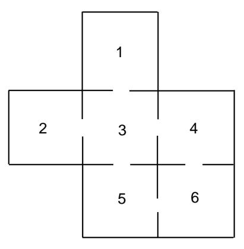

## 11.5. MEAN FIRST PASSAGE TIME

science. For him the only real examples of the chains were literary texts, where the two states denoted the vowels and consonants.  $^{19}$ 

In a paper written in  $191320$  Markov chose a sequence of 20,000 letters from Pushkin's *Eugene Onegin* to see if this sequence can be approximately considered a simple chain. He obtained the Markov chain with transition matrix

|           |      | vowel consonant |  |
|-----------|------|-----------------|--|
| vowel     | .128 | .872            |  |
| consonant | .663 | -337            |  |

The fixed vector for this chain is  $(.432, .568)$ , indicating that we should expect about 43.2 percent vowels and 56.8 percent consonants in the novel, which was borne out by the actual count.

Claude Shannon considered an interesting extension of this idea in his book The Mathematical Theory of Communication.21 in which he developed the informationtheoretic concept of entropy. Shannon considers a series of Markov chain approximations to English prose. He does this first by chains in which the states are letters and then by chains in which the states are words. For example, for the case of words he presents first a simulation where the words are chosen independently but with appropriate frequencies.

REPRESENTING AND SPEEDILY IS AN GOOD APT OR COME CAN DIFFERENT NATURAL HERE HE THE A IN CAME THE TO OF TO EXPERT GRAY COME TO FURNISHES THE LINE MES-SAGE HAD BE THESE.

He then notes the increased resemblence to ordinary English text when the words are chosen as a Markov chain, in which case he obtains

THE HEAD AND IN FRONTAL ATTACK ON AN ENGLISH WRI-TER THAT THE CHARACTER OF THIS POINT IS THEREFORE ANOTHER METHOD FOR THE LETTERS THAT THE TIME OF WHO EVER TOLD THE PROBLEM FOR AN UNEXPECTED.

A simulation like the last one is carried out by opening a book and choosing the first word, say it is the. Then the book is read until the word the appears again and the word after this is chosen as the second word, which turned out to be head. The book is then read until the word head appears again and the next word, and, is chosen, and so on.

Other early examples of the use of Markov chains occurred in Galton's study of the problem of survival of family names in 1889 and in the Markov chain introduced

&lt;sup>19See Dictionary of Scientific Biography, ed. C. C. Gillespie (New York: Scribner's Sons, 1970), pp. 124–130.  $^{20}\text{A}$ . A. Markov, "An Example of Statistical Analysis of the Text of Eugene Onegin Illustrat-

ing the Association of Trials into a Chain," Bulletin de l'Acadamie Imperiale des Sciences de St. Petersburg, ser. 6, vol. 7 (1913), pp. 153-162.

 $^{21}$ C. E. Shannon and W. Weaver, The Mathematical Theory of Communication (Urbana: Univ. of Illinois Press, 1964).

by P. and T. Ehrenfest in 1907 for diffusion. Poincaré in 1912 dicussed card shuffling in terms of an ergodic Markov chain defined on a permutation group. Brownian motion, a continuous time version of random walk, was introducted in 1900–1901 by L. Bachelier in his study of the stock market, and in 1905–1907 in the works of A. Einstein and M. Smoluchowsky in their study of physical processes.

One of the first systematic studies of finite Markov chains was carried out by M. Frechet.22 The treatment of Markov chains in terms of the two fundamental matrices that we have used was developed by Kemeny and Snell23 to avoid the use of eigenvalues that one of these authors found too complex. The fundamental matrix  $N$ occurred also in the work of J. L. Doob and others in studying the connection between Markov processes and classical potential theory. The fundamental matrix **Z** for ergodic chains appeared first in the work of Frechet, who used it to find the limiting variance for the central limit theorem for Markov chains.

## **Exercises**

1 Consider the Markov chain with transition matrix

$$
\mathbf{P} = \begin{pmatrix} 1/2 & 1/2 \\ 1/4 & 3/4 \end{pmatrix}
$$

Find the fundamental matrix  $Z$  for this chain. Compute the mean first passage matrix using Z.

- 2 A study of the strengths of Ivy League football teams shows that if a school has a strong team one year it is equally likely to have a strong team or average team next year; if it has an average team, half the time it is average next year, and if it changes it is just as likely to become strong as weak; if it is weak it has  $2/3$  probability of remaining so and  $1/3$  of becoming average.
  - (a) A school has a strong team. On the average, how long will it be before it has another strong team?
  - (b) A school has a weak team; how long (on the average) must the alumni wait for a strong team?
- **3** Consider Example 11.4 with  $a = .5$  and  $b = .75$ . Assume that the President says that he or she will run. Find the expected length of time before the first time the answer is passed on incorrectly.
- 4 Find the mean recurrence time for each state of Example 11.4 for  $a = .5$  and  $b = .75$ . Do the same for general a and b.
- 5 A die is rolled repeatedly. Show by the results of this section that the mean time between occurrences of a given number is 6.

 $^{22}$ M. Frechet, "Théorie des événements en chaine dans le cas d'un nombre fini d'états possible," in Recherches théoriques Modernes sur le calcul des probabilités, vol. 2 (Paris, 1938).

&lt;sup>23 J. G. Kemeny and J. L. Snell, Finite Markov Chains.

Figure 11.7: Maze for Exercise 7.

- 6 For the Land of Oz example (Example 11.1), make rain into an absorbing state and find the fundamental matrix N. Interpret the results obtained from this chain in terms of the original chain.
- 7 A rat runs through the maze shown in Figure 11.7. At each step it leaves the room it is in by choosing at random one of the doors out of the room.
  - (a) Give the transition matrix  $P$  for this Markov chain.
  - (b) Show that it is an ergodic chain but not a regular chain.
  - (c) Find the fixed vector.
  - (d) Find the expected number of steps before reaching Room 5 for the first time, starting in Room 1.
- 8 Modify the program ErgodicChain so that you can compute the basic quantities for the queueing example of Exercise 11.3.20. Interpret the mean recurrence time for state 0.
- **9** Consider a random walk on a circle of circumference  $n$ . The walker takes one unit step clockwise with probability  $p$  and one unit counterclockwise with probability  $q = 1 - p$ . Modify the program **ErgodicChain** to allow you to input  $n$  and  $p$  and compute the basic quantities for this chain.
  - (a) For which values of  $n$  is this chain regular? ergodic?
  - (b) What is the limiting vector  $\mathbf{w}$ ?
  - (c) Find the mean first passage matrix for  $n = 5$  and  $p = .5$ . Verify that  $m_{ij} = d(n - d)$ , where d is the clockwise distance from i to j.
- 10 Two players match pennies and have between them a total of 5 pennies. If at any time one player has all of the pennies, to keep the game going, he gives one back to the other player and the game will continue. Show that this game can be formulated as an ergodic chain. Study this chain using the program ErgodicChain.

- 11 Calculate the reverse transition matrix for the Land of Oz example (Example  $11.1$ ). Is this chain reversible?
- 12 Give an example of a three-state ergodic Markov chain that is not reversible.
- 13 Let P be the transition matrix of an ergodic Markov chain and  $P^*$  the reverse transition matrix. Show that they have the same fixed probability vector w.
- 14 If P is a reversible Markov chain, is it necessarily true that the mean time to go from state i to state j is equal to the mean time to go from state j to state  $i$ ? Hint: Try the Land of Oz example (Example 11.1).
- 15 Show that any ergodic Markov chain with a symmetric transition matrix (i.e.,  $p_{ij} = p_{ji}$ ) is reversible.
- 16 (Crowell24) Let P be the transition matrix of an ergodic Markov chain. Show that

$$
(I + P + \cdots + P^{n-1})(I - P + W) = I - P^n + nW
$$
,

and from this show that

$$
\frac{\mathbf{I} + \mathbf{P} + \cdots + \mathbf{P}^{n-1}}{n} \to \mathbf{W} ,
$$

as  $n \to \infty$ .

- 17 An ergodic Markov chain is started in equilibrium (i.e., with initial probability vector **w**). The mean time until the next occurrence of state  $s_i$  is  $\bar{m}_i$  =  $\sum_k w_k m_{ki} + w_i r_i$ . Show that  $\bar{m}_i = z_{ii}/w_i$ , by using the facts that  $\mathbf{wZ} = \mathbf{w}$ and  $m_{ki} = (z_{ii} - z_{ki})/w_i$ .
- 18 A perpetual craps game goes on at Charley's. Jones comes into Charley's on an evening when there have already been 100 plays. He plans to play until the next time that snake eyes (a pair of ones) are rolled. Jones wonders how many times he will play. On the one hand he realizes that the average time between snake eyes is 36 so he should play about 18 times as he is equally likely to have come in on either side of the halfway point between occurrences of snake eyes. On the other hand, the dice have no memory, and so it would seem that he would have to play for 36 more times no matter what the previous outcomes have been. Which, if either, of Jones's arguments do you believe? Using the result of Exercise 17, calculate the expected to reach snake eyes, in equilibrium, and see if this resolves the apparent paradox. If you are still in doubt, simulate the experiment to decide which argument is correct. Can you give an intuitive argument which explains this result?
- 19 Show that, for an ergodic Markov chain (see Theorem 11.16),

$$
\sum_j m_{ij} w_j = \sum_j z_{jj} - 1 = K.
$$

 $24$ Private communication.