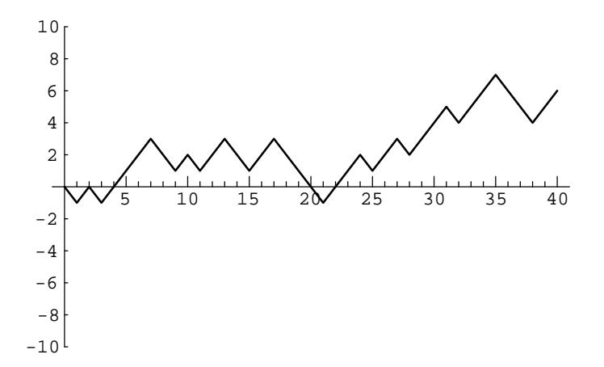

Figure 12.1: A random walk of length 40.

**Theorem 12.1** The probability of a return to the origin at time  $2m$  is given by

$$
u_{2m} = \binom{2m}{m} 2^{-2m} .
$$

The probability of a return to the origin at an odd time is 0.

A random walk is said to have a *first return* to the origin at time  $2m$  if  $m > 0$ , and  $S_{2k} \neq 0$  for all  $k < m$ . In Figure 12.1, the first return occurs at time 2. We define  $f_{2m}$  to be the probability of this event. (We also define  $f_0 = 0$ .) One can think of the expression  $f_{2m}2^{2m}$  as the number of paths of length  $2m$  between the points  $(0,0)$  and  $(2m,0)$  that do not touch the horizontal axis except at the endpoints. Using this idea, it is easy to prove the following theorem.

**Theorem 12.2** For  $n \geq 1$ , the probabilities  $\{u_{2k}\}\$  and  $\{f_{2k}\}\$  are related by the equation

$$
u_{2n} = f_0 u_{2n} + f_2 u_{2n-2} + \cdots + f_{2n} u_0.
$$

**Proof.** There are  $u_{2n}2^{2n}$  paths of length 2n which have endpoints  $(0,0)$  and  $(2n,0)$ . The collection of such paths can be partitioned into *n* sets, depending upon the time of the first return to the origin. A path in this collection which has a first return to the origin at time 2k consists of an initial segment from  $(0,0)$  to  $(2k,0)$ , in which no interior points are on the horizontal axis, and a terminal segment from  $(2k, 0)$ to  $(2n,0)$ , with no further restrictions on this segment. Thus, the number of paths in the collection which have a first return to the origin at time  $2k$  is given by

$$
f_{2k}2^{2k}u_{2n-2k}2^{2n-2k} = f_{2k}u_{2n-2k}2^{2n}.
$$

If we sum over  $k$ , we obtain the equation

$$
u_{2n}2^{2n} = f_0 u_{2n}2^{2n} + f_2 u_{2n-2}2^{2n} + \cdots + f_{2n} u_0 2^{2n}.
$$

Dividing both sides of this equation by  $2^{2n}$  completes the proof.

 $\Box$ 

The expression in the right-hand side of the above theorem should remind the reader of a sum that appeared in Definition 7.1 of the convolution of two distributions. The convolution of two sequences is defined in a similar manner. The above theorem says that the sequence  $\{u_{2n}\}\$ is the convolution of itself and the sequence  $\{f_{2n}\}\$ . Thus, if we represent each of these sequences by an ordinary generating function, then we can use the above relationship to determine the value  $f_{2n}$ .

**Theorem 12.3** For  $m \geq 1$ , the probability of a first return to the origin at time  $2m$  is given by  $\sim$ 

$$
f_{2m} = \frac{u_{2m}}{2m-1} = \frac{\binom{2m}{m}}{(2m-1)2^{2m}}.
$$

**Proof.** We begin by defining the generating functions

$$
U(x) = \sum_{m=0}^{\infty} u_{2m} x^m
$$

and

$$
F(x) = \sum_{m=0}^{\infty} f_{2m} x^m
$$

Theorem 12.2 says that

$$
U(x) = 1 + U(x)F(x) . \t(12.1)
$$

(The presence of the 1 on the right-hand side is due to the fact that  $u_0$  is defined to be 1, but Theorem 12.2 only holds for  $m \ge 1$ .) We note that both generating functions certainly converge on the interval  $(-1, 1)$ , since all of the coefficients are at most 1 in absolute value. Thus, we can solve the above equation for  $F(x)$ , obtaining

$$
F(x) = \frac{U(x) - 1}{U(x)}
$$

Now, if we can find a closed-form expression for the function  $U(x)$ , we will also have a closed-form expression for  $F(x)$ . From Theorem 12.1, we have

$$
U(x) = \sum_{m=0}^{\infty} {2m \choose m} 2^{-2m} x^m
$$

In Wilf, $1$  we find that

$$
\frac{1}{\sqrt{1-4x}} = \sum_{m=0}^{\infty} \binom{2m}{m} x^m
$$

The reader is asked to prove this statement in Exercise 1. If we replace x by  $x/4$ in the last equation, we see that

$$
U(x) = \frac{1}{\sqrt{1-x}}.
$$

&lt;sup>1H. S. Wilf, *Generatingfunctionology*, (Boston: Academic Press, 1990), p. 50.

Therefore, we have

$$
F(x) = \frac{U(x) - 1}{U(x)}
$$
  
= 
$$
\frac{(1 - x)^{-1/2} - 1}{(1 - x)^{-1/2}}
$$
  
= 
$$
1 - (1 - x)^{1/2}.
$$

Although it is possible to compute the value of  $f_{2m}$  using the Binomial Theorem, it is easier to note that  $F'(x) = U(x)/2$ , so that the coefficients  $f_{2m}$  can be found by integrating the series for  $U(x)$ . We obtain, for  $m \geq 1$ ,

$$
f_{2m} = \frac{u_{2m-2}}{2m}
$$
  
= 
$$
\frac{\binom{2m-2}{m-1}}{m2^{2m-1}}
$$
  
= 
$$
\frac{\binom{2m}{m}}{(2m-1)2^{2m}}
$$
  
= 
$$
\frac{u_{2m}}{2m-1},
$$

since

$$
\binom{2m-2}{m-1}=\frac{m}{2(2m-1)}\binom{2m}{m}.
$$

This completes the proof of the theorem.

## Probability of Eventual Return

In the symmetric random walk process in  $\mathbb{R}^m$ , what is the probability that the particle eventually returns to the origin? We first examine this question in the case that  $m = 1$ , and then we consider the general case. The results in the next two examples are due to  $Pólya.2$ 

**Example 12.1** (Eventual Return in  $\mathbb{R}^1$ ) One has to approach the idea of eventual return with some care, since the sample space seems to be the set of all walks of infinite length, and this set is non-denumerable. To avoid difficulties, we will define  $w_n$  to be the probability that a first return has occurred no later than time n. Thus,  $w_n$  concerns the sample space of all walks of length n, which is a finite set. In terms of the  $w_n$ 's, it is reasonable to define the probability that the particle eventually returns to the origin to be

$$
w_*=\lim_{n\to\infty}w_n.
$$

This limit clearly exists and is at most one, since the sequence  $\{w_n\}_{n=1}^{\infty}$  is an increasing sequence, and all of its terms are at most one.

 $\Box$ 

 ${}^{2}G$ . Pólya, "Über eine Aufgabe der Wahrscheinlichkeitsrechnung betreffend die Irrfahrt im Strassennetz," Math. Ann., vol. 84 (1921), pp. 149-160.

In terms of the  $f_n$  probabilities, we see that

$$
w_{2n} = \sum_{i=1}^{n} f_{2i} \; .
$$

Thus,

$$
w_* = \sum_{i=1}^{\infty} f_{2i} .
$$

In the proof of Theorem 12.3, the generating function

$$
F(x) = \sum_{m=0}^{\infty} f_{2m} x^m
$$

was introduced. There it was noted that this series converges for  $x \in (-1,1)$ . In fact, it is possible to show that this series also converges for  $x = \pm 1$  by using Exercise 4, together with the fact that

$$
f_{2m}=\frac{u_{2m}}{2m-1}.
$$

(This fact was proved in the proof of Theorem 12.3.) Since we also know that

$$
F(x) = 1 - (1 - x)^{1/2} ,
$$

we see that

$$
w_* = F(1) = 1
$$
.

Thus, with probability one, the particle returns to the origin.

An alternative proof of the fact that  $w_* = 1$  can be obtained by using the results in Exercise 2.  $\Box$ 

**Example 12.2** (Eventual Return in  $\mathbb{R}^m$ ) We now turn our attention to the case that the random walk takes place in more than one dimension. We define  $f_{2n}^{(m)}$  to be the probability that the first return to the origin in  $\mathbb{R}^m$  occurs at time  $2n$ . The quantity  $u_{2n}^{(m)}$  is defined in a similar manner. Thus,  $f_{2n}^{(1)}$  and  $u_{2n}^{(1)}$  equal  $f_{2n}$  and  $u_{2n}$ , which were de one can mimic the proof of Theorem 12.2, and show that for all  $m \geq 1$ ,

$$
u_{2n}^{(m)} = f_0^{(m)} u_{2n}^{(m)} + f_2^{(m)} u_{2n-2}^{(m)} + \dots + f_{2n}^{(m)} u_0^{(m)}.
$$
 (12.2)

We continue to generalize previous work by defining

$$
U^{(m)}(x) = \sum_{n=0}^{\infty} u_{2n}^{(m)} x^n
$$

and

$$
F^{(m)}(x) = \sum_{n=0}^{\infty} f_{2n}^{(m)} x^n
$$

476