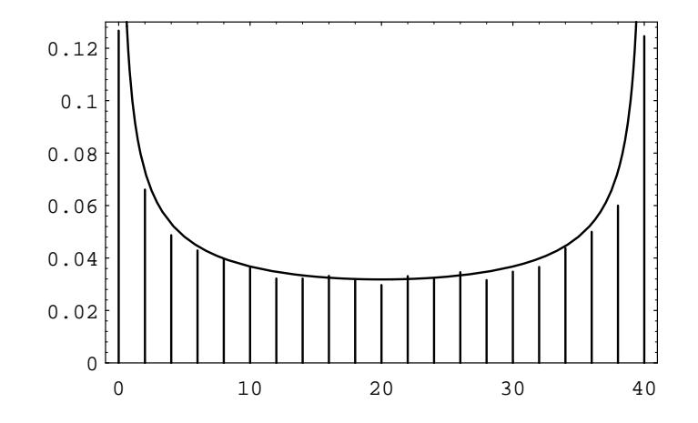

## **Arc Sine Laws** 12.3

In Exercise 12.1.6, the distribution of the time of the last equalization in the symmetric random walk was determined. If we let  $\alpha_{2k,2m}$  denote the probability that a random walk of length  $2m$  has its last equalization at time  $2k$ , then we have

$$
\alpha_{2k,2m} = u_{2k}u_{2m-2k} .
$$

We shall now show how one can approximate the distribution of the  $\alpha$ 's with a simple function. We recall that

$$
u_{2k} \sim \frac{1}{\sqrt{\pi k}} \ .
$$

Therefore, as both k and m go to  $\infty$ , we have

$$
\alpha_{2k,2m} \sim \frac{1}{\pi\sqrt{k(m-k)}}
$$

This last expression can be written as

$$
\frac{1}{\pi m \sqrt{(k/m)(1-k/m)}}
$$

Thus, if we define

$$
f(x) = \frac{1}{\pi\sqrt{x(1-x)}}
$$

for  $0 < x < 1$ , then we have

$$
\alpha_{2k,2m} \approx \frac{1}{m} f\left(\frac{k}{m}\right).
$$

The reason for the  $\approx$  sign is that we no longer require that k get large. This means that we can replace the discrete  $\alpha_{2k,2m}$  distribution by the continuous density  $f(x)$ on the interval  $[0,1]$  and obtain a good approximation. In particular, if x is a fixed real number between 0 and 1, then we have

$$
\sum_{k\leq x m} \alpha_{2k,2m} \approx \int_0^x f(t) dt .
$$

It turns out that  $f(x)$  has a nice antiderivative, so we can write

$$
\sum_{k < xm} \alpha_{2k, 2m} \approx \frac{2}{\pi} \arcsin \sqrt{x} .
$$

One can see from the graph of this last function that it has a minimum at  $x = 1/2$ and is symmetric about that point. As noted in the exercise, this implies that half of the walks of length  $2m$  have no equalizations after time  $m$ , a fact which probably would not be guessed.

It turns out that the arc sine density comes up in the answers to many other questions concerning random walks on the line. Recall that in Section 12.1, a random walk could be viewed as a polygonal line connecting  $(0,0)$  with  $(m, S_m)$ . Under this interpretation, we define  $b_{2k,2m}$  to be the probability that a random walk of length  $2m$  has exactly  $2k$  of its  $2m$  polygonal line segments above the t-axis.

The probability  $b_{2k,2m}$  is frequently interpreted in terms of a two-player game. (The reader will recall the game Heads or Tails, in Example 1.4.) Player A is said to be in the lead at time n if the random walk is above the  $t$ -axis at that time, or if the random walk is on the t-axis at time n but above the t-axis at time  $n-1$ . (At time 0, neither player is in the lead.) One can ask what is the most probable number of times that player A is in the lead, in a game of length  $2m$ . Most people will say that the answer to this question is  $m$ . However, the following theorem says that  $m$  is the least likely number of times that player  $A$  is in the lead, and the most likely number of times in the lead is 0 or  $2m$ .

**Theorem 12.4** If Peter and Paul play a game of Heads or Tails of length  $2m$ , the probability that Peter will be in the lead exactly  $2k$  times is equal to

 $\alpha_{2k,2m}$ .

**Proof.** To prove the theorem, we need to show that

$$
b_{2k,2m} = \alpha_{2k,2m} \tag{12.9}
$$

Exercise 12.1.7 shows that  $b_{2m,2m} = u_{2m}$  and  $b_{0,2m} = u_{2m}$ , so we only need to prove that Equation 12.9 holds for  $1 \leq k \leq m-1$ . We can obtain a recursion involving the b's and the  $f$ 's (defined in Section 12.1) by counting the number of paths of length 2m that have exactly 2k of their segments above the t-axis, where  $1 \leq k \leq m-1$ . To count this collection of paths, we assume that the first return occurs at time  $2j$ , where  $1 \leq j \leq m-1$ . There are two cases to consider. Either during the first  $2j$ outcomes the path is above the  $t$ -axis or below the  $t$ -axis. In the first case, it must be true that the path has exactly  $(2k - 2j)$  line segments above the t-axis, between  $t=2j$  and  $t=2m$ . In the second case, it must be true that the path has exactly 2k line segments above the t-axis, between  $t = 2j$  and  $t = 2m$ .

We now count the number of paths of the various types described above. The number of paths of length  $2j$  all of whose line segments lie above the t-axis and which return to the origin for the first time at time 2j equals  $(1/2)2^{2j}f_{2j}$ . This also equals the number of paths of length  $2j$  all of whose line segments lie below the t-axis and which return to the origin for the first time at time  $2j$ . The number of paths of length  $(2m-2j)$  which have exactly  $(2k-2j)$  line segments above the t-axis is  $b_{2k-2i,2m-2i}$ . Finally, the number of paths of length  $(2m-2j)$  which have exactly 2k line segments above the t-axis is  $b_{2k,2m-2j}$ . Therefore, we have

$$
b_{2k,2m} = \frac{1}{2} \sum_{j=1}^{k} f_{2j} b_{2k-2j,2m-2j} + \frac{1}{2} \sum_{j=1}^{m-k} f_{2j} b_{2k,2m-2j}.
$$

We now assume that Equation 12.9 is true for  $m < n$ . Then we have

Figure 12.2: Times in the lead.

$$
b_{2k,2n} = \frac{1}{2} \sum_{j=1}^{k} f_{2j} \alpha_{2k-2j,2m-2j} + \frac{1}{2} \sum_{j=1}^{m-k} f_{2j} \alpha_{2k,2m-2j}
$$
  
\n
$$
= \frac{1}{2} \sum_{j=1}^{k} f_{2j} u_{2k-2j} u_{2m-2k} + \frac{1}{2} \sum_{j=1}^{m-k} f_{2j} u_{2k} u_{2m-2j-2k}
$$
  
\n
$$
= \frac{1}{2} u_{2m-2k} \sum_{j=1}^{k} f_{2j} u_{2k-2j} + \frac{1}{2} u_{2k} \sum_{j=1}^{m-k} f_{2j} u_{2m-2j-2k}
$$
  
\n
$$
= \frac{1}{2} u_{2m-2k} u_{2k} + \frac{1}{2} u_{2k} u_{2m-2k} ,
$$

where the last equality follows from Theorem 12.2. Thus, we have

 $b_{2k,2n} = \alpha_{2k,2n}$ ,

which completes the proof.

We illustrate the above theorem by simulating 10,000 games of Heads or Tails, with each game consisting of 40 tosses. The distribution of the number of times that Peter is in the lead is given in Figure 12.2, together with the arc sine density.

We end this section by stating two other results in which the arc sine density appears. Proofs of these results may be found in Feller. $8$ 

**Theorem 12.5** Let  $J$  be the random variable which, for a given random walk of length 2m, gives the smallest subscript j such that  $S_j = S_{2m}$ . (Such a subscript j must be even, by parity considerations.) Let  $\gamma_{2k,2m}$  be the probability that  $J = 2k$ . Then we have

$$
\gamma_{2k,2m}=\alpha_{2k,2m}.
$$

 $\Box$ 

 $\Box$ 

 $^8\rm{W}.$  Feller, op. cit., pp. 93–94.

The next theorem says that the arc sine density is applicable to a wide range of situations. A continuous distribution function  $F(x)$  is said to be *symmetric* if  $F(x) = 1 - F(-x)$ . (If X is a continuous random variable with a symmetric distribution function, then for any real x, we have  $P(X \le x) = P(X \ge -x)$ .) We imagine that we have a random walk of length  $n$  in which each summand has the distribution  $F(x)$ , where F is continuous and symmetric. The subscript of the first *maximum* of such a walk is the unique subscript  $k$  such that

$$
S_k > S_0, \ldots, S_k > S_{k-1}, S_k \geq S_{k+1}, \ldots, S_k \geq S_n
$$

We define the random variable  $K_n$  to be the subscript of the first maximum. We can now state the following theorem concerning the random variable  $K_n$ .

**Theorem 12.6** Let F be a symmetric continuous distribution function, and let  $\alpha$ be a fixed real number strictly between 0 and 1. Then as  $n \to \infty$ , we have

$$
P(K_n < n\alpha) \to \frac{2}{\pi} \arcsin \sqrt{\alpha} .
$$

A version of this theorem that holds for a symmetric random walk can also be found in Feller.

## **Exercises**

1 For a random walk of length 2m, define  $\epsilon_k$  to equal 1 if  $S_k > 0$ , or if  $S_{k-1} = 1$ and  $S_k = 0$ . Define  $\epsilon_k$  to equal -1 in all other cases. Thus,  $\epsilon_k$  gives the side of the *t*-axis that the random walk is on during the time interval  $[k-1, k]$ . A "law of large numbers" for the sequence  $\{\epsilon_k\}$  would say that for any  $\delta > 0$ , we would have

$$
P\left(-\delta < \frac{\epsilon_1 + \epsilon_2 + \dots + \epsilon_n}{n} < \delta\right) \to 1
$$

as  $n \to \infty$ . Even though the  $\epsilon$ 's are not independent, the above assertion certainly appears reasonable. Using Theorem 12.4, show that if  $-1 \le x \le 1$ , then

$$
\lim_{n \to \infty} P\left(\frac{\epsilon_1 + \epsilon_2 + \dots + \epsilon_n}{n} < x\right) = \frac{2}{\pi} \arcsin \sqrt{\frac{1+x}{2}}.
$$

2 Given a random walk  $W$  of length  $m$ , with summands

 ${X_1, X_2, \ldots, X_m}$ ,

define the *reversed* random walk to be the walk  $W^*$  with summands

 $\{X_m, X_{m-1}, \ldots, X_1\}$ .

(a) Show that the kth partial sum  $S_k^*$  satisfies the equation

$$
S_k^* = S_m - S_{n-k}
$$

where  $S_k$  is the kth partial sum for the random walk W.