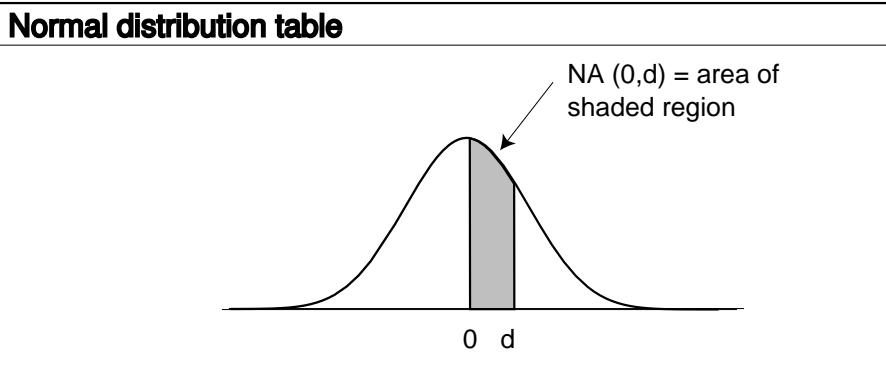

- (b) Explain the geometric relationship between the graphs of a random walk and its reversal. (It is not in general true that one graph is obtained from the other by reflecting in a vertical line.)
- $(c)$  Use parts  $(a)$  and  $(b)$  to prove Theorem 12.5.

CHAPTER 12. RANDOM WALKS

## Appendices

## **Appendix A**

|     | .00   | .01   | .02   | .03   | .04   | .05   | .06   | .07   | .08   | .09   |
|-----|-------|-------|-------|-------|-------|-------|-------|-------|-------|-------|
| 0.0 | .0000 | .0040 | .0080 | .0120 | .0160 | .0199 | .0239 | .0279 | .0319 | .0359 |
| 0.1 | .0398 | .0438 | .0478 | .0517 | .0557 | .0596 | .0636 | .0675 | .0714 | .0753 |
|     |       |       |       |       |       |       |       |       |       |       |
| 0.2 | .0793 | .0832 | .0871 | .0910 | .0948 | .0987 | .1026 | .1064 | .1103 | .1141 |
| 0.3 | .1179 | .1217 | .1255 | .1293 | .1331 | .1368 | .1406 | .1443 | .1480 | .1517 |
| 0.4 | .1554 | .1591 | .1628 | .1664 | .1700 | .1736 | .1772 | .1808 | .1844 | .1879 |
| 0.5 | .1915 | .1950 | .1985 | .2019 | .2054 | .2088 | .2123 | .2157 | .2190 | .2224 |
| 0.6 | .2257 | .2291 | .2324 | .2357 | .2389 | .2422 | .2454 | .2486 | .2517 | .2549 |
| 0.7 | .2580 | .2611 | .2642 | .2673 | .2704 | .2734 | .2764 | .2794 | .2823 | .2852 |
| 0.8 | .2881 | .2910 | .2939 | .2967 | .2995 | .3023 | .3051 | .3078 | .3106 | .3133 |
| 0.9 | .3159 | .3186 | .3212 | .3238 | .3264 | .3289 | .3315 | .3340 | .3365 | .3389 |
| 1.0 | .3413 | .3438 | .3461 | .3485 | .3508 | .3531 | .3554 | .3577 | .3599 | .3621 |
| 1.1 | .3643 | .3665 | .3686 | .3708 | .3729 | .3749 | .3770 | .3790 | .3810 | .3830 |
| 1.2 | .3849 | .3869 | .3888 | .3907 | .3925 | .3944 | .3962 | .3980 | .3997 | .4015 |
| 1.3 | .4032 | .4049 | .4066 | .4082 | .4099 | .4115 | .4131 | .4147 | .4162 | .4177 |
| 1.4 | .4192 | .4207 | .4222 | .4236 | .4251 | .4265 | .4279 | .4292 | .4306 | .4319 |
| 1.5 | .4332 | .4345 | .4357 | .4370 | .4382 | .4394 | .4406 | .4418 | .4429 | .4441 |
| 1.6 | .4452 | .4463 | .4474 | .4484 | .4495 | .4505 | .4515 | .4525 | .4535 | .4545 |
| 1.7 | .4554 | .4564 | .4573 | .4582 | .4591 | .4599 | .4608 | .4616 | .4625 | .4633 |
| 1.8 | .4641 | .4649 | .4656 | .4664 | .4671 | .4678 | .4686 | .4693 | .4699 | .4706 |
| 1.9 | .4713 | .4719 | .4726 | .4732 | .4738 | .4744 | .4750 | .4756 | .4761 | .4767 |
| 2.0 | .4772 | .4778 | .4783 | .4788 | .4793 | .4798 | .4803 | .4808 | .4812 | .4817 |
| 2.1 | .4821 | .4826 | .4830 | .4834 | .4838 | .4842 | .4846 | .4850 | .4854 | .4857 |
| 2.2 | .4861 | .4864 | .4868 | .4871 | .4875 | .4878 | .4881 | .4884 | .4887 | .4890 |
| 2.3 | .4893 | .4896 | .4898 | .4901 | .4904 | .4906 | .4909 | .4911 | .4913 | .4916 |
| 2.4 | .4918 | .4920 | .4922 | .4925 | .4927 | .4929 | .4931 | .4932 | .4934 | .4936 |
| 2.5 | .4938 | .4940 | .4941 | .4943 | .4945 | .4946 | .4948 | .4949 | .4951 | .4952 |
| 2.6 | .4953 | .4955 | .4956 | .4957 | .4959 | .4960 | .4961 | .4962 | .4963 | .4964 |
| 2.7 | .4965 | .4966 | .4967 | .4968 | .4969 | .4970 | .4971 | .4972 | .4973 | .4974 |
| 2.8 | .4974 | .4975 | .4976 | .4977 | .4977 | .4978 | .4979 | .4979 | .4980 | .4981 |
| 2.9 | .4981 | .4982 | .4982 | .4983 | .4984 | .4984 | .4985 | .4985 | .4986 | .4986 |
| 3.0 | .4987 | .4987 | .4987 | .4988 | .4988 | .4989 | .4989 | .4989 | .4990 | .4990 |
| 3.1 | .4990 | .4991 | .4991 | .4991 | .4992 | .4992 | .4992 | .4992 | .4993 | .4993 |
| 3.2 | .4993 | .4993 | .4994 | .4994 | .4994 | .4994 | .4994 | .4995 | .4995 | .4995 |
| 3.3 | .4995 | .4995 | .4995 | .4996 | .4996 | .4996 | .4996 | .4996 | .4996 | .4997 |
| 3.4 | .4997 | .4997 | .4997 | .4997 | .4997 | .4997 | .4997 | .4997 | .4997 | .4998 |
| 3.5 | .4998 | .4998 | .4998 | .4998 | .4998 | .4998 | .4998 | .4998 | .4998 | .4998 |
| 3.6 | .4998 | .4998 | .4999 | .4999 | .4999 | .4999 | .4999 | .4999 | .4999 | .4999 |
| 3.7 | .4999 | .4999 | .4999 | .4999 | .4999 | .4999 | .4999 | .4999 | .4999 | .4999 |
| 3.8 | .4999 | .4999 | .4999 | .4999 | .4999 | .4999 | .4999 | .4999 | .4999 | .4999 |
| 3.9 | .5000 | .5000 | .5000 | .5000 | .5000 | .5000 | .5000 | .5000 | .5000 | .5000 |

 $500\,$